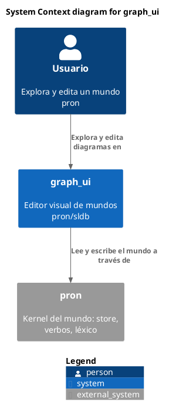
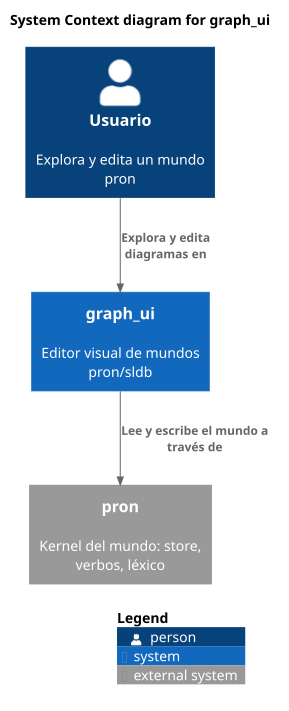
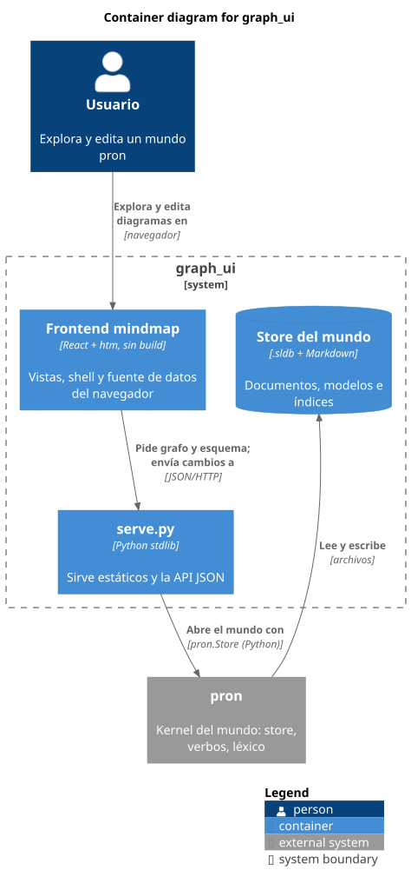

# Modelo C4

Carpeta: [anidamiento](index.md). La herramienta Structurizr como prior art está en
[`../../02-prior-art/structurizr-c4.md`](../../02-prior-art/structurizr-c4.md).

## 1. Qué representa

La **arquitectura de un sistema de software por niveles de zoom**: primero el sistema en su contexto
(personas y otros sistemas), después sus contenedores (aplicaciones y almacenes de datos), después los
componentes de cada contenedor, y finalmente el código. Del sitio oficial: *"The different levels of
zoom allow you to tell different stories to different audiences."*

Es un vocabulario **independiente de la notación** por declaración propia: *"The C4 model is
notation independent, and doesn't prescribe any particular notation."*

## 2. Sintaxis abstracta

c4model.com, *Abstractions*: *"A software system is made up of one or more containers (applications
and data stores), each of which contains one or more components, which in turn are implemented by one
or more code elements (classes, interfaces, objects, functions, etc). And people (actors, roles,
personas, named individuals, etc) use the software systems that we build."*

| Constructo | Qué es |
|---|---|
| **Person** | quien usa los sistemas |
| **Software System** | el nivel más alto de abstracción; lo que entrega valor |
| **Container** | *"a container represents an application or a data store. A container is something that needs to be running in order for the overall software system to work."* No es Docker. |
| **Component** | *"a grouping of related functionality encapsulated behind a well-defined interface"*; no se despliega por separado: *"all components inside a container execute in the same process space"* |
| **Relationship** | unidireccional, etiquetada con su intención y, entre contenedores, con tecnología o protocolo |

La pertenencia es estricta por nivel: contenedor ⊂ sistema, componente ⊂ contenedor.

## 3. Sintaxis concreta

C4 no fija símbolos pero sí **reglas de notación** (c4model.com, *Notation*):

- *"The type of every element should be explicitly specified (e.g. Person, Software System, Container
  or Component)."*
- *"Every container and component should have a technology explicitly specified."*
- *"Every line should represent a unidirectional relationship."* y *"Every line should be labelled,
  the label being consistent with the direction and intent of the relationship"*.
- *"Relationships between containers (typically these represent inter-process communication) should
  have a technology/protocol explicitly labelled."*
- *"Every diagram should have a key/legend explaining the notation being used."*

La convención más difundida (la de C4-PlantUML): cajas con tipo, descripción y tecnología; persona con
figura; sistemas externos en gris; **el límite del sistema como rectángulo punteado que contiene a sus
contenedores** (anidamiento).

## 4. Reglas de conexión

- Un contenedor pertenece a exactamente un sistema; un componente, a exactamente un contenedor.
- Las relaciones son dirigidas y llevan etiqueta.
- Una vista de un nivel muestra los elementos de ese nivel; las relaciones de niveles más finos se
  **elevan** a los elementos visibles (relaciones implícitas).

## 5. Ejemplo en notación estándar

`graph_ui` mismo, en dos niveles, con la biblioteca C4-PlantUML incluida en PlantUML.

**Contexto**, [`c4.assets/contexto.puml`](c4.assets/contexto.puml):





**Contenedores**, [`c4.assets/contenedores.puml`](c4.assets/contenedores.puml): el sistema se abre y
sus contenedores quedan dentro del límite.

```plantuml
System_Boundary(graph_ui, "graph_ui") {
  Container(front, "Frontend mindmap", "React + htm, sin build", "Vistas, shell y fuente de datos del navegador")
  Container(serve, "serve.py", "Python stdlib", "Sirve estáticos y la API JSON")
  ContainerDb(store, "Store del mundo", ".sldb + Markdown", "Documentos, modelos e índices")
}

Rel(usuario, front, "Explora y edita diagramas en", "navegador")
Rel(front, serve, "Pide grafo y esquema; envía cambios a", "JSON/HTTP")
Rel(serve, pron, "Abre el mundo con", "pron.Store (Python)")
Rel(pron, store, "Lee y escribe", "archivos")
```



## 6. El mismo ejemplo como mundo `pron`

Opción B. Archivo [`c4.assets/graph-ui.mundo.yaml`](c4.assets/graph-ui.mundo.yaml): un modelo por
abstracción (`Person`, `SoftwareSystem`, `Container`, `Component`, con `technology`), pertenencia
`part_of` (`many_to_one`) y relaciones `uses`. Como una `RelationDoc` no tiene campos para la etiqueta
ni la tecnología de la relación, van en `notes` con un separador:

```yaml
- type: uses
  source: Container:front
  target: Container:serve
  notes: Pide grafo y esquema; envía cambios a | JSON/HTTP
```

Montaje: `graph: 122 nodes, 129 edges, 13 relation types`; `pron check` → `ok`; `comandos con error: 0`.

**Control negativo** (componente como parte de un *sistema*): `Component:exportador part_of
SoftwareSystem:graph-ui` → **aceptada**. El par está dentro de `source_types: [Container, Component] ×
target_types: [SoftwareSystem, Container]`, el mismo problema de gramática por pares de
[ArchiMate](../nodo-arista-tipado/archimate.md). Un primer intento de este control usaba un componente
que ya tenía contenedor y lo rechazó la cardinalidad, no la gramática: hubo que aislar la regla.

### Relaciones implícitas: derivar la vista de contexto

Script [`c4.assets/relaciones-implicitas.py`](c4.assets/relaciones-implicitas.py): sube cada extremo
de `uses` por `part_of` hasta un elemento visible en contexto y descarta lo que queda interno.

```sh
python3 c4.assets/relaciones-implicitas.py c4.assets/graph-ui.mundo.yaml
```

```
Relaciones declaradas (nivel de contenedores):
   Usuario -> Frontend mindmap: Explora y edita diagramas en
   Frontend mindmap -> serve.py: Pide grafo y esquema; envía cambios a
   serve.py -> pron: Abre el mundo con
   pron -> Store del mundo: Lee y escribe

Relaciones implícitas en la vista de contexto:
   Usuario -> graph_ui   (de: Explora y edita diagramas en)
   graph_ui -> pron   (de: Abre el mundo con)
   pron -> graph_ui   (de: Lee y escribe)
```

La derivación encuentra una relación que el diagrama de contexto **escrito a mano** de la sección 5
omitió: `pron -> graph_ui` (pron lee y escribe el store, que es parte de `graph_ui`). Las vistas de
nivel grueso deberían calcularse desde el mundo, no dibujarse aparte.

## 7. Qué tendría que declarar el vocabulario visual

**Para dibujar**

| Constructo | Viene de | Símbolo |
|---|---|---|
| persona, sistema, contenedor, componente | documentos de cada modelo; `external`, `datastore` modifican el símbolo | caja con tipo, descripción, tecnología; figura; cilindro; gris si externo |
| pertenencia | `RelationDoc part_of` | **anidamiento** en el límite del padre |
| relación | `RelationDoc uses` | flecha etiquetada con intención y tecnología |
| nivel de la vista | parámetro de la vista: contexto, contenedores, componentes | qué modelos se muestran y **hasta dónde se elevan** las relaciones |
| leyenda | derivada de los kinds usados | obligatoria por las reglas de C4 |

Dos cosas nuevas para el vocabulario visual: **vistas parametrizadas por nivel** sobre la misma
pertenencia, y **relaciones derivadas** (elevar extremos por una relación de anidamiento).

**Para editar**

| Gesto | Operación | Escritura |
|---|---|---|
| soltar un contenedor dentro de un sistema | `move-into` | borrar `part_of` + crear |
| dibujar una relación en la vista de contenedores | `connect` | 1 `RelationDoc uses` (+ etiqueta y tecnología) |
| dibujar una relación en la vista de **contexto** | ambigua: no dice qué contenedores participan | el vocabulario debería pedir el detalle o crearla al nivel grueso |
| editar una relación implícita | no tiene documento propio | debe redirigir a las relaciones de las que se derivó |

## 8. Huecos

- **Etiqueta y tecnología de la relación sin campos**: C4 exige ambas; en `RelationDoc` solo caben en
  `notes` como texto con convención propia. Mismo hueco que los atributos de relación de
  [UML](../nodo-arista-tipado/uml-clases.md) y [ER](../nodo-arista-tipado/entidad-relacion.md).
- **Gramática por pares**: `Component part_of SoftwareSystem` pasa.
- **Relaciones derivadas**: no existen en el sustrato; si se calculan en la vista, editarlas requiere
  saber de qué relaciones reales vienen.
- **Vistas por nivel**: `graph_ui` tiene foco (entrar en un contenedor) pero no la noción de "vista de
  nivel N" con elevación de relaciones.

## 9. Fuentes

- S. Brown, *The C4 model*: https://c4model.com/abstractions, https://c4model.com/abstractions/container,
  https://c4model.com/abstractions/component,
  https://c4model.com/diagrams, https://c4model.com/diagrams/notation
- C4-PlantUML (incluida en la biblioteca estándar de PlantUML): https://github.com/plantuml-stdlib/C4-PlantUML
- Structurizr, *Implied relationships*: https://docs.structurizr.com/dsl/cookbook/implied-relationships
