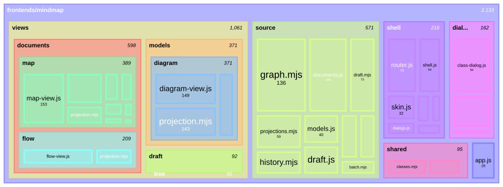

# Treemap

Carpeta: [anidamiento](index.md).

## 1. Qué representa

Una **jerarquía con una magnitud**: cómo se reparte un total (espacio en disco, líneas de código,
presupuesto) entre las ramas de un árbol. Lo propuso Ben Shneiderman (1992) para ver sistemas de
archivos completos: *"a two-dimensional (2-d) space-filling approach in which each node is a rectangle
whose area is proportional to some attribute such as node size"*.

Es el caso de esta carpeta donde el anidamiento **ocupa todo el espacio**: no hay líneas, y el tamaño
del contenedor está determinado por su contenido.

## 2. Sintaxis abstracta

| Constructo | Qué significa |
|---|---|
| **nodo hoja** | un elemento con un valor (tamaño) |
| **nodo interior** | una agrupación; su tamaño es derivado: *"each interior node must have the total size of its subtree (if necessary, then propagate the sums of storage consumed for each file and subdirectory up through the levels of the tree to the root)"* (Shneiderman 1992) |
| **jerarquía** | cada nodo tiene a lo sumo un padre |
| **atributo de color** (opcional) | una segunda variable: *"types of files [...], owners of programs (each owner has a different color), frequency of use (brighter colors for more frequent use)"* |

## 3. Sintaxis concreta

| Constructo | Símbolo |
|---|---|
| nodo | rectángulo |
| valor | **área** del rectángulo (canal de magnitud) |
| jerarquía | rectángulos dentro de rectángulos (contención); con marco si hacen falta nombres: *"If directory names are desired then nested rectangles that show a containing frame could be used, although this would reduce the effective display space."* |
| categoría o métrica | color |

La disposición de los rectángulos (*slice-and-dice* en el original, *squarified* en Bruls, Huizing y
van Wijk 2000, para evitar rectángulos finos difíciles de comparar) es una decisión del layout, no del
significado. Canales: **área** (magnitud, bajo en el ranking de efectividad de
[variables visuales](../../01-fundamentos/variables-visuales.md)), **contención** (jerarquía), color.

## 4. Reglas de conexión

- Árbol estricto: un padre por nodo, sin ciclos.
- Los valores son no negativos y el valor de un nodo interior es la suma de sus hijos.

## 5. Ejemplo en notación estándar

Las líneas de código de `frontends/mindmap/` de `graph_ui` (datos reales, `wc -l` en el commit
`653f9ea`), con el diagrama `treemap-beta` de Mermaid. El archivo Mermaid **se genera desde el mundo
`pron`** de la sección 6 con [`treemap-desde-mundo.py`](treemap.assets/treemap-desde-mundo.py): la
notación es una función del mundo, no un dibujo aparte.

```sh
python3 treemap.assets/treemap-desde-mundo.py treemap.assets/mindmap.mundo.yaml > treemap.assets/mindmap.mmd
mmdc -i treemap.assets/mindmap.mmd -o treemap.assets/mindmap.svg -w 1400
```

Comienzo de [`treemap.assets/mindmap.mmd`](treemap.assets/mindmap.mmd):

```text
treemap-beta
"frontends/mindmap"
    "dialogs"
        "class-dialog.js": 94
        "compiler-dialog.js": 56
        "conflict-dialog.js": 12
    "shared"
        "classes.mjs": 50
        "documents.mjs": 40
        "html.js": 5
```



Las carpetas no tienen número en el archivo Mermaid: el renderer las suma (2133 líneas en total;
`views` 1061, `source` 571). Un detalle del proceso: en la primera versión del generador `app.js`
quedaba como hoja suelta en el primer nivel y no se veía en el dibujo; hubo que emitir la raíz como
sección.

## 6. El mismo ejemplo como mundo `pron`

Archivo [`treemap.assets/mindmap.mundo.yaml`](treemap.assets/mindmap.mundo.yaml) (52 documentos): modelos
`Folder` y `SourceFile` (`lines: int`), y el verbo `in_folder` (`many_to_one`). El tamaño de las
carpetas **no se guarda**.

```yaml
tipos_de_relacion:
- name: in_folder
  cardinality: many_to_one
  axis: WHERE
  source_types: [Folder, SourceFile]
  target_types: [Folder]
  description: El archivo o carpeta está dentro de esa carpeta.
```

Montaje: `graph: 234 nodes, 277 edges, 12 relation types`; `pron check` → `ok`; `comandos con error: 0`.

| Control negativo | Regla | `pron refresh` |
|---|---|---|
| `graph.mjs in_folder shell` (ya está en `source`) | un padre por nodo | rechazada: `has 2 'in_folder' targets but cardinality is many_to_one` |
| `mindmap in_folder views-documents-map` (la raíz dentro de un descendiente) | sin ciclos | **aceptada** |

El control del ciclo usa la raíz porque no tiene dueño: la primera versión ponía `views` dentro de un
descendiente, y la rechazaba la cardinalidad (ya tenía padre), no la regla de ciclos.

## 7. Qué tendría que declarar un `VocabularyDoc`

**Para dibujar**

| Constructo | Viene de | Símbolo |
|---|---|---|
| hoja | documentos `SourceFile` | rectángulo |
| valor | **un campo numérico** (`lines`) | área |
| jerarquía | `RelationDoc in_folder` | contención |
| valor de un interior | **derivado**: suma de las hojas del subárbol | área del contenedor |
| color | otro campo o el modelo (extensión, autor…) | tono |

Tres cosas que no aparecieron en las otras formas: un **campo del mundo como canal de magnitud**, un
**valor derivado por agregación** y un layout donde **la posición y el tamaño no se guardan** (se
recalculan cada vez que cambian los datos).

**Para editar**

| Gesto | Operación | Escritura |
|---|---|---|
| arrastrar un archivo a otra carpeta | `move-into` | borrar `in_folder` + crear |
| redimensionar un rectángulo | no tiene sentido directo: el área es derivada | ninguna, o editar el campo del que sale (si es editable) |
| menú contextual sobre un nodo (borrar, marcar) | la operación del modelo del nodo | Shneiderman ya lo proponía: *"Allowing other operations (deletion, copying, marking) by way of pop-up menus is a natural next step."* |

## 8. Huecos

- **Valores derivados**: no hay en el sustrato forma de declarar "el tamaño de una carpeta es la suma
  de sus archivos"; lo calcula la vista (o un generador, como en este ejemplo).
- **Acyclicidad**: el ciclo pasa, como en [paquetes UML](uml-paquetes.md).
- **Renderer**: `graph_ui` dibuja con React Flow; un treemap no es un grafo de nodos posicionados sino
  un layout de partición del espacio. Mismo hueco que [`../matriz/`](../matriz/index.md).

## 9. Fuentes

- B. Shneiderman, *Tree Visualization with Tree-Maps: 2-D Space-Filling Approach*, ACM Transactions on
  Graphics 11(1), 1992, pp. 92–99: https://www.cs.umd.edu/~ben/papers/Shneiderman1992Tree.pdf
- M. Bruls, K. Huizing, J. J. van Wijk, *Squarified Treemaps*, Data Visualization 2000 (VisSym),
  Springer: https://diglib.eg.org/handle/10.2312/VisSym.VisSym00.033-042
- Mermaid, *Treemap Diagram* (fuente en el repositorio oficial):
  https://github.com/mermaid-js/mermaid/blob/develop/packages/mermaid/src/docs/syntax/treemap.md
