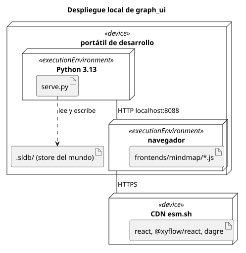
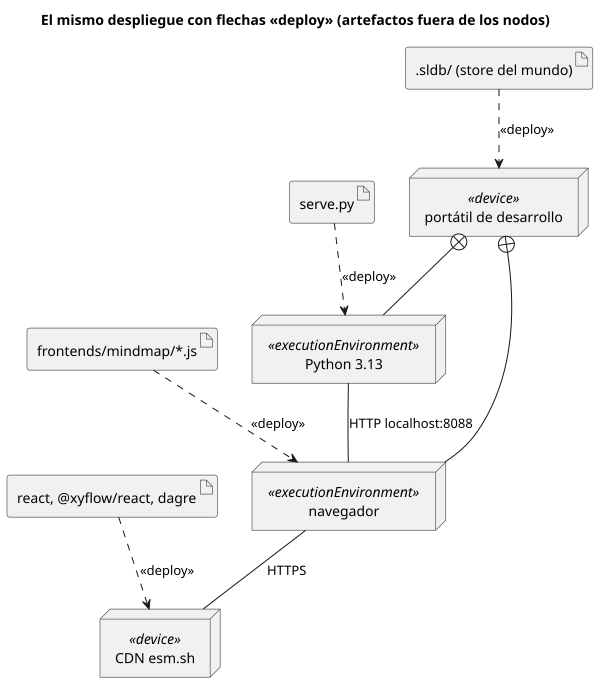

# UML — diagrama de despliegue

Carpeta: [anidamiento](index.md).

## 1. Qué representa

**Dónde corre cada cosa**: qué artefactos (archivos, paquetes, bundles) están desplegados en qué
nodos de ejecución, cómo se anidan esos nodos (un entorno de ejecución dentro de un dispositivo) y por
qué caminos se comunican. Se usa para documentar infraestructura y topología.

## 2. Sintaxis abstracta

UML 2.5.1, §19:

| Constructo | Definición |
|---|---|
| **Node** | §19.4.3: *"A Node is computational resource upon which Artifacts may be deployed, via Deployment relationships, for execution. [...] The internal structure of Nodes can only consist of other Nodes."* |
| **Device** | *"a physical computational resource with processing capability upon which Artifacts may be deployed for execution"* |
| **ExecutionEnvironment** | *"standard software systems that application components may require at execution time"*; *"ExecutionEnvironments can be nested"* |
| **Artifact** | §19.3.3: *"They represent concrete elements in the physical world"* |
| **Deployment** | §19.2.3: *"captures the relationship between a particular conceptual or physical element of a modeled system and the information assets assigned to it"* |
| **CommunicationPath** | §19.4.3: *"an Association between two DeploymentTargets, through which they may exchange Signals and Messages"* |

UML aclara que el despliegue vive en **dos niveles**, como los de
[metamodelado](../../01-fundamentos/metamodelado-mof.md): *"The Deployment relationship between a
DeployedArtifact and a DeploymentTarget can be defined at the 'type' level and at the 'instance'
level."*

## 3. Sintaxis concreta

§19.2.4 y §19.4.4. Otra vez **dos notaciones para el mismo significado**:

| Constructo | Símbolo |
|---|---|
| nodo | *"a perspective view of cube"*; `«device»` o `«executionEnvironment»` como palabra clave |
| artefacto | *"an ordinary Class rectangle with the keyword «artifact»"* o un ícono de documento |
| despliegue, notación A | el artefacto **dentro** del cubo: *"System elements deployed on a DeployedTarget, and Deployments that connect them, may be drawn inside the perspective cube."* |
| despliegue, notación B | flecha punteada `«deploy»`: *"Dashed arrows with the keyword «deploy» show the capability of a Node to support an externally depicted DeployedArtifact. Alternatively, this may be shown by nesting DeployedArtifact graphics inside Node symbols."* |
| nodo anidado | cubo dentro de cubo |
| camino de comunicación | *"the same as normal Association links"* (línea sólida) |

## 4. Reglas de conexión

- La estructura interna de un nodo solo contiene nodos (un artefacto se despliega, no se anida como
  estructura).
- Un artefacto puede desplegarse en varios nodos (instancias distintas).
- Un camino de comunicación une nodos y no tiene dirección.

## 5. Ejemplo en notación estándar

El despliegue local de `graph_ui`: `serve.py` corre en Python dentro del portátil, el frontend en el
navegador del mismo portátil, el store vive en el disco, y las bibliotecas vienen de un CDN.

**Notación A (anidamiento)**, [`uml-despliegue.assets/graph-ui-local.puml`](uml-despliegue.assets/graph-ui-local.puml),
renderizado con PlantUML (`smetana`, por las aristas que cruzan bordes; ver
[paquetes UML](uml-paquetes.md)):

```plantuml
node "portátil de desarrollo" <<device>> {
  node "Python 3.13" <<executionEnvironment>> as py {
    artifact "serve.py" as serve
  }
  node "navegador" <<executionEnvironment>> as nav {
    artifact "frontends/mindmap/*.js" as front
  }
  artifact ".sldb/ (store del mundo)" as store
}
node "CDN esm.sh" <<device>> as cdn {
  artifact "react, @xyflow/react, dagre" as libs
}

py -- nav : HTTP localhost:8088
nav -- cdn : HTTPS
serve ..> store : lee y escribe
```



**Notación B (flechas `«deploy»`)**, [`uml-despliegue.assets/graph-ui-local-deploy.puml`](uml-despliegue.assets/graph-ui-local-deploy.puml):
los mismos hechos, con los artefactos afuera y la anidación de nodos como `+--`.



## 6. El mismo ejemplo como mundo `pron`

Opción B, nivel de instancias. Archivo
[`uml-despliegue.assets/graph-ui-local.mundo.yaml`](uml-despliegue.assets/graph-ui-local.mundo.yaml):
modelos `DeployNode` (con `kind`) y `Artifact`; verbos `nested_in` (`many_to_one`), `deployed_on`
(`many_to_many`) y `communicates_with` con **`direction: undirected`** (`kgdb` materializa la arista
en los dos sentidos).

```yaml
  - {name: communicates_with, cardinality: many_to_many, direction: undirected, source_types: [DeployNode], target_types: [DeployNode],
     description: "Camino de comunicación entre dos nodos (UML CommunicationPath). Protocolo en notes."}
```

Montaje: `graph: 104 nodes, 107 edges, 14 relation types`; `pron check` → `ok`; `comandos con error: 0`.

| Control negativo | Regla | `pron refresh` |
|---|---|---|
| `Artifact:serve-py nested_in DeployNode:python` | la estructura interna de un nodo solo contiene nodos | rechazada: `source class 'Artifact' not in source_types ['DeployNode']` |
| `navegador communicates_with python` (ya existe `python communicates_with navegador`) | un camino no dirigido no se duplica | **aceptada**; el grafo pasa de 107 a 109 aristas |

La primera regla la expresa bien `source_types`. La segunda no: como el id de una `RelationDoc` lleva
origen y destino, el mismo camino no dirigido puede existir como dos documentos, y `kgdb` materializa
las dos direcciones de cada uno.

## 7. Qué tendría que declarar el vocabulario visual

**Para dibujar**

| Constructo | Viene de | Símbolo |
|---|---|---|
| nodo | `DeployNode`; `kind` elige la palabra clave | cubo con `«device»` / `«executionEnvironment»` |
| artefacto | `Artifact` | rectángulo con ícono de documento |
| nodo anidado | `RelationDoc nested_in` | cubo dentro de cubo |
| despliegue | `RelationDoc deployed_on` | **a elección**: dentro del cubo (A) o flecha `«deploy»` (B) |
| camino | `RelationDoc communicates_with` (no dirigida) | línea sin punta; protocolo desde `notes` |

Un mismo artefacto desplegado en dos nodos no puede dibujarse **dentro** de los dos: la notación A
exige elegir (duplicar el símbolo, o caer a la B para ese artefacto). Anidar una relación
`many_to_many` necesita una regla de representación; con `many_to_one` no.

**Para editar**

| Gesto | Operación | Escritura |
|---|---|---|
| soltar un artefacto dentro de un nodo | `deploy(artefacto, nodo)` | 1 `RelationDoc deployed_on` |
| sacar un artefacto de un nodo | `undeploy` | borrar esa `deployed_on` (no las demás del artefacto) |
| soltar un nodo dentro de otro | `move-into` | borrar `nested_in` anterior + crear |
| unir dos nodos | `connect-path` | 1 `communicates_with`; si ya existe en cualquier dirección, no crear |

## 8. Huecos

- **Relaciones no dirigidas duplicables**: `direction: undirected` materializa ambos sentidos, pero
  nada impide dos documentos para el mismo par en sentidos opuestos. El vocabulario (o `pron` al
  afirmar) tendría que normalizar el orden.
- **Anidar una relación `many_to_many`**: la notación de anidamiento asume a lo sumo un contenedor;
  el vocabulario tiene que declarar qué hacer con varios.
- **Protocolo del camino y otros atributos** otra vez en `notes`.
- **Acyclicidad** de `nested_in`: mismo hueco que en [paquetes UML](uml-paquetes.md).

## 9. Fuentes

- OMG, *UML 2.5.1*, §19.2.3–19.2.4 (Deployment), §19.3.3–19.3.4 (Artifact), §19.4.3–19.4.4 (Node,
  Device, ExecutionEnvironment, CommunicationPath): https://www.omg.org/spec/UML/2.5.1/PDF
- PlantUML, *Deployment diagram*: https://plantuml.com/deployment-diagram
- `kgdb`, `src/kgdb/models/relation_type_doc.py` (`direction`) e `ingest/typed.py` (aristas inversas).
