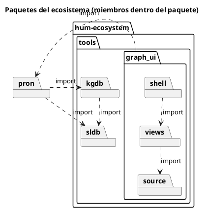
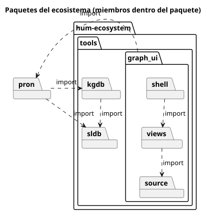
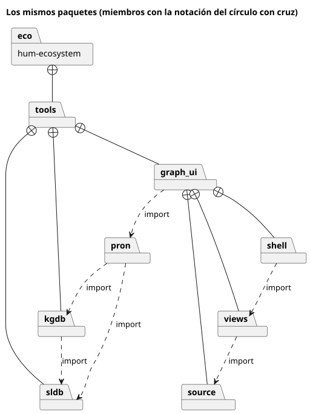

# UML — diagrama de paquetes

Carpeta: [anidamiento](index.md).

## 1. Qué representa

La **organización de un modelo o de un sistema en espacios de nombres**: qué elementos pertenecen a
qué paquete, cómo se anidan los paquetes y qué paquete depende o importa de cuál. Se usa para dar
estructura a modelos grandes y para razonar sobre dependencias entre módulos.

## 2. Sintaxis abstracta

UML 2.5.1, §12.2.3: *"A Package is a namespace for its members, which comprise those elements
associated via packagedElement (which are said to be owned or contained), and those imported."*

| Constructo | Qué significa |
|---|---|
| **Package** | un espacio de nombres que agrupa elementos |
| **packagedElement** (pertenencia) | el elemento es propiedad del paquete; un elemento tiene a lo sumo un paquete dueño |
| **PackageImport** | el paquete importador puede referirse a los elementos públicos del importado por su nombre |
| **Dependency** | un paquete depende de otro |

## 3. Sintaxis concreta

UML ofrece **dos notaciones para la misma pertenencia**, que es exactamente la cuestión de esta
carpeta (§12.2.4): *"A Package is shown as a large rectangle with a small rectangle (a 'tab')
attached to the left side of the top of the large rectangle: collectively this represents a 'folder
icon.' The members of the Package may be shown within the large rectangle. Members may also be shown
by branching lines to member elements, drawn outside the package. A plus sign (+) within a circle is
drawn at the end attached to the Package."*

| Constructo | Símbolo |
|---|---|
| paquete | carpeta (rectángulo con pestaña); el nombre va en la pestaña si muestra miembros |
| pertenencia, notación A | el miembro **dentro** del rectángulo |
| pertenencia, notación B | línea del paquete al miembro con **círculo con cruz** en el extremo del paquete |
| importación | §7.4.4.3: *"a dashed arrow with an open arrowhead from the importing Namespace to the imported Package or Element. The keyword «import» is shown near the dashed arrow if the visibility is public"* |

Canales: en A, **contención** (región espacial); en B, **conexión** con un terminal de forma. Mismo
significado, dos canales.

## 4. Reglas de conexión

- Un elemento pertenece a lo sumo a un paquete (la pertenencia forma un árbol).
- Un paquete no puede contenerse a sí mismo, directa ni indirectamente.
- La importación une paquetes (o un paquete con un elemento).

## 5. Ejemplo en notación estándar

Los paquetes de este ecosistema: `hum-ecosystem` contiene `tools`, que contiene `sldb`, `kgdb` y
`graph_ui`; `graph_ui` contiene `source`, `views` y `shell`; `pron` queda afuera. Importaciones:
`kgdb` → `sldb`, `pron` → `kgdb` y `sldb`, `graph_ui` → `pron`, `views` → `source`, `shell` → `views`.
Dos archivos con el mismo contenido, renderizados con PlantUML.

**Notación A**, [`uml-paquetes.assets/ecosistema-anidado.puml`](uml-paquetes.assets/ecosistema-anidado.puml):





Detalle del renderizado que importa para el diseño: con el motor por defecto de PlantUML (Graphviz
`dot`) la importación `graph_ui ..> pron` **desapareció del dibujo**: es una arista que sale de un
contenedor con hijos hacia un elemento de afuera, el caso que los layouts por *clusters* manejan mal.
Con el motor ELK la arista aparece pero sale de `source` (un hijo), no de `graph_ui`. Con `smetana`
(`!pragma layout smetana`, el que se usa) sale del paquete correcto. Las aristas que cruzan el borde de
un contenedor son un problema de layout propio de esta carpeta.

**Notación B**, [`uml-paquetes.assets/ecosistema-circulo.puml`](uml-paquetes.assets/ecosistema-circulo.puml)
(la pertenencia como `+--`):

```plantuml
eco +-- tools
tools +-- sldb
tools +-- kgdb
tools +-- graph_ui
graph_ui +-- source
graph_ui +-- views
graph_ui +-- shell
```



## 6. El mismo ejemplo como mundo `pron`

Opción B. Archivo [`uml-paquetes.assets/ecosistema.mundo.yaml`](uml-paquetes.assets/ecosistema.mundo.yaml):
documentos `UmlPackage`; la pertenencia es el verbo `owned_by` (del miembro al paquete,
`many_to_one`) y la importación el verbo `imports`.

```yaml
tipos_de_relacion:
  - {name: owned_by, cardinality: many_to_one, axis: WHERE, source_types: [UmlPackage], target_types: [UmlPackage],
     description: "El origen es miembro (packagedElement) del paquete destino."}
  - {name: imports, cardinality: many_to_many, source_types: [UmlPackage], target_types: [UmlPackage],
     description: "El paquete origen importa los elementos públicos del destino (UML PackageImport)."}
```

Montaje: `graph: 103 nodes, 108 edges, 13 relation types`; `pron check` → `ok`; `comandos con error: 0`.

Controles negativos sobre las reglas de la sección 4:

| Arista inválida | Regla | `pron refresh` (`kgdb`) |
|---|---|---|
| `hum-ecosystem owned_by source` | sin ciclos (`source` ya está dentro de `hum-ecosystem`) | **aceptada** |
| `views owned_by tools` | a lo sumo un dueño | rechazada: `has 2 'owned_by' targets but cardinality is many_to_one` |
| `pron owned_by pron` | un paquete no se contiene a sí mismo | **aceptada** |

`cardinality: many_to_one` garantiza un dueño; nada garantiza que la pertenencia sea un árbol.

## 7. Qué tendría que declarar un `VocabularyDoc`

**Para dibujar**

| Constructo | Viene de | Símbolo |
|---|---|---|
| paquete | documentos `UmlPackage` | carpeta |
| pertenencia | `RelationDoc owned_by` | **a elección de la vista**: anidamiento (A) o línea con círculo con cruz (B) |
| importación | `RelationDoc imports` | flecha punteada abierta con «import» |

Lo nuevo respecto de [nodo-arista](../nodo-arista-tipado/index.md): una relación del mundo tiene que
declarar **cómo se representa** (`como: anidamiento | arista`), y un vocabulario puede ofrecer las dos.
El anidamiento exige además que la relación sea un árbol, que el mundo no garantiza: la vista necesita
una regla para ciclos (romperlos, marcarlos, rechazar el gesto).

**Para editar**

| Gesto | Operación | Escritura |
|---|---|---|
| soltar un paquete dentro de otro (A) | `move-into(miembro, paquete)` | borrar el `owned_by` anterior + crear el nuevo |
| sacar un paquete de su contenedor (A) | `move-out(miembro)` | borrar el `owned_by` |
| arrastrar la línea con círculo con cruz a otro paquete (B) | la misma `move-into` | ídem |
| soltar dentro de un descendiente propio | debería impedirse (crearía un ciclo) | ninguna |

Los gestos A y B son distintos en la pantalla y **la misma operación** en el mundo: evidencia de que
la operación pertenece al vocabulario y el gesto a la notación.

## 8. Huecos

- **Sin acyclicidad**: `kgdb` acepta ciclos de pertenencia y autocontención. El anidamiento (y todo
  árbol) necesita esa garantía; hoy tendría que imponerla el vocabulario en la vista.
- **Contención como metadato de modelo no declarable por CLI**: `graph_ui` ya entiende
  `__containment__` (campos de lista con ids), pero `sldb models create` no lo genera; por eso el
  mundo usa un verbo. Hay dos formas de declarar lo mismo en el ecosistema.
- **Aristas que cruzan el borde de un contenedor**: el oráculo mismo tuvo que cambiar de motor de
  layout para dibujarlas bien. `graph_ui` necesitará un layout de grupos que las soporte.

## 9. Fuentes

- OMG, *UML 2.5.1*, §7.4.4.3 (notación de imports), §12.2.3 (semántica de Package), §12.2.4 (notación):
  https://www.omg.org/spec/UML/2.5.1/PDF
- PlantUML, diagramas de clases y paquetes: https://plantuml.com/class-diagram
- PlantUML, motores de layout: https://plantuml.com/smetana02 (`smetana`) y https://plantuml.com/elk (ELK)
