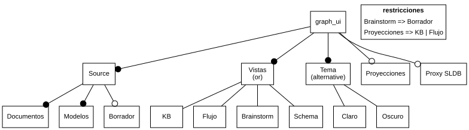

# Feature model

Carpeta: [árbol](index.md).

## 1. Qué representa

**La variabilidad de una familia de productos**: qué características (*features*) puede tener un producto,
cuáles son obligatorias, cuáles se excluyen y cuáles exigen otras. Los introdujo el método FODA (Kang et al.,
SEI, 1990), que define feature como *"prominent or distinctive user-visible aspect, quality, or
characteristic of a software system or system"* (citado en Wikipedia, *Feature model*).

Es el árbol de esta carpeta **con semántica formal**: el diagrama equivale a una fórmula proposicional y cada
producto válido es una asignación que la satisface. Se puede preguntar cuántos productos hay, qué features
nunca pueden elegirse (muertas) o cuáles están en todos (núcleo).

## 2. Sintaxis abstracta

Wikipedia, *Feature model*:

| Constructo | Qué significa |
|---|---|
| **Mandatory** | *"child feature must be selected"* (si la madre lo está) |
| **Optional** | *"child feature can be selected or not selected"* |
| **Or** | *"at least one of the sub-features must be selected"* |
| **Alternative (xor)** | *"exactly one of the sub-features must be selected"* |
| **A requires B** | *"The selection of A in a product implies the selection of B."* |
| **A excludes B** | *"A and B cannot be part of the same product."* |

Lenguajes actuales como UVL (*Universal Variability Language*) permiten restricciones con cualquier fórmula
proposicional (`=>`, `|`, `&`, `!`), no solo `requires` y `excludes`.

## 3. Sintaxis concreta

| Constructo | Símbolo (FODA, FeatureIDE) |
|---|---|
| feature | caja con el nombre |
| mandatory | línea a la madre con **círculo lleno** en la hija |
| optional | línea con **círculo vacío** |
| or | arco **lleno** que une las líneas de las hijas |
| alternative | arco **vacío** |
| restricción | texto aparte, o flecha punteada `requires`/`excludes` |

Canales: conexión (jerarquía), **terminal de línea** (variabilidad), **arco que agrupa líneas** (tipo de
grupo). El arco es un símbolo sobre **varias aristas a la vez**: dibuja una propiedad de la madre, no de una
línea.

## 4. Reglas de conexión

- Árbol con una raíz, que está en todos los productos.
- Una hija elegida implica a su madre.
- Los grupos `or` y `alternative` agrupan **todas** las hijas de una madre (en la forma básica).
- Las restricciones nombran features existentes.
- Buen modelo: sin features muertas, sin opcionales falsas (una optional que igual está siempre).

## 5. Ejemplo en notación estándar

Un modelo de variabilidad **hipotético** de `graph_ui` en UVL: las piezas existen en `frontends/mindmap`
(facetas de `source/`, vistas del registro, `skins/light.css` y `skins/dark.css`, proyecciones, proxy a SLDB);
la configurabilidad no. Archivo [`feature-model.assets/graph-ui.uvl`](feature-model.assets/graph-ui.uvl):

```text
features
    graph_ui
        mandatory
            Source
                mandatory
                    Documentos
                    Modelos
                optional
                    Borrador
            Vistas
                or
                    KB
                    Flujo
                    Brainstorm
                    Schema
            Tema
                alternative
                    Claro
                    Oscuro
        optional
            Proyecciones
            "Proxy SLDB"

constraints
    Brainstorm => Borrador
    Proyecciones => KB | Flujo
```

### Oráculo de semántica

[`analizar-uvl.py`](feature-model.assets/analizar-uvl.py) lee el UVL con **flamapy 2.6.0** (lector UVL +
solucionador SAT):

```
satisfacible: True
configuraciones: 160
núcleo: ['graph_ui', 'Source', 'Documentos', 'Modelos', 'Vistas', 'Tema']
muertas: []
```

Comprobado a mano: 15 subconjuntos no vacíos de vistas × Borrador × Proyecciones × Proxy × 2 temas, con las dos
restricciones, dan 40 × 2 × 2 = **160**.

## 6. El mismo ejemplo como mundo `pron`

Archivo [`feature-model.assets/graph-ui.mundo.yaml`](feature-model.assets/graph-ui.mundo.yaml), generado desde el
UVL por [`mundo-desde-uvl.py`](feature-model.assets/mundo-desde-uvl.py).

| Feature model | Mundo `pron` |
|---|---|
| feature | `Feature` (`name`) |
| jerarquía | verbo `subfeature_of`, `many_to_one` |
| mandatory / optional | campo `variability` **de la hija** |
| tipo de grupo | campo `group` **de la madre** (`and`, `or`, `alternative`) |
| restricción | `Constraint` con `formula` como **texto**, más `mentions` hacia las features que nombra |

Montaje: `graph: 131 nodes, 142 edges, 13 relation types`; `pron check` → `ok`; `comandos con error: 0`.

Dibujado desde el mundo ([`diagrama-desde-mundo.py`](feature-model.assets/diagrama-desde-mundo.py)); Graphviz no
tiene el arco de grupo, así que el tipo va rotulado en la madre:



### La misma semántica desde el mundo

[`enumerar-desde-mundo.py`](feature-model.assets/enumerar-desde-mundo.py) cuenta configuraciones leyendo solo el
mundo (y traduciendo cada `formula` a Python):

```
configuraciones: 160
núcleo: ['Documentos', 'Modelos', 'Source', 'Tema', 'Vistas', 'graph_ui']
muertas: []
```

Coincide con flamapy.

### Qué regla hace cumplir quién

Variante [`graph-ui-muerta.uvl`](feature-model.assets/graph-ui-muerta.uvl) con una restricción más, `Claro =>
Oscuro`, que contradice el `alternative` de `Tema`. flamapy:

```
configuraciones: 80
núcleo: ['graph_ui', 'Source', 'Documentos', 'Modelos', 'Vistas', 'Tema', 'Oscuro']
muertas: ['Claro']
```

Su mundo ([`graph-ui-muerta.mundo.yaml`](feature-model.assets/graph-ui-muerta.mundo.yaml)) monta sano (`graph:
134 nodes, 147 edges`, `pron check` → `ok`), y el enumerador desde el mundo encuentra lo mismo (`80`, `muertas:
['Claro']`). Una feature muerta no es un error de tipos ni de cardinalidad: es una consecuencia lógica del
conjunto, que ningún chequeo por arista puede ver.

## 7. Qué tendría que declarar un `VocabularyDoc`

**Para dibujar**

| Constructo | Viene de | Símbolo |
|---|---|---|
| feature | `Feature` | caja |
| línea a la madre | `subfeature_of` | línea |
| terminal | `variability` **de la hija** | círculo lleno o vacío |
| arco de grupo | `group` **de la madre**, sobre todas sus líneas | arco lleno (`or`) o vacío (`alternative`) |
| restricción | `Constraint.formula` | texto; `requires`/`excludes` simples como flecha punteada |
| estado de análisis | **derivado**: muerta, núcleo, opcional falsa | color o marca |

**Para editar**

| Gesto | Operación | Escritura |
|---|---|---|
| agregar hija | `add-feature(madre)` | 1 `Feature` + `subfeature_of` |
| clic en el terminal | `toggle-variability` | `update` de `variability` de la hija |
| clic en el arco | `set-group(madre, or \| alternative \| and)` | `update` de `group` de la madre |
| escribir una restricción | `add-constraint(fórmula)` | 1 `Constraint` + `mentions` por cada nombre; **validar que los nombres existan** |
| renombrar una feature | `rename` | `update` de `name` **y** reescribir las fórmulas que la nombran |
| cualquier cambio | reanalizar | ninguna; marcar muertas y núcleo |

La fila de renombrar muestra el costo de la fórmula como texto: `mentions` dice **qué** features nombra, pero no
dónde en la fórmula.

## 8. Huecos

- **Restricciones proposicionales**: no hay tipo de dato fórmula; es texto, y `mentions` es un índice paralelo que
  puede divergir del texto.
- **Semántica global** (muertas, núcleo, cantidad de productos): la calcula un solucionador; el sustrato no la
  expresa ni la verifica.
- **Símbolo sobre varias aristas** (el arco de grupo): la vista tiene que dibujar una propiedad de un nodo sobre
  el conjunto de sus aristas salientes.
- **Variabilidad repartida entre hija y madre** (`variability` en la hija, `group` en la madre): una sola cosa
  del diagrama, dos campos en dos documentos.

## 9. Fuentes

- K. C. Kang, S. G. Cohen, J. A. Hess, W. E. Novak, A. S. Peterson, *Feature-Oriented Domain Analysis (FODA)
  Feasibility Study*, CMU/SEI-90-TR-021, 1990 (citado a través de Wikipedia).
- Wikipedia, *Feature model*: https://en.wikipedia.org/wiki/Feature_model
- UVL, *Universal Variability Language* (gramática y parsers): https://github.com/Universal-Variability-Language/uvl-parser
- flamapy 2.6.0 (`flamapy-fm`, `flamapy-sat`): https://github.com/flamapy · https://pypi.org/project/flamapy-fm/
