# Mapa mental

Carpeta: [árbol](index.md). La diferencia con un [mapa conceptual](../nodo-arista-tipado/mapa-conceptual.md) es
exactamente la de esta carpeta: el conceptual rotula relaciones arbitrarias; el mental solo tiene "hijo de".

## 1. Qué representa

**Un tema y sus ramificaciones**. Wikipedia (*Mind map*): *"A mind map is a diagram used to visually organize
information into a hierarchy, showing relationships among pieces of the whole."* Y frente al mapa conceptual:
*"mind maps are based on a radial hierarchy (tree structure) denoting relationships with a central concept"*.
El término lo popularizó Tony Buzan con la serie *Use Your Head* (BBC, 1974).

Es el vocabulario **con menos semántica** del manual, y por eso el más útil para una pregunta de `graph_ui`:
qué significa una vista que **no muestra el tipo** de lo que dibuja.

## 2. Sintaxis abstracta

| Constructo | Qué significa |
|---|---|
| **tema central** | la raíz |
| **rama** | un hijo de un nodo; los hijos directos de la raíz son las ideas principales |
| **jerarquía** | cada nodo, salvo la raíz, tiene un padre |

No hay tipos de nodo ni de relación. Lo que un mapa mental calla no es que no existan: es que no los dibuja.

## 3. Sintaxis concreta

| Constructo | Símbolo |
|---|---|
| tema central | forma destacada en el centro |
| rama | texto sobre o dentro de una forma, unido al padre por una línea |
| rama principal | color propio que heredan sus descendientes |
| profundidad | distancia al centro |

Canales: **posición radial** (profundidad), **color por rama** (a qué idea principal pertenece), conexión. El
color no codifica clase: codifica **ascendencia**.

## 4. Reglas de conexión

- Un solo padre por nodo.
- Una sola raíz.
- Sin ciclos.

## 5. Ejemplo en notación estándar

La estructura de **este manual** como mapa mental de Mermaid. La sintaxis de Mermaid (`mindmap.md` del
repositorio oficial): *"The syntax for creating Mindmaps is simple and relies on indentation for setting the
levels in the hierarchy."* [`mind-map.assets/manual.mmd`](mind-map.assets/manual.mmd), generado desde el mundo
de la sección 6 (estado al escribir este documento), extracto:

```text
mindmap
  root((Representación semántica — manual))
    Eje 1 — Fundamentos
      Lentes bidireccionales: editar la vista y actualizar el dato
      Metamodelado: capas MOF, instanciación lingüística y ontológica
      Physics of Notations: cómo evaluar una notación
      Proyectar vs representar
      Sintaxis abstracta, sintaxis concreta y semántica
      Variables visuales: con qué se dibuja el significado
    Eje 2 — Prior art
      ...
```

Renderizado con `mmdc` 11.12.0:



## 6. El mismo ejemplo como mundo `pron`

Archivo [`mind-map.assets/manual.mundo.yaml`](mind-map.assets/manual.mundo.yaml), generado desde los archivos
del manual por [`mundo-desde-manual.py`](mind-map.assets/mundo-desde-manual.py). **El mundo sí tiene tipos**:

| Nivel | Modelo | Verbo hacia el padre |
|---|---|---|
| raíz | `Manual` | — |
| eje | `Axis` | `axis_of` → `Manual` |
| carpeta del eje 3 | `Folder` | `folder_of` → `Axis` |
| documento de los ejes 1 y 2 | `Document` | `chapter_of` → `Axis` |
| documento de una carpeta | `Document` | `example_of` → `Folder` |

Cuatro verbos, todos `many_to_one`. Montaje: `graph: 231 nodes, 273 edges, 15 relation types`; `pron check` →
`ok`; `comandos con error: 0`.

[`mapa-desde-mundo.py`](mind-map.assets/mapa-desde-mundo.py) recibe **qué verbos forman la jerarquía** y dibuja
la unión sin mostrar ni los modelos ni los verbos. Es la lectura del mapa mental que la dirección de producto de
`graph_ui` pide para Brainstorm: el mismo contenido tipado que la vista KB, **sin representar el tipo**; una
proyección con pérdida, no datos sin tipo.

### El hijo que se crea con Tab

En un mapa mental, Tab crea un hijo del nodo seleccionado. En un mundo tipado ese hijo necesita una clase y un
verbo. [`hijo-por-defecto.py`](mind-map.assets/hijo-por-defecto.py) los calcula desde los verbos de jerarquía:

```
Manual: Axis por axis_of → sin ambigüedad
Axis: Folder por folder_of, Document por chapter_of → AMBIGUO: el vocabulario debe elegir
Folder: Document por example_of → sin ambigüedad
Document: — → hoja (Tab no aplica)
```

Donde hay una sola opción, el gesto puede ocultar el tipo por completo. Donde hay dos, alguien tiene que
elegir: o el vocabulario declara un hijo por defecto por clase de padre, o el gesto pregunta (y deja de ser un
mapa mental puro).

### Qué regla hace cumplir quién

```
$ python3 verificar-arbol.py manual.mundo.yaml axis_of folder_of chapter_of example_of
49 nodos, 0 problema(s)
```

Variante [`manual-dos-padres.mundo.yaml`](mind-map.assets/manual-dos-padres.mundo.yaml): el documento de IBIS es
además `chapter_of` del eje 1. Cada verbo sigue siendo `many_to_one`, así que monta sano (`graph: 231 nodes, 274
edges`, `pron check` → `ok`):

```
DOS PADRES: Document:03-diagrama-vocabulario--n-aria--argument-maps-ibis -> example_of Folder:03-diagrama-vocabulario--n-aria, chapter_of Axis:01-fundamentos
49 nodos, 1 problema(s)
```

Y el generador del mapa mental, que recorre de la raíz a las hojas, **dibuja el documento dos veces** (líneas 4 y
49 del `.mmd`) sin avisar. Un árbol dibujado sobre un grafo que no es árbol duplica en silencio.

### La vista Brainstorm hoy

`frontends/mindmap/source/draft.js`: *"Brainstorm draft facet: owns the localStorage-backed idea tree and the
plan+compile conversion into real SLDB documents."* Las ideas (`parentId`, `className`) viven en `localStorage` y
se **convierten** a documentos. Es un segundo lugar para los datos, no un mapa mental del mundo.

## 7. Qué tendría que declarar el vocabulario visual

**Aplicabilidad**: al menos un verbo de jerarquía `many_to_one`, y que su unión forme un árbol.

**Para dibujar**

| Constructo | Viene de | Símbolo |
|---|---|---|
| raíz | el nodo sin padre en la unión de verbos (o uno elegido) | forma central |
| rama | **unión** de los verbos de jerarquía declarados | línea al padre |
| color | la rama principal de la que desciende | color heredado |
| tipo | **nada** (declarado como oculto) | — |

**Para editar**

| Gesto | Operación | Escritura |
|---|---|---|
| Tab sobre un nodo | `add-child(padre)` | 1 documento de la clase por defecto para esa clase de padre + 1 `RelationDoc` con el verbo correspondiente |
| Enter sobre un nodo | `add-sibling` | ídem con el padre del nodo |
| editar el texto | `rename` | `update` del campo de título declarado |
| arrastrar a otro padre | `reparent(nodo, padre)` | borrar la arista de jerarquía actual + crear la nueva; **el verbo puede cambiar** (de `chapter_of` a `example_of`) y **la clase del nuevo padre puede no admitir al nodo** |
| borrar una rama | `delete-subtree` | untrack de todos los descendientes y sus aristas |

`reparent` muestra el costo de ocultar el tipo: arrastrar un `Document` desde un eje a una carpeta es un gesto
trivial en el mapa y un cambio de verbo en el mundo; arrastrar una `Folder` bajo otra `Folder` es el mismo gesto
y **no tiene verbo**. La vista tiene que prohibirlo aunque no muestre por qué.

## 8. Huecos

- **Árbol sobre varios verbos**: cada verbo `many_to_one` no impide dos padres en la unión, ni ciclos, ni varias
  raíces.
- **Hijo por defecto por clase de padre**: no hay dónde declararlo; es el punto abierto para que Brainstorm cree
  sin mostrar el tipo.
- **Brainstorm guarda un borrador aparte** en `localStorage` y lo convierte, en vez de proyectar el mundo.
- **Dibujar un árbol sobre un grafo que no lo es duplica nodos en silencio.**

## 9. Fuentes

- Wikipedia, *Mind map*: https://en.wikipedia.org/wiki/Mind_map
- Mermaid, *Mindmap* (fuente en el repositorio oficial):
  https://github.com/mermaid-js/mermaid/blob/develop/packages/mermaid/src/docs/syntax/mindmap.md
- `graph_ui`: `frontends/mindmap/source/draft.js`, `views/draft/tree/tree-view.js`.
