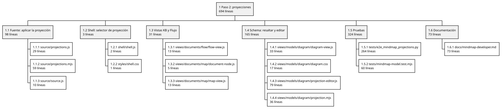

# Work Breakdown Structure (WBS)

Carpeta: [árbol](index.md). El mismo trabajo en el tiempo está en [Gantt](../posicion/gantt.md); el mismo
"tamaño como suma de las partes", dibujado como área, en [treemap](../anidamiento/treemap.md).

## 1. Qué representa

**Todo el trabajo de un proyecto, descompuesto en entregables** hasta llegar a paquetes que se pueden estimar y
asignar. Wikipedia (*Work breakdown structure*): *"WBS is a hierarchical and incremental decomposition of the
project into deliverables (from major ones such as phases to the smallest ones, sometimes known as work
packages). It is a tree structure, which shows a subdivision of effort required to achieve an objective"*.

Frente al [mapa mental](mind-map.md), la WBS es un árbol **con aritmética**: lo que hay en una madre es
exactamente lo que hay en sus hijas.

## 2. Sintaxis abstracta

| Constructo | Qué significa |
|---|---|
| **entregable** | un resultado del proyecto; se descompone en otros |
| **paquete de trabajo** | PMI, citado en Wikipedia: *"lowest level of the work breakdown structure for which cost and duration are estimated and managed."* |
| **código WBS** | `1`, `1.2`, `1.2.3`: la posición en la jerarquía, usada como identificador |
| **regla del 100 %** | *"the sum of the work at the 'child' level must equal 100% of the work represented by the 'parent'"* |
| **exclusión mutua** | *"there must be no overlap in scope definition between different elements of a work breakdown structure"* |

## 3. Sintaxis concreta

| Constructo | Símbolo |
|---|---|
| elemento | caja con código y nombre, a veces con costo o esfuerzo |
| jerarquía | organigrama (de arriba hacia abajo) o esquema indentado |
| paquete de trabajo | caja hoja, a veces con otro estilo |

Canales: posición vertical (nivel), conexión (madre), **texto con número** (código, esfuerzo). El código repite
en texto lo que ya dice la posición.

## 4. Reglas de conexión

- Árbol: un solo padre por elemento, una raíz (el proyecto).
- Regla del 100 % en todos los niveles.
- Los códigos son únicos y el de una hija extiende el de su madre.
- Las hojas son paquetes de trabajo.

## 5. Ejemplo en notación estándar

La WBS **del trabajo ya hecho** en el paso 2 de `graph_ui` (proyecciones, commits `be1d695` y `363fe9b`): un
paquete por archivo tocado, con el esfuerzo medido como líneas agregadas más borradas según `git show
--numstat`, agrupados en seis entregables. [`mundo-desde-git.py`](wbs.assets/mundo-desde-git.py) genera el
mundo; [`plantuml-desde-mundo.py`](wbs.assets/plantuml-desde-mundo.py) lo escribe con la sintaxis `@startwbs` de
PlantUML ([`paso-2.puml`](wbs.assets/paso-2.puml)), extracto:

```plantuml
@startwbs
* 1 Paso 2: proyecciones\n694 líneas
** 1.1 Fuente: aplicar la proyección\n98 líneas
*** 1.1.1 source/projections.js\n29 líneas <<paquete>>
*** 1.1.2 source/projections.mjs\n59 líneas <<paquete>>
*** 1.1.3 source/source.js\n10 líneas <<paquete>>
...
** 1.5 Pruebas\n324 líneas
*** 1.5.1 tests/e2e_mindmap_projections.py\n264 líneas <<paquete>>
*** 1.5.2 tests/mindmap-model.test.mjs\n60 líneas <<paquete>>
@endwbs
```



La mitad del esfuerzo del paso fue la prueba E2E (264 de 694 líneas).

## 6. El mismo ejemplo como mundo `pron`

Archivo [`wbs.assets/paso-2.mundo.yaml`](wbs.assets/paso-2.mundo.yaml).

| WBS | Mundo `pron` |
|---|---|
| elemento | `WorkItem` (`code`, `name`, `kind`, `effort`) |
| jerarquía | verbo `part_of`, `many_to_one` |
| paquete de trabajo | `kind: work_package` |
| esfuerzo de un entregable | **guardado** en `effort`, como hacen las herramientas que almacenan totales |

Montaje: `graph: 144 nodes, 156 edges, 12 relation types`; `pron check` → `ok`; `comandos con error: 0`.

### Qué regla hace cumplir quién

[`verificar-wbs.py`](wbs.assets/verificar-wbs.py) sobre el mundo generado: `22 elementos, 0 problema(s)`.

Variante [`paso-2-inconsistente.mundo.yaml`](wbs.assets/paso-2-inconsistente.mundo.yaml): el total de `1.4` quedó
desactualizado (150) y el segundo paquete de `1.5` repite el código `1.5.1`. Monta sano (`graph: 144 nodes, 156
edges`, `pron check` → `ok`):

```
REGLA DEL 100 %: 1 dice 694 y sus hijos suman 679
REGLA DEL 100 %: 1.4 dice 150 y sus hijos suman 165
CÓDIGO REPETIDO: 1.5.1 en WorkItem:w-1-5-1 y WorkItem:w-1-5-2
22 elementos, 3 problema(s)
```

Un solo total desactualizado rompe la regla **en dos niveles**: `1.4` ya no suma sus hojas, y la raíz, que no se
tocó, ya no suma sus entregables. Guardar un valor derivado obliga a propagar cada edición hacia arriba; no
guardarlo obliga a calcularlo en cada lectura. El sustrato no hace ninguna de las dos (mismo hueco que el
[treemap](../anidamiento/treemap.md) y el inicio derivado del [Gantt](../posicion/gantt.md)).

El código tiene el mismo problema en otra forma: es **la posición escrita como dato**. Si se arrastra `1.5.2`
bajo `1.6`, el código tiene que pasar a `1.6.2` y los hermanos que quedan pueden necesitar renumerarse (el
reordenamiento con enteros de [secuencia UML](../posicion/uml-secuencia.md)).

## 7. Qué tendría que declarar el vocabulario visual

**Para dibujar**

| Constructo | Viene de | Símbolo |
|---|---|---|
| elemento | `WorkItem` | caja |
| jerarquía | `part_of` | organigrama |
| código | **derivado** de la posición, o `code` si se guarda | texto |
| esfuerzo de un entregable | **derivado**: suma de las hojas, o `effort` si se guarda (y marcado si no coincide) | texto |
| paquete de trabajo | hoja, o `kind` | estilo de caja |

**Para editar**

| Gesto | Operación | Escritura |
|---|---|---|
| agregar un paquete bajo un entregable | `add-package(madre)` | 1 `WorkItem` + `part_of`; código siguiente; **propagar** el esfuerzo hacia arriba si se guarda |
| cambiar el esfuerzo de una hoja | `set-effort` | `update` de la hoja **y** de todos sus ancestros si los totales se guardan |
| mover una rama | `reparent` | borrar + crear `part_of`; renumerar códigos de la rama y de los hermanos; propagar totales en las dos ramas |
| dividir un paquete en dos | `split(paquete)` | el paquete pasa a entregable + 2 hojas cuyos esfuerzos suman el original |

`split` es la operación que la regla del 100 % hace natural: la escritura tiene que preservar la suma.

## 8. Huecos

- **Valores derivados** (total de un entregable, código por posición): ni se calculan ni se protegen; guardados,
  un cambio los deja inconsistentes en varios niveles.
- **Unicidad de un campo** (`code`): no declarable.
- **Operaciones que preservan un invariante** (`split` conserva la suma, `reparent` renumera): compuestas y sin
  unidad.

## 9. Fuentes

- Wikipedia, *Work breakdown structure* (definición, regla del 100 %, exclusión mutua, paquete de trabajo):
  https://en.wikipedia.org/wiki/Work_breakdown_structure
- PMI, *Practice Standard for Work Breakdown Structures* (citado a través de Wikipedia).
- PlantUML, *WBS diagram*: https://plantuml.com/wbs-diagram
- `git show --numstat be1d695 363fe9b` del repositorio `graph_ui`.
