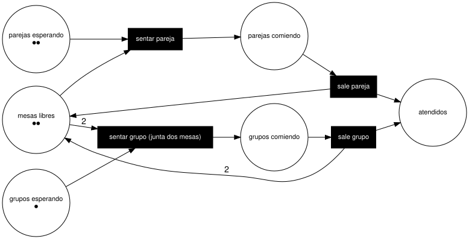

# Redes de Petri

Carpeta: [estado y grafos bipartitos](index.md).

## 1. Qué representa

**Concurrencia y recursos**: varias cosas que pueden pasar a la vez, compitiendo por lo que hay. Las
propuso Carl Adam Petri (1962) y se usan para analizar procesos, protocolos y sistemas distribuidos:
¿se puede trabar?, ¿se agota un recurso?, ¿se conserva algo?

Wikipedia (*Petri net*) lo resume: *"A Petri net consists of places, transitions, and arcs. Arcs run from
a place to a transition or vice versa, never between places or between transitions."* Es el caso puro de
esta carpeta: **la gramática de conexión es la definición**.

Frente a un [statechart](statecharts.md): allá una instancia está en **un** estado; acá el estado es un
**marcado**, una cantidad de marcas por lugar, y muchas transiciones pueden estar habilitadas a la vez.

## 2. Sintaxis abstracta

Red lugar/transición (P/T), en la formulación habitual (misma página):

| Constructo | Qué significa |
|---|---|
| **lugar** (*place*) | una condición o un depósito de recursos |
| **transición** | un evento que consume y produce marcas |
| **arco** | de lugar a transición (entrada) o de transición a lugar (salida), con **peso** `W(x, y) > 0` |
| **marcado** | *"a mapping M: S → ℕ"*: cuántas marcas tiene cada lugar |
| **habilitación** | *"if and only if ∀s: M(s) ≥ W(s,t)"* |
| **disparo** | *"consumes W(s,t) tokens from each of its input places s, and produces W(t,s) tokens in each of its output places s"*; es atómico |

La ejecución no es determinista: *"when multiple transitions are enabled at the same time, they will
fire in any order."*

## 3. Sintaxis concreta

| Constructo | Símbolo |
|---|---|
| lugar | círculo blanco |
| transición | rectángulo (barra angosta o caja) |
| arco | flecha; el peso como número si es mayor que 1 |
| marca | punto negro dentro del lugar (o un número) |

Canales: **forma** (qué clase de nodo), conexión dirigida, **numerosidad** (puntos) o texto (peso).

## 4. Reglas de conexión

- Un arco une un lugar con una transición o una transición con un lugar; nunca dos del mismo tipo.
- El peso de un arco es un entero positivo.
- El marcado de un lugar es un entero no negativo.
- Entre un lugar y una transición hay a lo más un arco en cada sentido (el peso lo resume).

## 5. Ejemplo en notación estándar

Un restaurante con **dos mesas**, dos parejas y un grupo esperando; el grupo necesita **juntar las dos
mesas** (arcos de peso 2). En PNML (ISO/IEC 15909-2, gramática `ptnet` 2009),
[`petri.assets/mesas.pnml`](petri.assets/mesas.pnml), extracto:

```xml
<place id="mesas-libres"><name><text>mesas libres</text></name><initialMarking><text>2</text></initialMarking></place>
<place id="grupo-espera"><name><text>grupos esperando</text></name><initialMarking><text>1</text></initialMarking></place>
<transition id="sentar-grupo"><name><text>sentar grupo (junta dos mesas)</text></name></transition>
<arc id="a4" source="grupo-espera" target="sentar-grupo"/>
<arc id="a5" source="mesas-libres" target="sentar-grupo"><inscription><text>2</text></inscription></arc>
<arc id="a11" source="sale-grupo" target="mesas-libres"><inscription><text>2</text></inscription></arc>
```

Validado contra la gramática RELAX NG oficial (`xmllint --relaxng ptnet.pntd` → `validates`). Dos
pruebas contra la misma gramática:

| Variante | Resultado | Por qué |
|---|---|---|
| `initialMarking` = `-1` | `fails to validate` | la gramática declara `nonNegativeInteger` |
| arco de `pareja-espera` a `mesas-libres` (lugar → lugar) | **`validates`** | el arco es `source`/`target` `IDREF`; la regla bipartita queda en un comentario: *"In general, if the source attribute refers to a place, then the target attribute refers to a transition and vice versa."* (`pnmlcoremodel.rng`) |

El formato de intercambio estándar **no hace cumplir** la gramática de conexión que define a la red.

Dibujada desde el mundo de la sección 6 con [`dot-desde-mundo.py`](petri.assets/dot-desde-mundo.py) y
Graphviz (no hay un renderer de PNML instalado):



### Oráculo de ejecución

[`oraculo-snakes.py`](petri.assets/oraculo-snakes.py) construye la red **desde el PNML** con SNAKES
0.9.33 (una biblioteca de redes de Petri en Python) y calcula su grafo de alcanzabilidad:

```python
for arc in page.findall("p:arc", NS):
    weight = arc.find("p:inscription/p:text", NS)
    label = MultiArc([Value(dot)] * int(weight.text)) if weight is not None else Value(dot)
    source, target = arc.get("source"), arc.get("target")
    if net.has_place(source):
        net.add_input(source, target, label)
    else:
        net.add_output(target, source, label)

graph = StateGraph(net)
graph.build()
```

```
lugares: mesas-libres, pareja-espera, grupo-espera, pareja-come, grupo-come, atendidos
(0, 0, 0, 0, 1, 2)
...
(2, 0, 0, 0, 0, 3) MUERTO
...
(2, 2, 1, 0, 0, 0)
15 marcados alcanzables, 1 sin transiciones habilitadas
```

El único marcado muerto es el esperado: todos atendidos y las dos mesas libres. En los 15 se cumple
`mesas-libres + pareja-come + 2·grupo-come = 2` (las mesas se conservan).

## 6. El mismo ejemplo como mundo `pron`

Archivo [`petri.assets/mesas.mundo.yaml`](petri.assets/mesas.mundo.yaml), **generado desde el PNML**.

| Petri | Mundo `pron` |
|---|---|
| lugar | documento `Place` con `tokens: int` (marcado inicial) |
| transición | documento `Transition` |
| arco de entrada | verbo `input_of`, `source_types: [Place]`, `target_types: [Transition]` |
| arco de salida | verbo `output_to`, `source_types: [Transition]`, `target_types: [Place]` |
| peso | `notes: peso=2` (no hay campo) |

```yaml
- name: input_of
  cardinality: many_to_many
  source_types:
  - Place
  target_types:
  - Transition
  description: 'Arco de entrada: el lugar origen entrega marcas a la transición destino al dispararse.'
```

Montaje: `graph: 109 nodes, 113 edges, 13 relation types`; `pron check` → `ok`; `comandos con error: 0`.

**La bipartición sí se hace cumplir**, mejor que en PNML. Controles negativos:

```
- edge sldb://document/Place:pareja-espera -[input_of]-> sldb://document/Place:mesas-libres: target class 'Place' not in target_types ['Transition']
- edge sldb://document/Transition:sentar-pareja -[output_to]-> sldb://document/Transition:sale-pareja: target class 'Transition' not in target_types ['Place']
```

Con dos verbos, uno por sentido, `source_types × target_types` alcanza: es el caso en que el producto de
tipos coincide con la gramática (a diferencia de [ArchiMate](../nodo-arista-tipado/archimate.md)).

### La ejecución desde el mundo

[`simular-desde-mundo.py`](petri.assets/simular-desde-mundo.py) juega las marcas leyendo `tokens`,
`input_of`, `output_to` y el peso desde `notes`. Su salida es **idéntica** a la de SNAKES (`diff` sin
diferencias). Con `--sin-pesos`, que es lo que ve quien lea las aristas del grafo de `pron` (ver abajo):

```
17 marcados alcanzables, 1 sin transiciones habilitadas
```

17 en vez de 15: el grupo se sienta en una sola mesa. El peso **es semántica**, no decoración.

### El peso no tiene dónde vivir

Tres intentos, sobre el mundo montado con `--conservar`:

1. **Campo de la arista**: `RelationDoc` no tiene atributos; queda `notes` (texto libre).
2. **`notes` en el grafo**: la arista materializada en `.pron/graph.nx.json` lleva `origin`,
   `relation_doc`, `condition` y `axis`; `notes` **no llega**.
3. **Dos arcos paralelos** (peso como multiplicidad): una segunda `RelationDoc`
   `input_of--Place:mesas-libres--Transition:sentar-grupo--2` se crea y `pron refresh` informa `114 edges`,
   pero el grafo guardado tiene **113** enlaces y `edges_to(sentar-grupo, input_of)` devuelve una sola
   arista desde `mesas-libres`, la del documento nuevo. El multigrafo usa `key = relation_type`: dos
   `RelationDoc` con los mismos extremos y tipo **se pisan en silencio**. `pron check` → `ok`.

Y el marcado: `sldb docs update mesas-libres '{"label": "mesas libres", "tokens": -3}'` → `Updated 'mesas-libres'`; `pron check` → `ok`. La
gramática PNML lo rechaza; el sustrato no.

### Disparar no es un movimiento declarable

En [statecharts](statecharts.md) disparar es una forma `change` que lleva un campo a un valor fijo (y el
SHRDLU la nombra con un alias de acción).
Disparar `sentar grupo` necesita **restar 1 y 2 y sumar 1**, en tres documentos, atómicamente. Los pasos
de un `compose` hacen `self.kernel.change(tgt, step["field"], step["value"])` con un valor literal
(`src/pron/session.py`): no hay aritmética sobre el valor actual, ni en un alias ni en la
forma `change`. El disparo no se puede declarar como acción del mundo.

## 7. Qué tendría que declarar el vocabulario visual

**Para dibujar**

| Constructo | Viene de | Símbolo |
|---|---|---|
| lugar | `Place` | círculo; `tokens` como puntos (hasta un umbral) o número |
| transición | `Transition` | rectángulo negro |
| arco | `input_of`, `output_to` | flecha; peso como rótulo si > 1 |
| habilitación | derivada: `∀ entrada: tokens ≥ peso` | resaltar la transición |
| marcado actual | `tokens`, o un marcado de simulación que **no** es el inicial | puntos |

La última fila separa dos cosas que el mundo mezcla: el **marcado inicial** (dato del modelo) y el
**marcado de una simulación** (estado de la vista o de una instancia).

**Para editar**

| Gesto | Operación | Escritura |
|---|---|---|
| arrastrar de lugar a transición | `connect-input` | `input_of`; la vista **no ofrece** soltar sobre otro lugar |
| arrastrar de transición a lugar | `connect-output` | `output_to` |
| cambiar el peso | `set-weight(arco, n)` | hoy no hay dónde; `n ≥ 1` |
| agregar o quitar marcas | `set-tokens(lugar, n)` | `update` de `tokens`; `n ≥ 0` |
| clic en una transición habilitada | `fire(t)` | en simulación: nada en el mundo; si es real, un `(move (change lugar tokens n) …)` con las marcas que calcula la vista: la regla de disparo queda fuera del mundo |

El gesto de conectar elige el verbo **por la clase del origen**: el mismo arrastre es `input_of` o
`output_to`. El vocabulario tiene que declarar esa elección.

## 8. Huecos

- **Atributos de arista**: el peso no tiene campo (mismo hueco que las asociaciones de
  [UML de clases](../nodo-arista-tipado/uml-clases.md)); `notes` es texto y no llega al grafo de `pron`.
- **Aristas paralelas se pisan en silencio**: dos `RelationDoc` con mismos extremos y tipo quedan como
  una en `.pron/graph.nx.json` (`key = relation_type`), aunque `refresh` cuente ambas.
- **Rangos**: `tokens = -3` se acepta (como `maturity = 1.7` en [Wardley](../posicion/wardley.md)).
- **Acciones con aritmética y atómicas sobre varios documentos**: disparar no se puede declarar.
- **Marcado inicial vs. marcado de ejecución**: un solo campo para las dos cosas.
- **Invariantes** (`mesas-libres + pareja-come + 2·grupo-come = 2`): no declarables; los calcula una
  herramienta de análisis.
- **PNML no valida la bipartición**; `kgdb` sí. Si `graph_ui` importa PNML, la validación útil es la del
  mundo.

## 9. Fuentes

- Wikipedia, *Petri net* (definiciones, disparo, notación): https://en.wikipedia.org/wiki/Petri_net
- ISO/IEC 15909-2 (PNML); gramáticas RELAX NG oficiales:
  https://www.pnml.org/version-2009/grammar/ptnet.pntd ·
  https://www.pnml.org/version-2009/grammar/pnmlcoremodel.rng ·
  https://www.pnml.org/version-2009/grammar/conventions.rng · sitio de referencia: https://www.pnml.org/
- SNAKES 0.9.33 (`PetriNet`, `MultiArc`, `StateGraph`): https://snakes.ibisc.univ-evry.fr/ ·
  https://pypi.org/project/SNAKES/
- W. Reisig, *Understanding Petri Nets* (Springer, 2013).
- `pron`: `src/pron/graph.py` (`load`, `edges_to`), `src/pron/session.py` (pasos `change` de `compose`).
