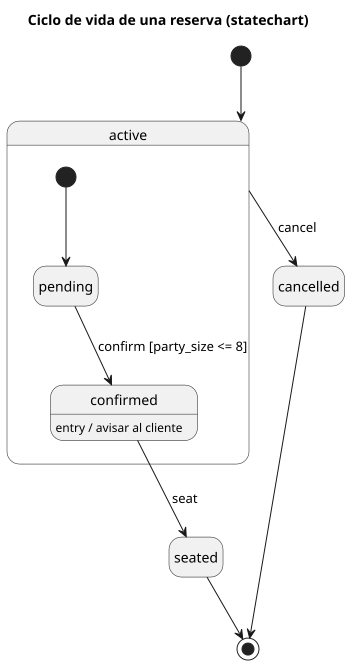
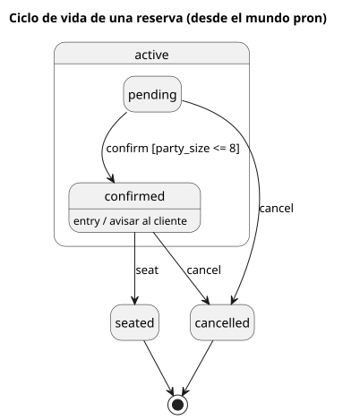

# Statecharts y máquinas de estado UML

Carpeta: [estado y grafos bipartitos](index.md).

## 1. Qué representa

Los **estados posibles de algo y cómo pasa de uno a otro** cuando ocurren eventos. Harel los propuso en
1987 (*Science of Computer Programming* 8): *"We present a broad extension of the conventional formalism
of state machines and state diagrams, that is relevant to the specification and design of complex
discrete-event systems (...) Our diagrams, which we call statecharts, extend conventional
state-transition diagrams with essentially three elements, dealing, respectively, with the notions of
hierarchy, concurrency and communication."* UML los adoptó como *StateMachine* (§14) y el W3C los
estandarizó como XML ejecutable (SCXML, 2015).

Es el vocabulario de esta carpeta con **semántica de ejecución**: el diagrama no solo describe, dice qué
cambios de estado son legales. `pron` ya implementa esa parte para un campo.

## 2. Sintaxis abstracta

UML 2.5.1, §14.2.3:

| Constructo | Qué significa |
|---|---|
| **State** | *"a situation in the execution of a StateMachine Behavior during which some invariant condition holds"* |
| **simple / composite** | *"A simple State has no internal Vertices or Transitions. A composite State contains at least one Region"* |
| **región ortogonal** | un estado compuesto con varias regiones activas a la vez (concurrencia) |
| **Transition** | *"a single directed arc originating from a single source Vertex and terminating on a single target Vertex"*, con disparadores, guarda y efecto |
| **transición de grupo** | §14.2.3.8.2: *"Transitions whose source Vertex is a composite States are called high-level or group Transitions"*; salen de todos sus subestados |
| **entry / exit** | comportamiento al entrar o salir de un estado |
| **Pseudostate** | inicial, historia (`H`, `H*`), elección, unión, bifurcación, terminación… |
| **FinalState** | la región terminó |

SCXML, §3.1 (introducción a la notación), fija el orden de ejecución: *"If a state machine takes transition T from state S1 to state
S2, it first performs the onexit actions in S1, then the actions in T, then the onentry actions in S2."*

## 3. Sintaxis concreta

| Constructo | Símbolo (UML 2.5.1, §14.2.4) |
|---|---|
| estado | *"a rectangle with rounded corners, with the State name shown within"* |
| estado compuesto | el mismo rectángulo con un compartimento que contiene el subdiagrama |
| inicial | *"a small solid filled circle"* |
| final | *"a circle surrounding a small solid filled circle"* |
| historia | *"a small circle containing an 'H'"* (`H*` para profunda) |
| transición | flecha con rótulo `[<trigger> [',' <trigger>]* ['[' <guard> ']'] ['/' <behavior-expression>]]` |

Canales: **contención** (jerarquía), conexión dirigida (transición), **forma** (qué clase de vértice) y
**texto estructurado** en la arista (evento, guarda, efecto).

## 4. Reglas de conexión

- Una transición une exactamente dos vértices; puede ser un bucle.
- Un pseudoestado inicial tiene exactamente una transición saliente, sin evento ni guarda (SCXML, §3.6:
  *"this transition MUST NOT contain 'cond' or 'event' attributes"*).
- Un estado final no tiene transiciones salientes.
- Una transición de grupo aplica a todos los subestados del estado compuesto.
- El estado activo de una región es exactamente uno.

## 5. Ejemplo en notación estándar

El ciclo de vida de una reserva del restaurante de `pron` (`source/spec/09a`), con lo que un statechart
agrega: el estado compuesto `active`, la transición de grupo `cancel`, la guarda de `confirm` y una
acción de entrada. En SCXML, [`statecharts.assets/reserva.scxml`](statecharts.assets/reserva.scxml),
validado contra el esquema del W3C (`xmllint --schema scxml.xsd` → `validates`):

```xml
<scxml xmlns="http://www.w3.org/2005/07/scxml" version="1.0" datamodel="ecmascript" name="Reservation.status" initial="active">
  <datamodel>
    <data id="guest" expr="'Ana'"/>
    <data id="party_size" expr="6"/>
  </datamodel>
  <state id="active" initial="pending">
    <!-- transición de grupo: sale de cualquier subestado de active -->
    <transition event="cancel" target="cancelled"/>
    <state id="pending">
      <transition event="confirm" cond="party_size &lt;= 8" target="confirmed"/>
    </state>
    <state id="confirmed">
      <onentry>
        <log label="avisar al cliente" expr="guest"/>
      </onentry>
      <transition event="seat" target="seated"/>
    </state>
  </state>
  <final id="seated"/>
  <final id="cancelled"/>
</scxml>
```

Dibujado con PlantUML, [`reserva.puml`](statecharts.assets/reserva.puml):



### Oráculo de ejecución

Un statechart dice qué pasa al llegar un evento, así que además del dibujo hay un resultado esperado
**de comportamiento**. La misma máquina en XState v5,
[`reserva.xstate.mjs`](statecharts.assets/reserva.xstate.mjs):

```js
active: {
  initial: 'pending',
  on: { cancel: '#reserva.cancelled' },
  states: {
    pending: {
      on: { confirm: { target: 'confirmed', guard: ({ context }) => context.party_size <= 8 } },
    },
    confirmed: {
      entry: ({ context }) => acciones.push(`avisar al cliente (${context.guest})`),
      on: { seat: '#reserva.seated' },
    },
  },
},
```

Ejecutada con `xstate@5.33.0` sobre dos reservas:

```
Ana confirm: {"active":"pending"} -> {"active":"confirmed"}
Ana confirm: {"active":"confirmed"} -> {"active":"confirmed"} (ignorado)
Ana seat: {"active":"confirmed"} -> "seated"
Ana cancel: "seated" -> "seated" (ignorado)
Bruno confirm: {"active":"pending"} -> {"active":"pending"} (ignorado)
Bruno cancel: {"active":"pending"} -> "cancelled"
acciones: avisar al cliente (Ana)
```

## 6. El mismo ejemplo como mundo `pron`

Archivo [`statecharts.assets/reserva.mundo.yaml`](statecharts.assets/reserva.mundo.yaml). Sigue la
convención que `pron` ya trae (`09a`; `Verbs.machine` y `Verbs.transition` en `src/pron/verbs.py`): un
modelo **llamado `State`** con `machine = "Reservation.status"` y `name`, y el verbo `transitions_to`
con la guarda en `condition`.

| Statechart | Mundo `pron` |
|---|---|
| estado | documento `State` (`machine`, `name`) |
| valor actual | campo `Reservation.status` (el `name` de un `State`) |
| transición + guarda | `transitions_to` con `condition: party_size <= 8`, evaluada sobre la reserva |
| evento | `AnchorDoc` con `ref: action:change Reservation.status=confirmed` |
| estado compuesto | `State` con `kind: composite` + verbo `substate_of` (agregado por el ejemplo) |
| transición de grupo `cancel` | **aplanada**: `pending → cancelled` y `confirmed → cancelled` |
| estado final | `kind: final` (texto) |
| entry | campo `entry` (texto; nadie lo ejecuta) |
| estado inicial | **nada** |

Montaje: `graph: 111 nodes, 110 edges, 13 relation types`; `pron check` → `ok`; `comandos con error: 0`.

### Los mismos eventos, por `pron`

[`disparar-eventos.py`](statecharts.assets/disparar-eventos.py) dice cada evento como oración (`confirm
Ana's reservation`) con `pron say` y lee el estado con `sldb docs show`:

```
Ana confirm: pending -> confirmed  | pron: Done.
Ana confirm: confirmed -> confirmed  | pron: Could not do that: no transition confirmed → confirmed on Reservation.status
Ana seat: confirmed -> seated  | pron: Done.
Ana cancel: seated -> seated  | pron: Could not do that: no transition seated → cancelled on Reservation.status
Bruno confirm: pending -> pending  | pron: Could not do that: cannot go pending → confirmed: the condition is party_size <= 8
Bruno cancel: pending -> cancelled  | pron: Done.
```

**Los estados finales coinciden con XState en los seis pasos.** Las diferencias:

1. Un evento sin transición: el statechart lo **ignora**; `pron` lo **rechaza** con motivo. Para una
   conversación es mejor; para un vocabulario que simula, es otra semántica.
2. La acción de entrada: XState registró `avisar al cliente (Ana)`; `pron` no ejecuta nada.
3. La transición de grupo existe solo porque se aplanó a mano.

### Qué pasa si se escribe por fuera

Sobre el mismo mundo, `Bruno` ya `cancelled`:

- `pron.Store.replace("Reservation", "reserva-bruno", {..., "status": "seated"})` → `después seated`.
  Es la puerta que usa `graph_ui` para guardar un documento (`frontends/mindmap/sldb_adapter.py`,
  `update_document`): la transición `cancelled → seated`, que no existe, **se acepta**.
- `sldb docs create` de una reserva con `status: "banana"` → creada; `pron refresh` y `pron check` →
  `ok`.

La máquina se hace cumplir **solo en `Kernel.change`**, el camino de las oraciones.

### Lo que el mundo no guarda

[`plantuml-desde-mundo.py`](statecharts.assets/plantuml-desde-mundo.py) dibuja el mundo
([`reserva.desde-mundo.puml`](statecharts.assets/reserva.desde-mundo.puml)):



Comparado con el oráculo: faltan los dos estados iniciales y `cancel` sale dos veces. Un vocabulario
podría **re-agrupar** transiciones iguales desde todos los subestados, pero sería adivinar: el mundo no
distingue "una transición de grupo" de "dos transiciones que coinciden".

Y la función que `pron` expone para "the entry states of a `transitions_to` machine"
(`Graph.roots`, `src/pron/graph.py`) devuelve, sobre este mundo:

```
roots(State, transitions_to): ['...State:state-reservation-active', '...State:state-reservation-cancelled', '...State:state-reservation-seated']
```

los estados **sin salidas** (los finales, y el compuesto): lo contrario de los de entrada.

## 7. Qué tendría que declarar el vocabulario visual

**Para dibujar**

| Constructo | Viene de | Símbolo |
|---|---|---|
| estado | `State` donde `machine = M.f` | rectángulo redondeado |
| compuesto | `substate_of` | contención, subdiagrama dentro |
| inicial | *falta en el mundo* (atributo `initial` por región) | círculo lleno con flecha |
| final | `kind = final` | círculo con círculo lleno |
| transición | `transitions_to` | flecha; rótulo `evento [condition] / efecto` |
| evento | el `AnchorDoc` cuyo `ref` cambia `M.f` al destino | parte del rótulo |
| estado actual de una instancia | `Reservation.status` de la instancia seleccionada | resaltado |

La última fila es la que une el nivel de tipos con el de instancias (ver
[metamodelado](../../01-fundamentos/metamodelado-mof.md)): la misma vista muestra la máquina y **dónde
está** una reserva concreta.

**Para editar**

| Gesto | Operación | Escritura |
|---|---|---|
| unir dos estados | `assert(transitions_to, a, b)` | 1 `RelationDoc`; solo `State → State` |
| rotular la guarda | `set-condition` | `update` de `condition`; ¿se valida como predicado de `sldb`? |
| meter un estado en otro | `nest(s, compuesto)` | `substate_of` (`many_to_one`) |
| **disparar un evento** sobre la instancia resaltada | `fire(evento, instancia)` | `Kernel.change` de `M.f`, que evalúa transición y guarda |
| editar `status` en el inspector | debería ser `fire` | hoy es `Store.replace`, sin validación |

La penúltima fila es un gesto que **no edita el diagrama**, sino el mundo que el diagrama gobierna: el
vocabulario tiene que distinguir editar la máquina de ejecutarla.

## 8. Huecos

- **`graph_ui` guarda campos gobernados por una máquina sin validarlos**: `Store.replace` acepta
  `cancelled → seated`.
- **Estado inicial y pseudoestados**: no hay dónde decir cuál es el estado inicial de una máquina o de un
  compuesto; historia, elección y unión tampoco.
- **Transiciones de grupo**: `Verbs.transition` busca aristas del estado exacto; la jerarquía hay que
  aplanarla y se pierde la intención.
- **Evento ↔ transición**: el evento es un `AnchorDoc` que fija el **valor destino**
  (`action:change M.f=v`). Un mismo evento que lleve a destinos distintos según el estado origen (un
  `next` genérico) no se puede declarar; y el nombre del evento en la arista vive en `notes`, duplicado.
- **Acciones**: `entry`, `exit` y el efecto de una transición no existen en el sustrato.
- **Regiones ortogonales**: un campo tiene un valor; dos regiones activas a la vez serían dos campos y dos
  máquinas sin relación declarada.
- **Convención por nombre**: la máquina se reconoce porque el modelo se llama `State`
  (`self.store.docs_of("State", s)`); un mundo con dos vocabularios de estados comparte ese nombre.
- **`Graph.roots` documentado como estados de entrada** devuelve los que no tienen salida.
- **Valores fuera de la máquina**: `status: "banana"` monta sano.

## 9. Fuentes

- D. Harel, *Statecharts: A visual formalism for complex systems*, Science of Computer Programming 8(3),
  1987, doi:10.1016/0167-6423(87)90035-9 (resumen en el repositorio del Weizmann Institute):
  https://weizmann.elsevierpure.com/en/publications/statecharts-a-visual-formalism-for-complex-systems/
- OMG, *UML 2.5.1*, §14.2.3 (semántica) y §14.2.4 (notación): https://www.omg.org/spec/UML/2.5.1/PDF
- W3C, *State Chart XML (SCXML): State Machine Notation for Control Abstraction*, Recommendation 1
  September 2015, §3.5–3.13; esquema: https://www.w3.org/TR/scxml/ ·
  https://www.w3.org/2011/04/SCXML/scxml.xsd
- XState v5 (`createMachine`, `createActor`, `guard`, `entry`): https://stately.ai/docs/xstate
- `pron` (commit `5a0fc43`): `source/spec/09a-el-mundo-del-restaurante.md`, `src/pron/verbs.py` (`machine`, `transition`),
  `src/pron/kernel.py` (`change`), `src/pron/graph.py` (`roots`), `src/pron/models/anchor.py`.
- `graph_ui`: `frontends/mindmap/sldb_adapter.py` (`update_document`).
