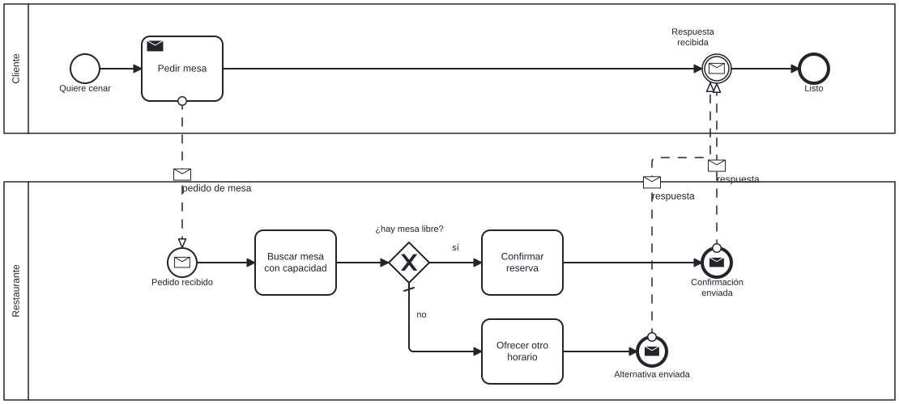

# BPMN 2.0

Carpeta: [flujo](index.md). Los carriles (lanes) están en
[`../posicion/swimlanes.md`](../posicion/swimlanes.md).

## 1. Qué representa

**Procesos de negocio entre participantes**: qué hace cada organización o rol, en qué orden, qué eventos
lo disparan y qué mensajes se mandan entre sí. Es el estándar de la OMG (BPMN 2.0, 2011), pensado para que
lo lean analistas de negocio y lo ejecuten motores de procesos.

Frente a la [actividad UML](uml-actividad.md), BPMN agrega **eventos tipados** (inicio, intermedio, fin;
de mensaje, temporizador…) y separa dos clases de flujo con reglas distintas: el de **secuencia**, dentro
de un participante, y el de **mensaje**, entre participantes.

## 2. Sintaxis abstracta

BPMN 2.0, Tabla 7.1:

| Constructo | Definición |
|---|---|
| **Event** | *"something that 'happens' during the course of a Process (...) There are three types of Events, based on when they affect the flow: Start, Intermediate, and End."* |
| **Activity** (Task, Sub-Process) | *"a generic term for work that company performs"* |
| **Gateway** | *"used to control the divergence and convergence of Sequence Flows (...) it will determine branching, forking, merging, and joining of paths"* |
| **Sequence Flow** | *"used to show the order that Activities will be performed in a Process"* |
| **Message Flow** | *"used to show the flow of Messages between two Participants"* |
| **Pool** | *"the graphical representation of a Participant in a Collaboration"* |

## 3. Sintaxis concreta

| Constructo | Símbolo |
|---|---|
| evento | círculo: borde fino (inicio), doble (intermedio), grueso (fin); marcador interno del disparador |
| tarea | rectángulo redondeado; marcador del tipo (sobre para *send task*) |
| compuerta | rombo; marcador `X` (exclusiva), `+` (paralela), `O` (inclusiva) |
| flujo de secuencia | línea continua con punta llena; la salida por defecto con una barra |
| flujo de mensaje | §9.3: *"a line with an open circle line start and an open arrowhead line end that MUST be drawn with a dashed single line"* |
| pool | rectángulo con el nombre del participante en una franja lateral |

**El layout es parte del estándar**: el mismo archivo XML lleva el modelo y el diagrama (BPMN DI, §12),
con la posición de cada figura y los puntos de cada flecha.

## 4. Reglas de conexión

- §9.2: *"The Sequence Flows can cross the boundaries between Lanes of a Pool (...) but cannot cross the
  boundaries of a Pool."*
- §9.3: *"A Message Flow MUST connect two separate Pools. (...) They MUST NOT connect two objects within
  the same Pool."*
- §10.4.2: *"A Start Event MUST NOT be a target for Sequence Flows"*.
- §10.4.3: *"An End Event MUST NOT be a source for Sequence Flows"* y *"An End Event MUST NOT be the target
  of a Message Flow"*.
- Las compuertas no reciben ni emiten flujos de mensaje (Tabla 7.4).

Las dos primeras dependen de **dónde está** cada extremo, no de qué clase es: una regla de conexión que
depende del contenedor.

## 5. Ejemplo en notación estándar

La reserva de mesa como colaboración: el cliente pide, el restaurante busca mesa, decide y responde con
un mensaje. Modelo en [`bpmn.assets/reserva.semantica.bpmn`](bpmn.assets/reserva.semantica.bpmn), extracto:

```xml
<collaboration id="colaboracion">
  <participant id="pool-cliente" name="Cliente" processRef="proceso-cliente"/>
  <participant id="pool-restaurante" name="Restaurante" processRef="proceso-restaurante"/>
  <messageFlow id="mf-pedido" sourceRef="pedir-mesa" targetRef="pedido-recibido" messageRef="msg-pedido"/>
  ...
</collaboration>
<process id="proceso-restaurante" isExecutable="false">
  <startEvent id="pedido-recibido" name="Pedido recibido">
    <outgoing>sf-r1</outgoing>
    <messageEventDefinition messageRef="msg-pedido"/>
  </startEvent>
  <task id="buscar-mesa" name="Buscar mesa con capacidad">...</task>
  <exclusiveGateway id="hay-mesa" name="¿hay mesa libre?" default="sf-no">...</exclusiveGateway>
  <sequenceFlow id="sf-si" name="sí" sourceRef="hay-mesa" targetRef="confirmar">
    <conditionExpression xsi:type="tFormalExpression">capacity &gt;= party_size</conditionExpression>
  </sequenceFlow>
  ...
</process>
```

[`agregar-di.py`](bpmn.assets/agregar-di.py) le agrega el diagrama con posiciones fijadas a mano
([`reserva.bpmn`](bpmn.assets/reserva.bpmn)). Los dos archivos validan contra el esquema XML oficial de la
OMG (`xmllint --schema BPMN20.xsd` → `validates`).

Renderizado con **bpmn-js 18.28.0** (el modelador de bpmn.io) dentro de Chromium,
[`bpmn-js.py`](bpmn.assets/bpmn-js.py): `advertencias de importación: [] · errores JS: []`.



### Las reglas de un editor real

El mismo script pregunta a las reglas de modelado de bpmn-js (`bpmnRules.canConnect`) qué pasaría al
arrastrar de un elemento a otro:

```
buscar-mesa -> hay-mesa: {"type": "bpmn:SequenceFlow"}
pedir-mesa -> pedido-recibido: {"type": "bpmn:MessageFlow"}
pedir-mesa -> buscar-mesa: {"type": "bpmn:MessageFlow"}
confirmar -> cliente-listo: false
quiere-cenar -> pedir-mesa: {"type": "bpmn:SequenceFlow"}
cliente-listo -> quiere-cenar: false
```

El editor **elige el tipo de flujo según el contexto** (mismo pool: secuencia; pools distintos: mensaje) y
**prohíbe** el gesto cuando ninguno cabe (un mensaje hacia un fin, una secuencia desde un fin). Es la
edición guiada por la gramática que este manual busca para `graph_ui`.

El esquema XML no hace lo mismo: una variante con `<sequenceFlow sourceRef="pedir-mesa"
targetRef="buscar-mesa"/>`, que cruza de un pool a otro, **valida** (`cruza.bpmn validates`): las
referencias son `IDREF`. Igual que con [PNML](../estado-bipartito/petri.md), la regla vive en la
especificación y en los editores, no en el formato.

## 6. El mismo ejemplo como mundo `pron`

Archivo [`bpmn.assets/reserva.mundo.yaml`](bpmn.assets/reserva.mundo.yaml), **generado desde el XML**.

| BPMN | Mundo `pron` |
|---|---|
| participante (pool) | documento `Participant` |
| tarea, evento, compuerta | `Task` (`kind`), `Event` (`position`, `trigger`), `Gateway` (`kind`) |
| pertenencia a un pool | verbo `in_pool` (`many_to_one`) **y** campo `pool` |
| flujo de secuencia | verbo `sequence_flow` con `condition: pool = "{pool}"` |
| flujo de mensaje | verbo `message_flow` (solo `Task`, `Event`) con `condition: pool != "{pool}"` |
| nombre de la salida (`sí`) | `notes` |
| `conditionExpression` | nada (ver huecos) |
| diagrama (BPMN DI) | nada |

La regla de pool se escribe como `condition` porque la `condition` compara un campo del destino con uno
del origen interpolado. Para eso el pool tiene que estar **copiado en un campo**: `in_pool` es una arista, y
la condición no sigue aristas.

Montaje: `graph: 129 nodes, 153 edges, 14 relation types`; `pron check` → `ok`; `comandos con error: 0`.

### Los mismos arrastres, preguntados a `pron`

[`afirmar-flujos.py`](bpmn.assets/afirmar-flujos.py) intenta cada par con los dos verbos por
`Verbs.assert_edge`:

```
Task:buscar-mesa -> Gateway:hay-mesa: sequence_flow: ya existe · message_flow: rechazada (message_flow takes Task, Event as object, not Gateway)
Task:pedir-mesa -> Event:pedido-recibido: sequence_flow: rechazada (condition 'pool = "{pool}"' does not hold for Task:pedir-mesa → Event:pedido-recibido) · message_flow: ya existe
Task:pedir-mesa -> Task:buscar-mesa: sequence_flow: rechazada (condition 'pool = "{pool}"' does not hold for Task:pedir-mesa → Task:buscar-mesa) · message_flow: ACEPTADA
Task:confirmar -> Event:cliente-listo: sequence_flow: rechazada (condition 'pool = "{pool}"' does not hold for Task:confirmar → Event:cliente-listo) · message_flow: ACEPTADA
Event:quiere-cenar -> Task:pedir-mesa: sequence_flow: ya existe · message_flow: rechazada (condition 'pool != "{pool}"' does not hold for Event:quiere-cenar → Task:pedir-mesa)
Event:cliente-listo -> Event:quiere-cenar: sequence_flow: ACEPTADA · message_flow: rechazada (condition 'pool != "{pool}"' does not hold for Event:cliente-listo → Event:quiere-cenar)
```

Comparado con bpmn-js:

| Arrastre | bpmn-js | `pron` | |
|---|---|---|---|
| `buscar-mesa → hay-mesa` | secuencia | secuencia | igual |
| `pedir-mesa → pedido-recibido` | mensaje | mensaje | igual |
| `pedir-mesa → buscar-mesa` | mensaje | mensaje | igual |
| `quiere-cenar → pedir-mesa` | secuencia | secuencia | igual |
| `confirmar → cliente-listo` | **prohibido** | mensaje aceptado | un fin no recibe mensajes |
| `cliente-listo → quiere-cenar` | **prohibido** | secuencia aceptada | un fin no emite secuencia, un inicio no la recibe |

Las reglas de pool **se pueden** declarar en el sustrato (con el campo copiado). Las que dependen de un
**campo de clase** de un extremo, probadas con `Verbs.condition_holds` sobre el mundo montado:

```
pool = "{pool}" and position != "start"  Event:cliente-listo -> Event:quiere-cenar => False
pool = "{pool}" and position != "start"  Event:quiere-cenar -> Task:pedir-mesa     => False   (find 'st.{Task+}' ...)
"{position}" != "end"                    Event:cliente-listo -> Event:quiere-cenar => False
"{position}" != "end"                    Event:quiere-cenar -> Task:pedir-mesa     => False   ('"start" != "end"')
```

- Sobre el **destino** funciona para eventos (rechaza llegar a un inicio), pero **rechaza también un destino
  válido** de otra clase: `Task` no tiene `position`, y el predicado sobre un campo ausente es falso. Un verbo
  que admite varias clases no puede llevar una regla que solo aplica a una.
- Sobre el **origen** no se puede: interpolado, el valor del origen queda como literal a la izquierda y
  `sldb` evalúa `"start" != "end"` como falso.

## 7. Qué tendría que declarar un `VocabularyDoc`

**Para dibujar**

| Constructo | Viene de | Símbolo |
|---|---|---|
| pool | `Participant` | franja con nombre |
| elemento dentro del pool | `in_pool` | contención en la franja |
| evento | `Event`; borde por `position`, marcador por `trigger` | círculo |
| tarea | `Task`; marcador por `kind` | rectángulo redondeado |
| compuerta | `Gateway`; marcador por `kind` | rombo |
| secuencia / mensaje | `sequence_flow` / `message_flow` | continua / punteada con círculo y punta abierta |
| posiciones | **BPMN DI**, si el mundo se importó de un `.bpmn`; si no, layout | — |

**Para editar**

| Gesto | Operación | Escritura |
|---|---|---|
| arrastrar entre dos elementos | `connect(a, b)`: el vocabulario **elige** secuencia o mensaje según el pool de cada extremo, o prohíbe | 1 `RelationDoc` por `pron`, que evalúa la `condition` |
| mover un elemento a otro pool | `move-to-pool` | borrar `in_pool` + crear, `update` de `pool`, y **revalidar sus flujos** (una secuencia pasa a cruzar pools) |
| cambiar el tipo de un evento | `set-trigger` | `update` de `trigger`; cambia el símbolo |
| importar un `.bpmn` | `import` | N documentos + N `RelationDoc`; el DI a la vista |

`move-to-pool` es el gesto delicado: una escritura legal deja **aristas existentes** ilegales. `pron` tiene
`broken_conditions` para avisar después de escribir (`src/pron/verbs.py`); el vocabulario tiene que decidir
si avisa, prohíbe o convierte los flujos.

## 8. Huecos

- **Reglas que dependen del contenedor**: se expresan copiando el pool a un campo; la arista `in_pool` y el
  campo pueden divergir, y nada los mantiene iguales (valor derivado).
- **Reglas por campo de clase** (un fin no emite secuencia, un inicio no la recibe): `cardinality` es por
  verbo; una `condition` sobre un campo que solo tiene una de las clases del destino rechaza a las demás, y
  una comparación entre literales (el valor interpolado del origen) evalúa a falso.
- **Condición de negocio en un flujo** (`capacity >= party_size` en la salida `sí`): la `condition` de una
  `RelationDoc` es una regla de **validez de la arista**, no una expresión de **ejecución**; son dos cosas
  distintas con el mismo nombre.
- **Diagrama como dato del estándar**: BPMN DI trae posiciones que el mundo no guarda; importar y volver a
  exportar pierde el layout salvo que la vista lo conserve.
- **Esquemas XML que no validan la gramática** (BPMN, PNML): la validación real está en editores como
  bpmn-js, y en `pron` cuando se afirma por él.

## 9. Fuentes

- OMG, *Business Process Model and Notation (BPMN) 2.0* (formal/2011-01-03): Tabla 7.1, §7.5.1, §9.2,
  §9.3, §10.4.2, §10.4.3, §12: https://www.omg.org/spec/BPMN/2.0/PDF
- Esquemas XML oficiales: https://www.omg.org/spec/BPMN/20100501/BPMN20.xsd
- bpmn-js 18.28.0 (bpmn.io; `importXML`, `saveSVG`, `bpmnRules.canConnect`): https://github.com/bpmn-io/bpmn-js
- `pron`: `src/pron/verbs.py` (`assert_edge`, `condition_holds`, `broken_conditions`).
