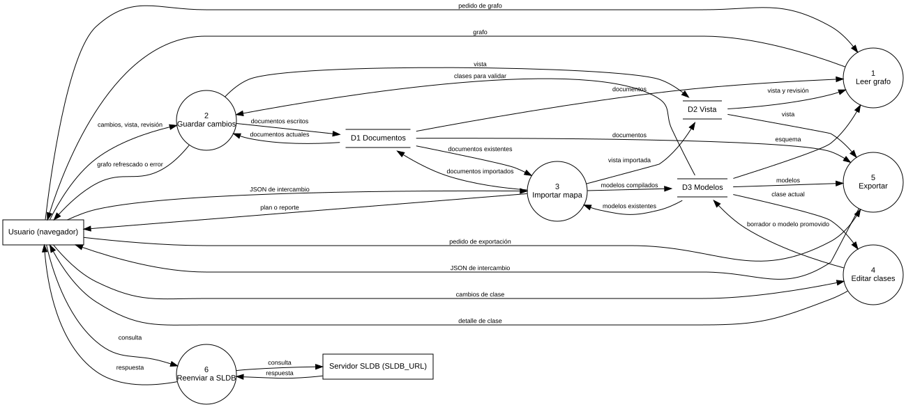
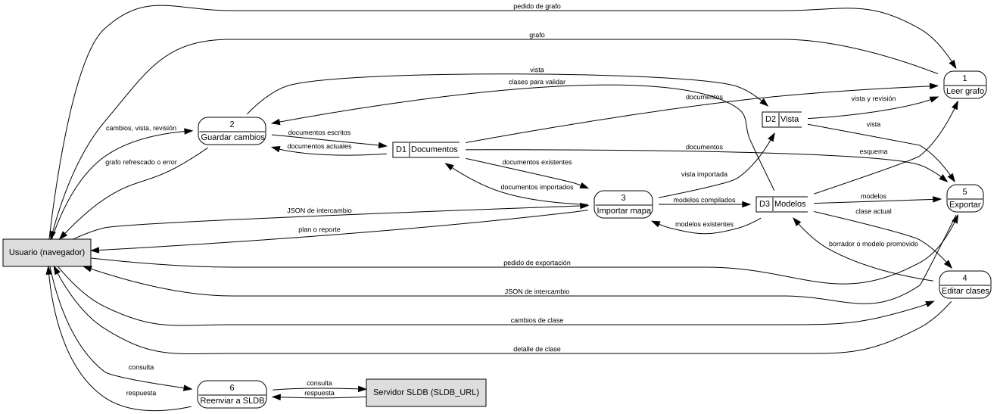

# Diagrama de flujo de datos (DFD)

Carpeta: [flujo](index.md).

## 1. Qué representa

**Por dónde pasan los datos**: qué procesos los transforman, dónde se guardan y quién de fuera los
entrega o los recibe. Viene del análisis estructurado de los años setenta (Constantine, Yourdon, DeMarco,
Gane y Sarson). Wikipedia (*Data-flow diagram*): *"A data-flow diagram has no control flow — there are no
decision rules and no loops."*

Es el vocabulario de esta carpeta **sin control**: el orden no está en las flechas sino en las
dependencias de datos. Frente a la [actividad](uml-actividad.md) y a [BPMN](bpmn.md), aquí no hay inicio,
fin ni compuertas, y la flecha es un **dato con nombre**, no un "después".

## 2. Sintaxis abstracta

Wikipedia, *Data-flow diagram*:

| Constructo | Definición |
|---|---|
| **proceso** | *"part of a system that transforms inputs to outputs"* |
| **flujo de datos** | *"shows the transfer of information (sometimes also material) from one part of the system to another"*; *"The flow should have a name that determines what information (or what material) is being moved."* |
| **almacén** (*data store, warehouse*) | *"used to store data for later use"*; *"The flow from the warehouse usually represents reading (...) and the flow to the warehouse usually expresses data entry or updating"* |
| **terminador** (entidad externa) | *"an external entity that communicates with the system and stands outside of the system"* |
| **nivel** | *"The refined representation of a process can be done in another data-flow diagram, which subdivides this process into sub-processes."* |

## 3. Sintaxis concreta

Hay **varias notaciones para la misma sintaxis abstracta**:

| Constructo | Yourdon / DeMarco | Gane & Sarson |
|---|---|---|
| proceso | círculo (burbuja) con número y nombre | rectángulo redondeado, número en una franja superior |
| almacén | dos líneas horizontales | rectángulo abierto por un lado, con su número en una celda |
| terminador | rectángulo | rectángulo (a menudo sombreado) |
| flujo | flecha con nombre | flecha con nombre |

Canales: forma (clase), conexión dirigida, **texto en la arista** (el dato).

## 4. Reglas de conexión

- *"For each data flow, at least one of the endpoints (source and / or destination) must exist in a
  process."* No hay flujos entre almacenes, entre terminadores, ni entre un terminador y un almacén.
- *"Each process must have its name, inputs and outputs."* Un proceso sin salidas es un "agujero negro";
  uno sin entradas, un "milagro".
- *"Each Data store must have input and output flow."*
- *"Flow should only transmit one type of information"*.
- Entre niveles, los flujos de un proceso y los de su diagrama hijo tienen que coincidir (balance).

## 5. Ejemplo en notación estándar

El DFD de nivel 0 de **`graph_ui` mismo** (`frontends/mindmap`), leído del código: `serve.py` (rutas),
`persistence.py` (`EditorStore.graph`, `save`), `compilation.py` (`plan`, `compile`, `export`),
`models_service.py` (editor de clases), `sldb_adapter.py` (`mindmap-view.json`, `write_view`).

| | Proceso | Implementado en |
|---|---|---|
| 1 | Leer grafo | `GET /api/graph`, `/api/schema` |
| 2 | Guardar cambios | `POST /api/save` |
| 3 | Importar mapa | `POST /api/plan`, `/api/compile` |
| 4 | Editar clases | `POST /api/models/*` |
| 5 | Exportar | `POST /api/export` |
| 6 | Reenviar a SLDB | `GET`/`POST /sldb/*` (proxy a `SLDB_URL`) |

Almacenes: D1 Documentos (Markdown + `.sldb/`), D2 Vista (`.sldb/runtime/mindmap-view.json`), D3 Modelos
(módulos `.py` y borradores `.py.temp`). Terminadores: el navegador y el servidor SLDB externo.

En Yourdon/DeMarco, escrito a mano en Graphviz
([`dfd.assets/graph-ui.demarco.dot`](dfd.assets/graph-ui.demarco.dot)), extracto:

```dot
// procesos: burbujas
"p2" [shape=circle, width=1.2, fixedsize=true, label="2\nGuardar cambios"];
// almacenes: dos líneas horizontales
"d2" [shape=plaintext, label=<<table border="1" sides="TB" cellborder="0" cellpadding="4"><tr><td>D2 Vista</td></tr></table>>];
// flujos de datos
"usuario" -> "p2" [label="cambios, vista, revisión"];
"d1" -> "p2" [label="documentos actuales"];
"p2" -> "d2" [label="vista"];
```



No hay un renderer de DFD instalado (ni PlantUML, ni Mermaid, ni D2 tienen el tipo); el `.dot` escrito a
mano con las formas de la notación hace de oráculo.

## 6. El mismo ejemplo como mundo `pron`

Archivo [`dfd.assets/graph-ui.mundo.yaml`](dfd.assets/graph-ui.mundo.yaml).

| DFD | Mundo `pron` |
|---|---|
| proceso | `Process` (`number`, `name`, `implemented_by`) |
| almacén | `DataStore` (`number`, `name`, `implemented_by`) |
| terminador | `ExternalEntity` |
| flujo hacia un proceso | verbo `feeds`: `[ExternalEntity, DataStore] → [Process]` |
| flujo desde un proceso | verbo `produces`: `[Process] → [Process, DataStore, ExternalEntity]` |
| nombre del flujo (el dato) | `notes` |

**La regla "todo flujo toca un proceso" cabe en dos verbos**: uno que termina en proceso y otro que sale de
uno. Cualquier otra combinación queda fuera de los productos de tipos. Montaje: `graph: 117 nodes, 143
edges, 13 relation types`; `pron check` → `ok`; `comandos con error: 0`. Controles negativos:

```
- edge sldb://document/DataStore:d2 -[feeds]-> sldb://document/DataStore:d1: target class 'DataStore' not in target_types ['Process']
- edge sldb://document/ExternalEntity:usuario -[feeds]-> sldb://document/DataStore:d1: target class 'DataStore' not in target_types ['Process']
```

El precio: el usuario piensa en **un** tipo de flecha y el mundo tiene **dos** verbos. Quien conecta tiene
que elegir el verbo según la clase del origen, como en [Petri](../estado-bipartito/petri.md).

### Otra notación desde el mismo mundo

[`gane-sarson-desde-mundo.py`](dfd.assets/gane-sarson-desde-mundo.py) dibuja el mundo en Gane & Sarson:



Es el caso más directo de **una sintaxis abstracta con dos sintaxis concretas** (ver
[sintaxis abstracta y concreta](../../01-fundamentos/sintaxis-abstracta-y-concreta.md)): mismo mundo, dos
vocabularios de dibujo, y un vocabulario visual por notación o uno con variantes.

### Qué regla hace cumplir quién

[`verificar-dfd.py`](dfd.assets/verificar-dfd.py) revisa las reglas de la sección 4 y compara el mundo
con el `.dot` escrito a mano:

```
$ python3 verificar-dfd.py graph-ui.mundo.yaml graph-ui.demarco.dot
6 procesos, 31 flujos, 0 problema(s)
```

Variante [`graph-ui-agujero-negro.mundo.yaml`](dfd.assets/graph-ui-agujero-negro.mundo.yaml), sin el
flujo `Exportar → Usuario`: monta sano (`graph: 117 nodes, 142 edges`, `pron check` → `ok`), y el
verificador:

```
AGUJERO NEGRO: el proceso p5 no produce nada
6 procesos, 30 flujos, 1 problema(s)
```

Es la participación mínima que falta en `kgdb` (ver [entidad-relación](../nodo-arista-tipado/entidad-relacion.md)),
ahora por clase: "todo `Process` origen de al menos un `produces`".

## 7. Qué tendría que declarar el vocabulario visual

**Aplicabilidad**: el mundo tiene procesos y verbos de flujo de datos. Una vista DFD sobre un mundo sin
eso no se ofrece.

**Para dibujar**

| Constructo | Viene de | Símbolo (por notación) |
|---|---|---|
| proceso | `Process` | burbuja / rectángulo redondeado con número |
| almacén | `DataStore` | dos líneas / rectángulo abierto |
| terminador | `ExternalEntity` | rectángulo |
| flujo | `feeds` **y** `produces`, dibujados igual | flecha con el dato (`notes`) |
| nivel | un proceso con diagrama hijo | vista anidada o navegación |

La fila de flujo muestra algo nuevo: **dos verbos del mundo, un solo constructo del diagrama**. El
vocabulario tiene que poder unir verbos en un constructo, no solo mapear uno a uno.

**Para editar**

| Gesto | Operación | Escritura |
|---|---|---|
| arrastrar hacia un proceso | `connect` → `feeds` | 1 `RelationDoc` |
| arrastrar desde un proceso | `connect` → `produces` | 1 `RelationDoc` |
| arrastrar entre almacenes | prohibido por la vista | ninguna |
| nombrar el flujo | `rename-flow` | `update` de `notes` |
| descomponer un proceso | `explode(p)` | procesos hijos + flujos que **balanceen** los del padre |

## 8. Huecos

- **Un constructo, varios verbos**: el mundo necesita dos verbos para expresar la regla; nada dice que
  `feeds` y `produces` son "el flujo de datos" del vocabulario.
- **El dato del flujo como texto**: el nombre del flujo va en `notes`; en análisis estructurado es una
  entrada del diccionario de datos, es decir una **referencia a un modelo**, y una arista no tiene campos
  que referencien.
- **Participación mínima por clase** (sin agujeros negros ni milagros, almacenes leídos y escritos): no
  declarable.
- **Balance entre niveles**: los flujos de un proceso y los de su diagrama hijo deben coincidir; es una
  restricción derivada entre dos subgrafos (no se incluyó en el ejemplo).
- **Dos notaciones**: nada en el sustrato ni en `graph_ui` separa "qué es" de "cómo se dibuja" más allá de
  la vista actual; aquí son dos scripts.

## 9. Fuentes

- Wikipedia, *Data-flow diagram* (definiciones, notaciones, reglas):
  https://en.wikipedia.org/wiki/Data-flow_diagram
- T. DeMarco, *Structured Analysis and System Specification*, Yourdon Press, 1978 (Prentice-Hall, 1979).
- C. Gane, T. Sarson, *Structured Systems Analysis: Tools and Techniques*, Prentice-Hall, 1979.
- `graph_ui`: `frontends/mindmap/serve.py`, `persistence.py`, `compilation.py`, `compiler.py`,
  `models_service.py`, `sldb_adapter.py`.
