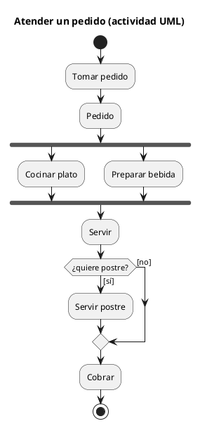
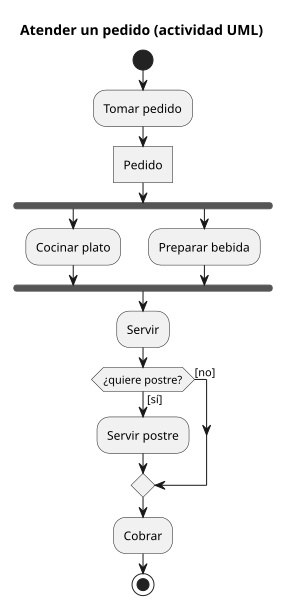
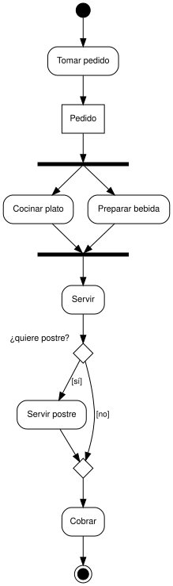
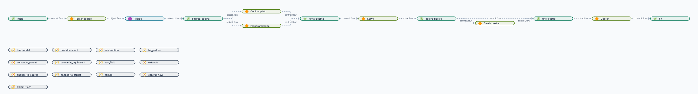

# UML — diagrama de actividad

Carpeta: [flujo](index.md). Las particiones (carriles) de una actividad están en
[`../posicion/swimlanes.md`](../posicion/swimlanes.md).

## 1. Qué representa

**Cómo avanza un comportamiento**: qué pasos se ejecutan, en qué orden, cuáles en paralelo, dónde se
elige un camino y qué objetos pasan de un paso a otro. Se usa para procesos, algoritmos y casos de uso.

La semántica es de **tokens**, como una [red de Petri](../estado-bipartito/petri.md). UML 2.5.1, §15.2.3.1:
*"The effect of one ActivityNode on another is specified by the flow of tokens over the ActivityEdges
between the ActivityNodes. Tokens are not explicitly modeled in an Activity, but are used for describing
the execution of an Activity."*

## 2. Sintaxis abstracta

UML 2.5.1, §15.2 y §15.3:

| Constructo | Qué significa |
|---|---|
| **Action** | un paso que hace algo |
| **ObjectNode** | un lugar por donde pasa un objeto (un token con valor) |
| **ControlFlow** | arista por la que solo pasan tokens de control |
| **ObjectFlow** | arista por la que pasan tokens de objeto |
| **InitialNode** | §15.3.3.1: *"a starting point for executing an Activity"*; *"shall not have any incoming ActivityEdges"* |
| **ActivityFinalNode** | §15.3.3.2: *"stops all flows in an Activity"* |
| **FlowFinalNode** | termina un solo flujo, sin afectar a los demás |
| **ForkNode** | §15.3.3.3: *"splits a flow into multiple concurrent flows. A ForkNode shall have exactly one incoming ActivityEdge"* |
| **JoinNode** | §15.3.3.4: *"synchronizes multiple flows. A JoinNode shall have exactly one outgoing ActivityEdge"* |
| **DecisionNode** | §15.3.3.6: *"chooses between outgoing flows"*; *"each token offered on the primary incoming edge shall traverse at most one outgoing edge"* |
| **MergeNode** | §15.3.3.5: *"brings together multiple flows without synchronization"* |
| **guarda** | condición en una arista de salida de una decisión |

## 3. Sintaxis concreta

UML 2.5.1, §15.3.4:

| Constructo | Símbolo |
|---|---|
| inicial | *"a solid circle"* |
| final de actividad | *"a solid circle within a hollow circle"* |
| final de flujo | *"a circle with an 'X' cross inside it"* |
| fork y join | *"simply a line segment"* (el **mismo** símbolo) |
| decision y merge | *"a diamond-shaped symbol"* (el **mismo** símbolo) |
| acción | rectángulo redondeado |
| nodo de objeto | rectángulo |
| guarda | `[condición]` junto a la arista |

Dos pares de constructos comparten símbolo y se distinguen **por el grado**: §15.3.4.2, *"a ForkNode must
have a single incoming ActivityEdge and usually has two or more outgoing ActivityEdges, while a JoinNode
usually has two or more incoming ActivityEdges and must have a single outgoing ActivityEdge"*. Es una
sobrecarga de símbolo deliberada (ver [Physics of Notations](../../01-fundamentos/physics-of-notations.md)):
la forma no basta, hay que mirar la topología.

## 4. Reglas de conexión

- Inicial sin entradas; final sin salidas.
- Fork: exactamente una entrada. Join y merge: exactamente una salida. Decisión: una entrada primaria.
- Fork, merge y decisión no mezclan flujos de control y de objeto.
- Un nodo de objeto solo participa en flujos de objeto.
- Una decisión se cierra con un merge, no con un join: un join esperaría un token que la decisión nunca
  manda (regla de buena forma, derivada de la semántica de tokens).

## 5. Ejemplo en notación estándar

Atender un pedido en el restaurante: el pedido (objeto) va a la cocina y a la barra en paralelo, se
sirve, y según si quiere postre se sirve o no antes de cobrar. PlantUML,
[`uml-actividad.assets/pedido.puml`](uml-actividad.assets/pedido.puml):





PlantUML no tiene nodos de objeto propios; el estereotipo `<<object>>` los dibuja como rectángulo. Su
decisión es un hexágono con la pregunta dentro, no el rombo de UML.

## 6. El mismo ejemplo como mundo `pron`

Archivo [`uml-actividad.assets/pedido.mundo.yaml`](uml-actividad.assets/pedido.mundo.yaml).

| Actividad | Mundo `pron` |
|---|---|
| acción | documento `Action` |
| nodo de objeto | documento `ObjectNode` |
| nodo de control | documento `ControlNode` con `kind` (`initial`, `fork`, `join`, `decision`, `merge`, `activity_final`…) |
| flujo de control | verbo `control_flow`, `source_types`/`target_types`: `[Action, ControlNode]` |
| flujo de objeto | verbo `object_flow`, entre `Action`, `ObjectNode` y `ControlNode` |
| guarda | `notes: '[sí]'` |

Montaje: `graph: 120 nodes, 132 edges, 13 relation types`; `pron check` → `ok`; `comandos con error: 0`.
Control negativo (`control_flow` desde el nodo de objeto `Pedido`): rechazado, `source class 'ObjectNode'
not in source_types ['Action', 'ControlNode']`.

Dibujado desde el mundo con los símbolos de UML
([`dot-desde-mundo.py`](uml-actividad.assets/dot-desde-mundo.py)): el símbolo sale de `ControlNode.kind`,
no del modelo.



### Qué regla hace cumplir quién

Variante [`pedido-mal-cerrado.mundo.yaml`](uml-actividad.assets/pedido-mal-cerrado.mundo.yaml): la decisión
se cierra con un **join** (`une-postre.kind = join`) y el fork recibe **dos** flujos. Monta sano: `graph:
120 nodes, 133 edges`, `pron check` → `ok`, `comandos con error: 0`.

[`verificar-actividad.py`](uml-actividad.assets/verificar-actividad.py) revisa los grados de §15.3.3 y juega
los tokens (una plaza por arista; decisión y merge eligen, el resto consume y produce todo):

```
$ python3 verificar-actividad.py pedido.mundo.yaml
13 nodos, 15 marcados alcanzables, 0 problema(s)

$ python3 verificar-actividad.py pedido-mal-cerrado.mundo.yaml
GRADO: ControlNode:bifurca-cocina es fork y tiene 2 flujos de entrada (debe ser 1)
TIPO DE FLUJO: ControlNode:bifurca-cocina (fork) mezcla control_flow y object_flow
SE TRABA: queda un marcado sin salida con tokens en quiere-postre->une-postre
SE TRABA: queda un marcado sin salida con tokens en servir-postre->une-postre
13 nodos, 12 marcados alcanzables, 4 problema(s)
```

Las reglas de grado dependen de `kind`, un **campo** del nodo: `cardinality` es por verbo y no puede
decir "si el destino es un fork, una sola entrada".

### La vista Flujo actual sobre este mundo

`graph_ui` levantado sobre el mundo montado (`SLDB_STORE=<mundo>/.sldb python3 serve.py`), vista
`/documents/flow`, sin errores de JavaScript: `26 documentos · 14 relaciones`.



Sobre un mundo que **sí es** un flujo, la vista dibuja el orden correcto de izquierda a derecha (dagre
sigue las aristas). Lo que no puede dibujar:

- **Los nodos de control son iguales entre sí**: `inicio`, `bifurca-cocina`, `quiere-postre`, `fin` son la
  misma píldora del color de `ControlNode`; el símbolo depende de `kind`, y la vista colorea por modelo.
- **Las guardas no aparecen**: el rótulo de la arista es el token del verbo (`control_flow`), no
  `[sí]`/`[no]`.
- **Documentos que no son del flujo**: los 13 `RelationTypeDoc` (`has_model`, `control_flow`,
  `object_flow`…) aparecen como nodos sueltos.
- **Nada distingue flujo de control de flujo de objeto** salvo el rótulo.

Es decir: la vista Flujo no es inútil por dibujar un grafo dirigido, sino por **no saber qué es un paso,
qué es control y qué es una guarda**, y por ofrecerse sobre cualquier mundo.

## 7. Qué tendría que declarar el vocabulario visual

**Aplicabilidad**: el mundo tiene un verbo de secuencia (`control_flow`) entre modelos de paso. Sin eso la
vista no se ofrece.

**Para dibujar**

| Constructo | Viene de | Símbolo |
|---|---|---|
| acción | `Action` | rectángulo redondeado |
| objeto | `ObjectNode` | rectángulo |
| control | `ControlNode`, **símbolo por `kind`** | círculo, diana, barra, rombo |
| flujo | `control_flow` / `object_flow` | flecha; guarda desde `notes` |
| orientación | declarada (arriba-abajo) | layout dirigido por la secuencia |
| qué se oculta | todo lo que no es de los modelos anteriores | — |

**Para editar**

| Gesto | Operación | Escritura |
|---|---|---|
| insertar un paso sobre una flecha | `insert-step(a→b, nuevo)` | 1 `Action` + borrar `a→b` + crear `a→nuevo` y `nuevo→b` |
| bifurcar en paralelo | `add-fork` | 1 `ControlNode(fork)` + 1 `ControlNode(join)` + reenganchar |
| agregar una alternativa | `add-decision` | `decision` + `merge` **emparejados**; guardas en las salidas |
| conectar desde un nodo de objeto | solo ofrece `object_flow` | 1 `RelationDoc` |
| borrar un paso | `remove-step` | borrar el paso y **unir** su entrada con su salida, no dejar el hueco |

Insertar y borrar son operaciones **compuestas**: varias escrituras que deben quedar juntas (una lente
sobre el flujo, no sobre aristas sueltas; ver [lentes](../../01-fundamentos/lentes-bidireccionales.md)).

## 8. Huecos

- **Cardinalidad según la clase del nodo**: fork con una entrada, join con una salida; `cardinality` es por
  verbo. Y el `kind` es un campo, no un modelo.
- **Buena forma del flujo** (decisión cerrada por merge, sin bloqueos): solo con un verificador del
  vocabulario.
- **Guardas como dato**: van en `notes`; `condition` es un predicado de `sldb` sobre el destino, no una
  expresión sobre el token.
- **`graph_ui`, vista Flujo**: sin aplicabilidad, sin símbolo por campo, rótulos por token de verbo,
  documentos de metamodelo mezclados con los del flujo.
- **Operaciones compuestas**: insertar un paso son cuatro escrituras que hoy no tienen una unidad.

## 9. Fuentes

- OMG, *UML 2.5.1*, §15.2.3 (semántica de actividades), §15.3.3 (nodos de control), §15.3.4 (notación):
  https://www.omg.org/spec/UML/2.5.1/PDF
- PlantUML, *Activity diagram (new syntax)*: https://plantuml.com/activity-diagram-beta
- `graph_ui`: `frontends/mindmap/views/documents/flow/flow-view.js`.
