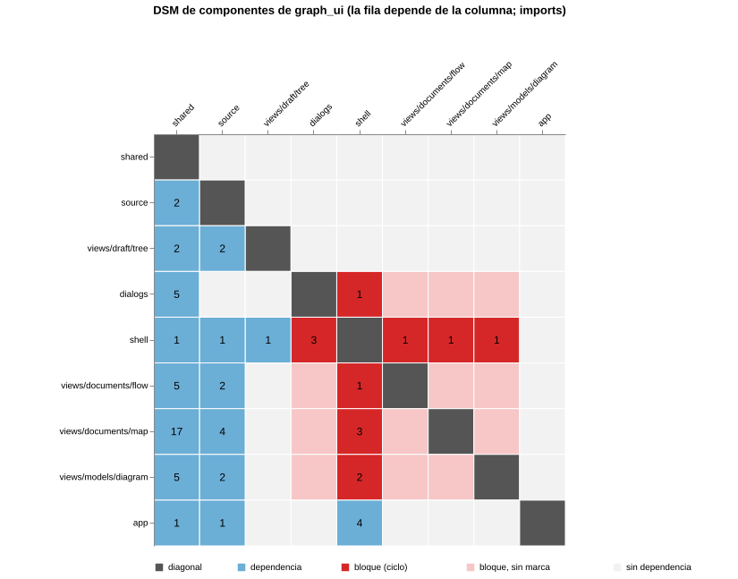
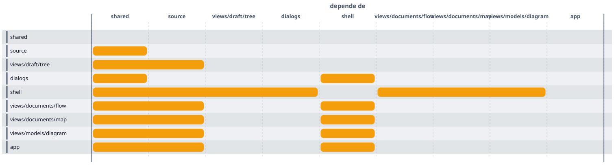

# Design Structure Matrix (DSM)

Carpeta: [matriz](index.md).

## 1. Qué representa

**Las dependencias entre las partes de un mismo sistema**, en una matriz cuadrada. dsmweb.org: *"A DSM is a
square matrix (i.e., it has an equal number of rows and columns) that shows relationships between elements
in a system."* Viene del trabajo de Steward (1981) sobre secuenciar tareas de diseño y se usa en ingeniería
de sistemas, gestión de proyectos y arquitectura de software (NDepend, Lattix).

Es el mismo contenido que un grafo dirigido de dependencias, dibujado de otra forma: *"It provides a simple
and concise way to represent a complex system. It is amenable to powerful analyses, such as clustering (to
facilitate modularity) and sequencing (to minimize cost and schedule risk in processes)."* Lo que en un grafo
denso es una maraña de flechas, en la matriz es un patrón: bloques, huecos, marcas del lado equivocado de la
diagonal.

## 2. Sintaxis abstracta

| Constructo | Qué significa |
|---|---|
| **elemento** | una parte del sistema (componente, tarea, parámetro); aparece como fila **y** como columna |
| **marca** | la celda `(i, j)` dice que hay dependencia entre el elemento i y el j |
| **DSM numérica** | *"a numerical DSM is used"* para dependencias con peso |
| **orden** | la secuencia de filas (y columnas, la misma) |
| **particionamiento** | reordenar para que las dependencias queden de un lado de la diagonal; lo que no se puede, forma **bloques** (ciclos) |
| **clustering** | agrupar elementos muy interdependientes en módulos |

**Convención**: dsmweb.org describe dos, una transpuesta de la otra (*"not all DSMs are written this way;
while the convention of 'row impacts column' prevails in some areas"*). Aquí: **la fila i marca la columna
j si i depende de j**. Con el orden particionado, las marcas debajo de la diagonal son dependencias hacia
elementos anteriores y las de arriba son las que cierran ciclos.

## 3. Sintaxis concreta

| Constructo | Símbolo |
|---|---|
| elemento | rótulo de fila y el mismo rótulo de columna, en el mismo orden |
| diagonal | celdas oscuras (un elemento consigo mismo) |
| marca | celda llena, o con el número si es numérica |
| bloque | recuadro o sombreado del cuadrado que ocupa un ciclo |

Canales: **posición en dos ejes categóricos ordenados** (el par), color o número (la marca), **región**
(bloque). El orden de filas es parte del significado: un mal orden esconde la estructura.

## 4. Reglas de conexión

- Filas y columnas son el mismo conjunto, en el mismo orden.
- La diagonal no lleva marca de dependencia.
- Particionar no cambia el contenido, solo el orden; los bloques son los componentes fuertemente conexos del
  grafo de dependencias.

## 5. Ejemplo en notación estándar

La DSM **de `graph_ui` mismo**: una fila por carpeta de módulos de `frontends/mindmap` (commit `363fe9b`),
con la cantidad de `import` relativos entre carpetas. [`mundo-desde-imports.py`](dsm.assets/mundo-desde-imports.py)
lee el código y escribe el mundo; [`dsm-desde-mundo.py`](dsm.assets/dsm-desde-mundo.py) particiona
(componentes fuertemente conexos de Tarjan, en orden topológico) y escribe un spec de **Vega-Lite**
([`graph-ui.dsm.vl.json`](dsm.assets/graph-ui.dsm.vl.json)), renderizado con `vega@6` y `vega-lite@6` en
Node ([`render-vega.mjs`](dsm.assets/render-vega.mjs)):

```json
"encoding": {"x": {"field": "columna", "type": "nominal", "sort": ["shared", "source", "..."], "axis": {"orient": "top"}},
             "y": {"field": "fila", "type": "nominal", "sort": ["shared", "source", "..."]}},
"layer": [
  {"mark": {"type": "rect", "stroke": "#ffffff", "strokeWidth": 1},
   "encoding": {"color": {"field": "clase", "type": "nominal", "scale": {"domain": ["diagonal", "dependencia", "bloque (ciclo)", "bloque, sin marca", "sin dependencia"]}}}},
  {"mark": {"type": "text", "fontSize": 12}, "encoding": {"text": {"field": "imports"}}}
]
```

```
orden: ['shared', 'source', 'views/draft/tree', 'dialogs', 'shell', 'views/documents/flow', 'views/documents/map', 'views/models/diagram', 'app']
bloques (ciclos): [['dialogs', 'shell', 'views/documents/flow', 'views/documents/map', 'views/models/diagram']]
marcas sobre la diagonal: 4
```



La matriz muestra de un vistazo lo que el grafo no: `shared` y `source` son la base (columnas llenas, filas
vacías), `app` está arriba de todo, y **`shell`, `dialogs` y tres vistas forman un ciclo**. Los imports que lo
cierran, en el código:

- `shell/registry.js` importa las vistas (`mapView`, `flowView`, `diagramView`) y `shell/shell.js` los
  diálogos;
- las vistas importan `shell/skin.js` (`resolveToken`) y `shell/dialogs.js` (`useShellDialogs`);
  `dialogs/compiler-dialog.js` importa `shell/use-before-unload.js`.

El `CLAUDE.md` del repositorio describe tres niveles (`shell/`, `source/`, `views/`); la DSM dice que `shell`
y `views` dependen uno del otro. No es un defecto de representación; es lo que una matriz sirve para ver.

## 6. El mismo ejemplo como mundo `pron`

Archivo [`dsm.assets/graph-ui.mundo.yaml`](dsm.assets/graph-ui.mundo.yaml).

| DSM | Mundo `pron` |
|---|---|
| elemento | `Component` (`path`, `modules`) |
| marca | verbo `depends_on`, `Component → Component` |
| valor de la celda | `notes: imports=17` |
| orden, bloques | **nada**: se calculan |

Montaje: `graph: 103 nodes, 118 edges, 12 relation types`; `pron check` → `ok`; `comandos con error: 0`.

El valor de la celda vuelve a caer en `notes` (como el peso de un arco en [Petri](../estado-bipartito/petri.md)):
es texto, no llega al grafo de `pron`, y quien dibuje tiene que parsearlo.

### El tipo matriz de `spec2viz`

`spec2viz` ya tiene `component_view_matrix` ([prior art](../../02-prior-art/spec2viz.md)).
[`spec2viz-desde-mundo.py`](dsm.assets/spec2viz-desde-mundo.py) expresa la DSM con él: una vista "depende de"
cuyas etapas son los componentes, y cada fila declara como pertenencia las columnas de las que depende.
`spec2viz validate` → `OK`; `spec2viz render` → Vega; renderizado con el mismo script:



Lo que el tipo existente conserva y lo que pierde:

| | Vega-Lite desde el mundo | `spec2viz` `component_view_matrix` |
|---|---|---|
| filas y columnas iguales | sí | por construcción del spec, no del tipo |
| valor de la celda | número | **no**: pertenencia sí/no |
| celdas contiguas | celdas separadas | **se funden en una barra** (`_contiguous` en `compilers/matrix.py`): la fila `shell` parece depender de un rango `shared…dialogs` |
| diagonal | marcada | no existe |
| bloques | recuadrados | no existen |
| orden | calculado | lo fija el spec |

El tipo de `spec2viz` modela **etapas de una vista** (qué componente participa de qué tramo de un flujo), no
**pares**: una barra que cruza columnas tiene sentido de intervalo. Es otra matriz, y confirma que "matriz"
no es un vocabulario sino una forma con varios significados posibles para la celda.

## 7. Qué tendría que declarar un `VocabularyDoc`

**Aplicabilidad**: un verbo cuyos `source_types` y `target_types` son el mismo conjunto.

**Para dibujar**

| Constructo | Viene de | Símbolo |
|---|---|---|
| filas = columnas | `Component` | rótulos en ambos ejes |
| celda | existencia de `depends_on` (y su valor) | color, número |
| orden | **derivado**: particionamiento o clustering, o un campo | posición |
| bloque | **derivado**: componentes fuertemente conexos | recuadro |
| convención | fila-depende-de-columna o su transpuesta | — |

**Para editar**

| Gesto | Operación | Escritura |
|---|---|---|
| clic en una celda vacía | `assert(depends_on, fila, columna)` | 1 `RelationDoc` |
| clic en una celda marcada | `retract` | untrack de la `RelationDoc` |
| cambiar el valor de la celda | `set-weight` | hoy, `notes` |
| arrastrar una fila | `reorder` | nada si el orden es derivado; `update` de un campo si es manual |
| "particionar" | recalcular el orden | ninguna |

En una DSM de código, además, las celdas **no se editan**: el mundo se genera del código. El vocabulario
tiene que poder declarar una vista de solo lectura sobre datos derivados.

## 8. Huecos

- **Peso de la relación**: `notes` otra vez (ver [Petri](../estado-bipartito/petri.md)).
- **Orden y bloques derivados**: el sustrato no calcula componentes fuertemente conexos ni orden
  topológico; es trabajo de la vista.
- **`graph_ui` no tiene vistas que no sean React Flow**: una matriz es otro renderer, no otro estilo de
  nodo.
- **`spec2viz` `component_view_matrix` funde celdas contiguas** en barras (intervalos de etapas), así que no
  sirve para matrices de pares sin cambiar el tipo.

## 9. Fuentes

- dsmweb.org, *Introduction to DSM*: https://dsmweb.org/introduction-to-dsm/
- D. V. Steward, *The Design Structure System: A Method for Managing the Design of Complex Systems*, IEEE
  Transactions on Engineering Management EM-28(3), 1981.
- Vega-Lite 6 y Vega 6 (`compile`, `View.toSVG`): https://vega.github.io/vega-lite/ · https://vega.github.io/vega/
- `spec2viz`: `spec2viz/models/matrix.py`, `spec2viz/compilers/matrix.py`, `spec2viz/renderers/vega.py`.
- `graph_ui`: `frontends/mindmap/shell/registry.js`, `shell/shell.js`, `views/*/*.js`, `dialogs/compiler-dialog.js`.
