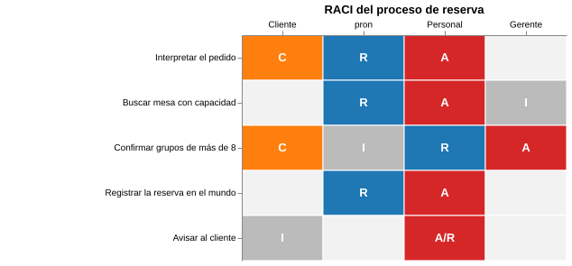

# Matriz RACI

Carpeta: [matriz](index.md). La responsabilidad como franja (un solo responsable por paso) está en
[carriles](../posicion/swimlanes.md).

## 1. Qué representa

**Quién hace qué en cada tarea**, con cuatro grados de participación. Wikipedia (*Responsibility assignment
matrix*): *"a project management technique that describes the responsibilities of various stakeholders in
completing tasks or deliverables. The matrix assigns one of four responsibilities to each stakeholder in
executing a deliverable: Responsible, Accountable, Consulted, and Informed."*

Frente a la [DSM](dsm.md), filas y columnas son **conjuntos distintos** (tareas y roles), y la celda no es "hay
o no hay" sino **cuál de cuatro relaciones**.

## 2. Sintaxis abstracta

Misma fuente:

| Letra | Qué significa |
|---|---|
| **R** Responsible | *"Those who complete the task."* *"There is at least one role with a participation type of responsible"* |
| **A** Accountable | *"The one ultimately answerable for the correct completion of the deliverable or task"*; *"there must be only one accountable stakeholder specified for each task or deliverable"* (según algunas escuelas) |
| **C** Consulted | *"Those whose opinions are sought (...) with whom there is two-way communication."* |
| **I** Informed | *"Those who are kept up-to-date on progress (...) with whom there is just one-way communication."* |

Las letras son un **parámetro del vocabulario**: hay variantes con otras (RASCI agrega *Support*, DACI usa
*Driver, Approvers, Contributors, Informed*, RACIQ agrega *Quality review*).

## 3. Sintaxis concreta

*"Responsibility assignment matrices are charted with the vertical axis representing tasks or deliverables
and the horizontal axis representing roles."* La celda lleva la letra; es habitual colorear por letra y
escribir `A/R` cuando un mismo rol hace y responde.

Canales: **posición en dos ejes categóricos** (tarea × rol), **letra** (texto) y color como refuerzo.

## 4. Reglas de conexión

- Cada tarea tiene exactamente un A.
- Cada tarea tiene al menos un R.
- Una celda tiene una letra, salvo la combinación A/R.

## 5. Ejemplo en notación estándar

El proceso de reserva de [carriles](../posicion/swimlanes.md), con el gerente que confirma a mano los grupos
de más de 8 (la nota de la transición `pending → confirmed` en `pron`, `source/spec/09a`). La tabla, generada
desde el mundo por [`raci-desde-mundo.py`](raci.assets/raci-desde-mundo.py):

| Tarea | Cliente | pron | Personal | Gerente |
|---|---|---|---|---|
| Interpretar el pedido | C | R | A |  |
| Buscar mesa con capacidad |  | R | A | I |
| Confirmar grupos de más de 8 | C | I | R | A |
| Registrar la reserva en el mundo |  | R | A |  |
| Avisar al cliente | I |  | A/R |  |

Y como grilla en Vega-Lite ([`reserva.raci.vl.json`](raci.assets/reserva.raci.vl.json)), renderizada con
[`dsm.assets/render-vega.mjs`](dsm.assets/render-vega.mjs):



## 6. El mismo ejemplo como mundo `pron`

Archivo [`raci.assets/reserva.mundo.yaml`](raci.assets/reserva.mundo.yaml).

| RACI | Mundo `pron` |
|---|---|
| tarea | `Activity` (`name`, `position` para el orden de filas) |
| rol | `Role` |
| R, C, I | verbos `responsible`, `consulted`, `informed`: `Activity → Role`, `many_to_many` |
| A | verbo `accountable`: `Activity → Role`, **`many_to_one`** |

**Una letra es un verbo.** La alternativa, un solo verbo `raci` con la letra en `notes`, no deja declarar
nada sobre ninguna letra. Con cuatro verbos, la regla del A único **la hace cumplir la cardinalidad**:

```
- sldb://document/Activity:t-confirmar-grupo has 2 'accountable' targets but cardinality is many_to_one
```

Montaje: `graph: 108 nodes, 117 edges, 15 relation types`; `pron check` → `ok`; `comandos con error: 0`.

### Qué regla hace cumplir quién

Variante [`reserva-incompleta.mundo.yaml`](raci.assets/reserva-incompleta.mundo.yaml): "Registrar la
reserva" queda sin R, y el Gerente es C e I a la vez en "Buscar mesa". Monta sano (`graph: 108 nodes, 117
edges`, `pron check` → `ok`). [`verificar-raci.py`](raci.assets/verificar-raci.py):

```
SIN R: t-registrar
CELDA CON consulted/informed: t-buscar × r-gerente
5 tareas, 2 problema(s)
```

| Regla | Quién la hace cumplir |
|---|---|
| a lo más un A | `kgdb` (`many_to_one`) |
| al menos un A, al menos un R | nadie (participación mínima) |
| una letra por celda, salvo A/R | nadie (exclusión entre verbos sobre el mismo par) |

La tercera es pariente de "exactamente uno de varios verbos" de [IBIS](../n-aria/argument-maps-ibis.md): aquí
la exclusión es **por par** (tarea, rol), no por origen.

## 7. Qué tendría que declarar el vocabulario visual

**Aplicabilidad**: un conjunto de verbos con los mismos `source_types` y `target_types` (la celda es
"cuál de ellos existe").

**Para dibujar**

| Constructo | Viene de | Símbolo |
|---|---|---|
| filas | `Activity`, ordenadas por `position` | rótulo de fila |
| columnas | `Role` | rótulo de columna |
| celda | **qué verbos** de `{responsible, accountable, consulted, informed}` unen el par | letra (`R`, `A`, `C`, `I`, `A/R`), color por letra |
| juego de letras | mapeo verbo → letra, declarado (RACI, RASCI, DACI) | — |

**Para editar**

| Gesto | Operación | Escritura |
|---|---|---|
| escribir `R` en una celda vacía | `assert(responsible, tarea, rol)` | 1 `RelationDoc` |
| cambiar `C` por `I` | `replace-letter` | borrar `consulted` + crear `informed` |
| poner `A` donde ya hay otro A en la fila | `move-accountable` | borrar el A anterior + crear el nuevo, **o** rechazar |
| vaciar una celda | `retract` | untrack de las `RelationDoc` del par |
| arrastrar una fila | `reorder` | `update` de `position` en las desplazadas |

La cuarta fila es una decisión del vocabulario: `pron` rechazaría el segundo A; el gesto puede **mover** el A
en vez de fallar.

## 8. Huecos

- **Participación mínima** (al menos un R, exactamente un A): no declarable.
- **Exclusión entre verbos sobre el mismo par** (una letra por celda): no declarable.
- **Un constructo, varios verbos**: la celda es una familia de cuatro verbos; nada en el mundo los agrupa (mismo
  hueco que el flujo del [DFD](../flujo/dfd.md)).
- **Reemplazar una letra** son dos escrituras sin unidad.

## 9. Fuentes

- Wikipedia, *Responsibility assignment matrix* (definiciones, variantes, convención de ejes):
  https://en.wikipedia.org/wiki/Responsibility_assignment_matrix
- M. L. Smith, J. Erwin, *Role & Responsibility Charting (RACI)*, PMI California Inland Empire Chapter
  (citado a través de Wikipedia).
- `pron`, `source/spec/09a-el-mundo-del-restaurante.md` (confirmación manual de grupos grandes).
