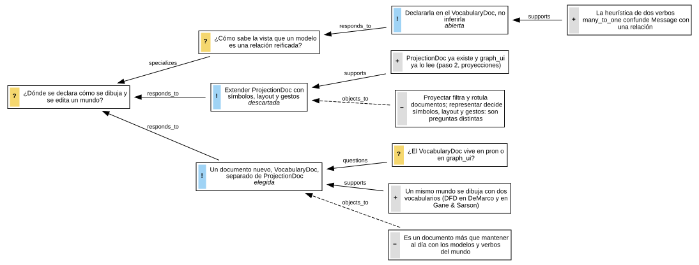
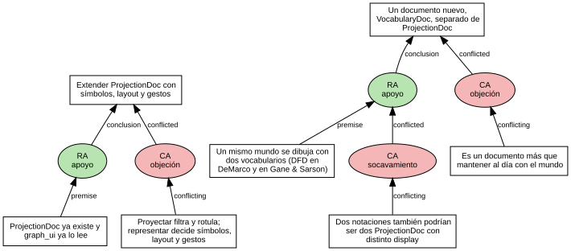

# IBIS y mapas de argumentos

Carpeta: [relaciones n-arias y reificadas](index.md).

## 1. Qué representa

**Una discusión**: qué preguntas hay, qué respuestas se propusieron y qué razones hay a favor y en contra
de cada una. IBIS (*Issue-Based Information System*) lo propusieron Kunz y Rittel en 1970 para planificación
y diseño; gIBIS (Conklin y Begeman, 1988) lo llevó a una herramienta de hipertexto, y de ahí vienen
Compendium y el *dialogue mapping*.

Wikipedia (*Issue-based information system*): *"The elements of IBIS are: issues (questions that need to
be answered), each of which are associated with (answered by) alternative positions (possible answers or
ideas), which are associated with arguments which support or object to a given position"*.

Está en esta carpeta porque un argumento **es una relación con contenido** entre una razón y una posición,
y porque los formatos de argumentación más recientes (AIF) reifican incluso el "apoya" y el "objeta"
para poder discutir sobre ellos.

## 2. Sintaxis abstracta

Conklin y Begeman (1988), sección sobre el modelo IBIS:

| Constructo | Qué significa |
|---|---|
| **Issue** | una pregunta del problema de diseño |
| **Position** | *"a statement or assertion which resolves the Issue"* |
| **Argument** | apoya u objeta una posición |
| **enlaces** | *"There are nine kinds of links in IBIS. For example, a Position Responds-to an Issue, and this is the only place the Responds-to link can be used. Arguments must be linked to their Positions with either Supports or Objects-to links. Issues may Generalize or Specialize other Issues and may also Question or Be-suggested-by other Issues, Positions, and Arguments. As an escape mechanism, Other nodes may connect to any other node type with Other links."* |
| **resolución** | no existe: *"There is no stopping rule, nor is there in the IBIS method a particular way of registering that an Issue has been resolved by agreement upon some Position."* |

## 3. Sintaxis concreta

| Constructo | Símbolo (gIBIS, Compendium) |
|---|---|
| pregunta | nodo con ícono `?` |
| posición | nodo con ícono de idea (`!`) |
| argumento | nodo con `+` (a favor) o `−` (en contra) |
| enlace | flecha del nodo nuevo al que responde, con su tipo |

Canales: **ícono** (clase), conexión dirigida, texto. El layout es un árbol por pregunta: *"each separate
Issue is the root of a (possibly empty) tree, with the children of the Issue being Positions and the
children of the Positions being Arguments."*

## 4. Reglas de conexión

gIBIS las presenta como *"a state transition diagram specifying all of the legal moves within the IBIS
method"* (Fig. 1):

- `responds_to`: solo de posición a pregunta.
- `supports`, `objects_to`: solo de argumento a posición; un argumento tiene **una** postura.
- `generalizes`, `specializes`: entre preguntas.
- `questions`, `suggested_by`: de pregunta a cualquier nodo.
- `other`: de cualquiera a cualquiera (válvula de escape).

Y la edición se guía por esas reglas: *"if a node of type Issue is selected, the menu changes as shown in
Figure 4 to reflect the legal operations on Issues. In this example, the user is choosing to create a
follow-up node of type Position which (...) will automatically be linked to it by a link of type
Responds-to."*

## 5. Ejemplo en notación estándar

Una decisión real de este manual: **dónde se declara la representación**, si extendiendo `ProjectionDoc`
o con un documento nuevo (se eligió el documento nuevo; ver el [README](../../README.md)). Dos preguntas
derivadas quedan abiertas.

No hay un renderer de IBIS instalado (Compendium es una aplicación de escritorio). El mapa se dibuja desde
el mundo de la sección 6 con la convención de íconos de gIBIS,
[`ibis-desde-mundo.py`](argument-maps-ibis.assets/ibis-desde-mundo.py):



## 6. El mismo ejemplo como mundo `pron`

Archivo [`argument-maps-ibis.assets/vocabulario.mundo.yaml`](argument-maps-ibis.assets/vocabulario.mundo.yaml).

| IBIS | Mundo `pron` |
|---|---|
| Issue, Position, Argument | modelos del mismo nombre |
| `responds_to` | `Position → Issue`, `many_to_one` |
| `supports`, `objects_to` | `Argument → Position`, `many_to_one` cada uno |
| `generalizes`, `specializes` | `Issue → Issue` |
| `questions`, `suggested_by` | `Issue → [Issue, Position, Argument]` |
| `replaces`, `other` | no incluidos (`other` anula la gramática) |
| decisión tomada | `Position.status` (`elegida`, `descartada`, `abierta`): **extensión**, IBIS no la tiene |

Montaje: `graph: 119 nodes, 130 edges, 18 relation types`; `pron check` → `ok`; `comandos con error: 0`.
Controles negativos:

```
- edge sldb://document/Argument:a-ya-existe -[supports]-> sldb://document/Issue:i-donde: target class 'Issue' not in target_types ['Position']
- edge sldb://document/Argument:a-heuristica -[responds_to]-> sldb://document/Issue:i-reificacion: source class 'Argument' not in source_types ['Position']
```

La gramática de gIBIS **cabe entera** en `source_types`/`target_types`: cada enlace tiene su verbo y cada
verbo sus clases.

### El menú de gIBIS, derivado del mundo

[`menu-contextual.py`](argument-maps-ibis.assets/menu-contextual.py) calcula, para un nodo seleccionado,
qué nodo nuevo se puede crear y con qué enlace, leyendo solo los verbos:

```
sin selección: crear Issue, Position, Argument
Issue seleccionado: nuevo Position que responds_to este · nuevo Issue que generalizes este · este generalizes un Issue nuevo · nuevo Issue que specializes este · este specializes un Issue nuevo · nuevo Issue que questions este · este questions un Issue nuevo · este questions un Position nuevo · este questions un Argument nuevo · nuevo Issue que suggested_by este · este suggested_by un Issue nuevo · este suggested_by un Position nuevo · este suggested_by un Argument nuevo
Position seleccionado: este responds_to un Issue nuevo · nuevo Argument que supports este · nuevo Argument que objects_to este · nuevo Issue que questions este · nuevo Issue que suggested_by este
Argument seleccionado: este supports un Position nuevo · este objects_to un Position nuevo · nuevo Issue que questions este · nuevo Issue que suggested_by este
```

Lo que el mundo **sí** da: las combinaciones legales. Lo que **no**: la dirección de la jugada. gIBIS crea
*follow-ups*, nodos nuevos que apuntan al seleccionado; opciones como "esta pregunta cuestiona una posición
nueva" son gramaticales pero no son jugadas de una discusión. Y gIBIS arranca un mapa solo con una pregunta
(*"the only legal operation is Issue creation"*), mientras que el mundo permite crear cualquier clase
suelta. El vocabulario tiene que declarar **qué extremo es el nodo nuevo** en cada gesto y **qué puede
existir sin enlaces**.

### Qué regla hace cumplir quién

Variante [`vocabulario-ambiguo.mundo.yaml`](argument-maps-ibis.assets/vocabulario-ambiguo.mundo.yaml): un
argumento apoya **y** objeta la misma posición, y otro objeta una posición y apoya otra. Cada verbo respeta
su `many_to_one`, así que monta sano (`graph: 119 nodes, 132 edges`, `pron check` → `ok`).
[`verificar-ibis.py`](argument-maps-ibis.assets/verificar-ibis.py):

```
ARGUMENTO CON 2 POSTURAS: Argument:a-dos-notaciones -> supports Position:p-nuevo, objects_to Position:p-nuevo
ARGUMENTO CON 2 POSTURAS: Argument:a-sincronizar -> objects_to Position:p-nuevo, supports Position:p-extender
5 argumentos, 2 problema(s)
```

"Exactamente uno entre dos verbos" no es declarable: la cardinalidad es por verbo.

### Discutir una inferencia: AIF

En IBIS se objeta un **nodo**. Pero la crítica más útil a veces es a la **flecha**: "que haya dos notaciones
no prueba que haga falta un documento nuevo; podrían ser dos `ProjectionDoc`". Eso ataca el `supports`, no
el argumento ni la posición. En este sustrato una `RelationDoc` no es nodo (ver
[clase de asociación](clase-de-asociacion.md)), así que no se puede.

El *Argument Interchange Format* (AIF) resuelve exactamente eso reificando. Especificación AIF (2011),
Definición 1.1: *"E ⊆ V × V \ I × I is the set of the edges in G"*, y *"Condition 2 states that I-nodes can
only be connected to other I-nodes via S-nodes, that is, there must be a scheme that expresses the rationale
behind the relation between I-nodes. S-nodes, on the other hand, can be connected to other S-nodes
directly."* Las inferencias son RA-nodes y los conflictos CA-nodes.

Archivo [`vocabulario-aif.mundo.yaml`](argument-maps-ibis.assets/vocabulario-aif.mundo.yaml): `INode`,
`RANode`, `CANode` y los verbos `premise`, `conclusion`, `conflicting`, `conflicted`. El socavamiento es
`ca-3`, cuyo `conflicted` apunta a la inferencia `ra-2`. Montaje: `graph: 118 nodes, 130 edges, 15 relation
types`; `pron check` → `ok`. Control negativo (premisa directa de I-node a I-node, la condición 2 de AIF):
`target class 'INode' not in target_types ['RANode']`.


([`aif-desde-mundo.py`](argument-maps-ibis.assets/aif-desde-mundo.py))

El mismo contenido, dos vocabularios: IBIS dibuja 4 flechas `supports`/`objects_to`; AIF dibuja 4 nodos de
esquema y 8 flechas, y a cambio puede atacar una flecha. Un `VocabularyDoc` para IBIS podría incluso
**dibujar** un mundo AIF colapsando los RA y CA en flechas, salvo los que son atacados.

## 7. Qué tendría que declarar un `VocabularyDoc`

**Para dibujar**

| Constructo | Viene de | Símbolo |
|---|---|---|
| pregunta, posición, argumento | `Issue`, `Position`, `Argument` | ícono `?`, `!`, `+`/`−` |
| postura del argumento | **cuál** de sus verbos existe (`supports` u `objects_to`) | `+` o `−`: el símbolo del nodo depende de una arista |
| enlace | cada verbo | flecha con tipo; objeción punteada |
| layout | árbol por pregunta | pregunta a la izquierda, hijos a la derecha |
| en AIF, colapsado | RA/CA con un solo premisa y una conclusión, no atacados | flecha en vez de nodo |

**Para editar**

| Gesto | Operación | Escritura |
|---|---|---|
| menú sobre una pregunta: "nueva posición" | `follow-up(Position, responds_to, issue)` | 1 `Position` + 1 `RelationDoc`, el nodo nuevo como origen |
| menú sobre una posición: "argumento a favor" | `follow-up(Argument, supports, position)` | 1 `Argument` + 1 `RelationDoc` |
| cambiar un argumento de a favor a en contra | `flip-stance` | borrar `supports` + crear `objects_to` |
| marcar una posición como elegida | `decide(position)` | `update` de `status` (extensión) |
| (AIF) atacar una flecha | `undercut(ra)` | 1 `CANode` + 1 `INode` + 2 `RelationDoc` |

## 8. Huecos

- **"Exactamente uno de varios verbos"** (un argumento, una postura): no declarable.
- **El símbolo de un nodo depende de sus aristas** (`+`/`−` según qué verbo sale): el vocabulario tiene que
  poder mapear símbolos por existencia de relaciones, no solo por clase o campo.
- **Dirección de la jugada y nodos que pueden existir sueltos**: el mundo da las combinaciones legales, no
  qué extremo es el nuevo ni que un mapa empieza por una pregunta.
- **No se puede discutir una relación**: una `RelationDoc` no es nodo; hay que reificar como AIF.
- **Colapsar reificaciones al dibujar** (RA como flecha salvo si está atacado): el mismo hueco que la clase
  de asociación, con una condición.

## 9. Fuentes

- W. Kunz, H. W. J. Rittel, *Issues as Elements of Information Systems*, Working Paper 131, Institute of
  Urban and Regional Development, UC Berkeley, 1970 (citado a través de Conklin y Begeman y de Wikipedia).
- J. Conklin, M. L. Begeman, *gIBIS: a hypertext tool for exploratory policy discussion*, ACM Transactions
  on Office Information Systems 6(4), 1988, doi:10.1145/58566.59297:
  http://csis.pace.edu/~marchese/CS835/Readings/p303-conklin_gibis.pdf
- Wikipedia, *Issue-based information system*: https://en.wikipedia.org/wiki/Issue-based_information_system
- Argumentation Research Group (Dundee), *The Argument Interchange Format (AIF) Specification*, 2011,
  Definición 1.1: http://www.arg-tech.org/wp-content/uploads/2011/09/aif-spec.pdf
