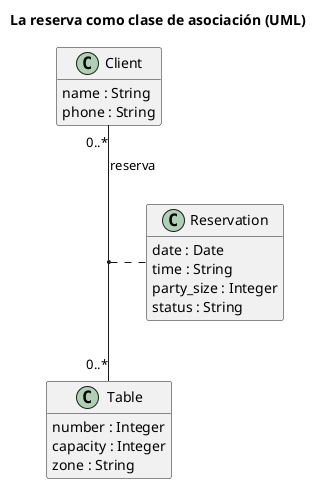
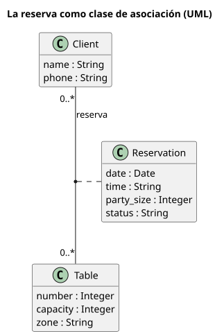
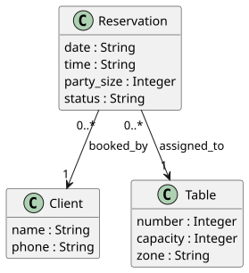
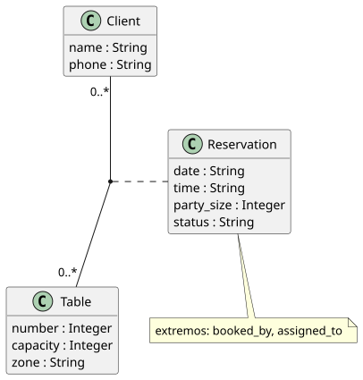

# UML — clase de asociación

Carpeta: [relaciones n-arias y reificadas](index.md). Las asociaciones binarias simples están en
[UML de clases](../nodo-arista-tipado/uml-clases.md).

## 1. Qué representa

Una **relación que tiene datos propios**. Entre un cliente y una mesa hay reservas, y cada reserva tiene
fecha, hora y cantidad de personas: esos datos no son del cliente ni de la mesa, son **del vínculo**.

UML 2.5.1, §11.5.3.2: *"An AssociationClass is a declaration of an Association that has a set of Features
of its own. An AssociationClass is both an Association and a Class, and preserves the static and dynamic
semantics of both."*

El restaurante de `pron` ya está modelado así sin decirlo: `Reservation` es un modelo con `booked_by` hacia
`Client` y `assigned_to` hacia `Table`. Este documento lo lee como lo que es.

## 2. Sintaxis abstracta

| Constructo | Qué significa |
|---|---|
| **Association** | §11.5.3.1: *"A link is a tuple with one value for each memberEnd of the Association"* |
| **memberEnd** | cada extremo, con su tipo, nombre de rol y multiplicidad |
| **AssociationClass** | la asociación y la clase son **el mismo elemento**: un solo nombre, atributos propios, extremos propios |
| **unicidad** | con `isUnique=true` no hay dos enlaces entre la misma tupla; pero para una clase de asociación, §11.5.3.2: *"Even when all ends of the AssociationClass have isUnique=true, it is possible to have several instances associating the same set of instances of the end Classes."* |

La última fila importa para el ejemplo: Ana puede reservar la mesa 12 el viernes **y** el sábado; son dos
instancias de la clase de asociación sobre el mismo par.

## 3. Sintaxis concreta

§11.5.4: *"An AssociationClass is shown as a Class symbol attached to the Association path by a dashed
line. (...) The Association path and the AssociationClass symbol represent the same underlying model
element, which has a single name."* Y: *"The AssociationClass symbol can be dragged away from the line,
but the dashed line must remain attached to both the path and the Class symbol."*

| Constructo | Símbolo |
|---|---|
| asociación | línea continua entre las dos clases, multiplicidades en los extremos |
| clase de asociación | rectángulo de clase unido **al medio de la línea** por una línea punteada |

Es un caso de **dos figuras, un elemento**: mover la caja no cambia nada, borrar cualquiera de las dos
borra el elemento.

## 4. Reglas de conexión

- La clase de asociación une exactamente los extremos de su asociación (dos, en el caso binario).
- Cada instancia tiene exactamente un participante por extremo.
- Los atributos de la clase y los nombres de los extremos no se repiten.
- *"An AssociationClass cannot be a generalization of an Association or a Class."*

## 5. Ejemplo en notación estándar

[`clase-de-asociacion.assets/reserva.puml`](clase-de-asociacion.assets/reserva.puml):





## 6. El mismo ejemplo como mundo `pron`

Archivo [`clase-de-asociacion.assets/reserva.mundo.yaml`](clase-de-asociacion.assets/reserva.mundo.yaml),
a nivel de instancias: dos clientes, dos mesas, tres reservas (dos de Ana en la mesa 12).

| UML | Mundo `pron` |
|---|---|
| clase de asociación | modelo `Reservation` con sus atributos |
| extremo "cliente" | verbo `booked_by`, `many_to_one` (exactamente un cliente por reserva, como máximo) |
| extremo "mesa" | verbo `assigned_to`, `many_to_one`, con `condition: capacity >= {party_size}` |
| la asociación `Client — Table` | **nada**: se deduce de las dos aristas de cada `Reservation` |

Montaje: `graph: 107 nodes, 105 edges, 13 relation types`; `pron check` → `ok`; `comandos con error: 0`.
Control negativo (segunda mesa para la misma reserva): `has 2 'assigned_to' targets but cardinality is
many_to_one`.

### Por qué no una arista con campos

Dos intentos sobre el mundo montado con `--conservar`:

**1. Una `RelationDoc` con los datos de la reserva.** `sldb docs create --model RelationDoc` con
`"party_size": 6, "date": "2026-09-18"` en el payload:

```
Created and tracked 'reserves--Client:client-ana--Table:table-12'
```

El archivo no tiene `party_size` (`grep -c party_size` → `0`) y `sldb docs show` devuelve solo `title`,
`source_id`, `target_id`, `relation_type`, `condition`, `notes`. **Los campos extra se descartan en
silencio**: no hay error, y el dato se pierde.

**2. Colgar algo de la arista.** Una `RelationDoc` cuyo `source_id` es otra `RelationDoc`:

```
- relation 'booked_by--meta': source 'RelationDoc:booked_by--Reservation:res-ana-viernes--Client:client-ana' is not a tracked document
```

`kgdb` la rechaza al ensamblar (`pron check` sigue diciendo `ok`): una `RelationDoc` **no es nodo**
(`src/kgdb/ingest/typed.py`: *"the RelationDoc itself is not a node"*), así que no se puede apuntar a ella.
El mensaje dice "not a tracked document", aunque el documento sí está trackeado.

Conclusión: en este sustrato **toda relación con datos es un modelo reificado**. No es un defecto grave
(es lo que hace ER con las relaciones con atributos, y lo que UML dice que la clase de asociación es),
pero significa que **el dibujo tiene que re-colapsarla**.

### ¿Se puede inferir la reificación?

[`detectar-reificaciones.py`](clase-de-asociacion.assets/detectar-reificaciones.py) busca, en todos los
mundos de este manual, modelos que sean origen de dos o más verbos `many_to_one`:

```
.../n-aria/clase-de-asociacion.assets/reserva.mundo.yaml: Reservation (2 extremos: booked_by→Client, assigned_to→Table)
.../nodo-arista-tipado/entidad-relacion.assets/restaurante-participacion.mundo.yaml: Reservation (2 extremos: booked_by→Client, assigned_to→Table)
.../nodo-arista-tipado/entidad-relacion.assets/restaurante.mundo.yaml: Reservation (2 extremos: booked_by→Client, assigned_to→Table)
.../nodo-arista-tipado/uml-clases.assets/uml-clases.mundo.yaml: UmlAssociation (2 extremos: end_a→UmlClass, end_b→UmlClass)
.../posicion/uml-secuencia.assets/conectar-orden-repetido.mundo.yaml: Message (3 extremos: in_interaction→Interaction, sends→Lifeline, receives→Lifeline)
.../posicion/uml-secuencia.assets/conectar.mundo.yaml: Message (3 extremos: in_interaction→Interaction, sends→Lifeline, receives→Lifeline)
```

Acierta con `UmlAssociation` (una asociación reificada) y con `Reservation`, pero:

- en [entidad-relación](../nodo-arista-tipado/entidad-relacion.md) la misma `Reservation` se dibujó como
  **entidad**, no como relación: la decisión es del vocabulario, no del mundo;
- `Message` sale como relación ternaria, cuando en una secuencia es un elemento con posición propia.

La heurística sirve para **sugerir**; la reificación tiene que **declararse**.
[`plantuml-desde-mundo.py`](clase-de-asociacion.assets/plantuml-desde-mundo.py) dibuja el esquema del
mundo de las dos maneras: sin declarar (izquierda) y con `--asociacion Reservation` (derecha).

| Sin declarar | Declarada |
|---|---|
|  |  |

## 7. Qué tendría que declarar el vocabulario visual

**Para dibujar**

| Constructo | Viene de | Símbolo |
|---|---|---|
| asociación | un modelo declarado como reificación (`Reservation`) y sus verbos extremo (`booked_by`, `assigned_to`) | **una** línea entre los destinos |
| clase de asociación | el mismo documento | caja unida al medio de la línea por punteada |
| rol y multiplicidad | nombre y `cardinality` de cada verbo extremo | texto junto a cada destino |
| varias instancias sobre el mismo par | varias `Reservation` con los mismos destinos | a nivel de tipos, una sola línea; a nivel de instancias, una por reserva |

**Para editar**

| Gesto | Operación | Escritura |
|---|---|---|
| arrastrar de `Client` a `Table` con la herramienta *Reserva* | `create-reservation(c, t, datos)` | 1 `Reservation` + `booked_by` + `assigned_to` (la segunda evalúa `capacity >= {party_size}`) |
| mover la caja de la clase de asociación | nada en el mundo | ninguna |
| arrastrar el extremo "mesa" a otra mesa | `reassign-table` | borrar `assigned_to` + crear, con la condición |
| borrar la línea o la caja | `delete-reservation` | 1 `Reservation` + sus 2 `RelationDoc` |

Todas las filas que escriben son **compuestas**: la unidad del usuario (la reserva) son tres documentos.

## 8. Huecos

- **Campos extra en `RelationDoc` se descartan en silencio** al crearla por `sldb docs create`.
- **Una `RelationDoc` no es nodo**: no se puede relacionar con nada; el error de ensamblado dice "not a
  tracked document" para un documento que sí lo está, y `pron check` no lo detecta.
- **La reificación no se declara en el sustrato**: nada dice que `booked_by` y `assigned_to` son los
  extremos de una misma asociación; la heurística confunde relaciones con elementos que tienen extremos.
- **Operaciones compuestas** (crear, reasignar, borrar una reserva) sin unidad atómica: mismo hueco que en
  [actividad UML](../flujo/uml-actividad.md) y [UML de clases](../nodo-arista-tipado/uml-clases.md).

## 9. Fuentes

- OMG, *UML 2.5.1*, §11.5.3.1 (Associations), §11.5.3.2 (Association Classes), §11.5.4 (notación):
  https://www.omg.org/spec/UML/2.5.1/PDF
- PlantUML, *Class diagram* (association classes): https://plantuml.com/class-diagram
- `pron`, `source/spec/09a-el-mundo-del-restaurante.md`; `kgdb` (commit `aeac2a7`),
  `src/kgdb/ingest/typed.py`, `src/kgdb/models/relation_doc.py`.
