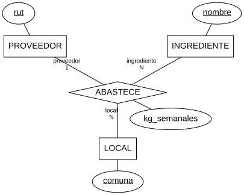

# Entidad-relación — relación n-aria

Carpeta: [relaciones n-arias y reificadas](index.md). ER binario (Chen y pata de gallo) está en
[entidad-relación](../nodo-arista-tipado/entidad-relacion.md).

## 1. Qué representa

Un hecho que **necesita tres o más participantes a la vez** para ser cierto: "la Feria abastece tomate al
local de Providencia" no se puede partir en "la Feria abastece tomate", "Providencia recibe tomate" y "la
Feria abastece a Providencia" sin perder información (sección 6).

Chen (1976), §2.2.2, define la relación directamente como n-aria: *"A relationship set, Ri, is a
mathematical relation among n entities, each taken from an entity set: {[e1, e2, ..., en] | e1 ∈ E1, e2 ∈
E2, ..., en ∈ En}, and each tuple of entities, [e1, e2, ..., en], is a relationship."* Lo binario es el caso
particular.

## 2. Sintaxis abstracta

Chen (1976), §2.2.2 y §2.2.3:

| Constructo | Qué significa |
|---|---|
| **conjunto de relaciones** | una relación matemática entre n conjuntos de entidades: un **conjunto** de tuplas |
| **rol** | *"The role of an entity in a relationship is the function that it performs in the relationship."* |
| **atributo de la relación** | *"Note that relationships also have attributes. (...) It is neither an attribute of EMPLOYEE nor an attribute of PROJECT, since its meaning depends on both the employee and project involved."* |
| **cardinalidad de un extremo** | cuántas instancias de ese extremo hay para una combinación fija de los otros n−1 |

UML dice lo mismo para asociaciones n-arias (UML 2.5.1, §11.5.3.1): la multiplicidad de un extremo se
calcula fijando los otros N−1, y *"For n-ary Associations, the lower multiplicity of an end is typically
0."*

## 3. Sintaxis concreta

| Notación | Relación ternaria |
|---|---|
| Chen | un rombo con **una línea por participante**, rol y cardinalidad en cada línea |
| UML | §11.5.4: *"An Association with more than two ends can only be drawn this way"*: un rombo con una línea por extremo |
| pata de gallo (Mermaid `erDiagram`) | **no existe**: cada relación es `<first-entity> <relationship> <second-entity>`; la ternaria se dibuja como **entidad asociativa** con tres relaciones binarias |

## 4. Reglas de conexión

- Cada instancia tiene **exactamente un** participante por rol.
- Una relación es un conjunto: **no hay dos instancias con la misma tupla**.
- Las cardinalidades se leen "mirando a través": en el ejemplo, fijados un ingrediente y un local, hay a lo
  más un proveedor (`(ingrediente, local) → proveedor`, una dependencia funcional).
- La relación no equivale a sus proyecciones binarias.

## 5. Ejemplo en notación estándar

Tres proveedores, ingredientes y locales de una cadena de restaurantes; la relación ABASTECE lleva los kilos
por semana. Notación de Chen en Graphviz,
[`er-n-aria.assets/abastece.chen.dot`](er-n-aria.assets/abastece.chen.dot):

```dot
ABASTECE [shape=diamond, pos="2,1.2!"];
kg [shape=ellipse, label="kg_semanales", pos="3.6,0.4!"];
PROVEEDOR -- ABASTECE [label="proveedor\n1"];
INGREDIENTE -- ABASTECE [label="ingrediente\nN"];
LOCAL -- ABASTECE [label="local\nN"];
ABASTECE -- kg;
```



La misma relación en Mermaid, [`abastece.mmd`](er-n-aria.assets/abastece.mmd), que solo tiene relaciones
binarias:

```text
erDiagram
    PROVEEDOR ||--o{ ABASTECIMIENTO : "provee en"
    INGREDIENTE ||--o{ ABASTECIMIENTO : "es abastecido en"
    LOCAL ||--o{ ABASTECIMIENTO : "recibe en"
```



**La notación de pata de gallo obliga a reificar**, igual que el sustrato (sección 6). Y pierde la
dependencia funcional: los tres `||--o{` no dicen que `(ingrediente, local)` determina el proveedor.

## 6. El mismo ejemplo como mundo `pron`

Archivo [`er-n-aria.assets/abastece.mundo.yaml`](er-n-aria.assets/abastece.mundo.yaml).

| Chen | Mundo `pron` |
|---|---|
| entidades | `Supplier`, `Ingredient`, `Branch` |
| relación ABASTECE | modelo `Supply` con `kg_per_week` |
| roles | verbos `supplier`, `ingredient`, `branch`, cada uno `many_to_one` desde `Supply` |
| tupla | un `Supply` con sus tres aristas |

Montaje: `graph: 111 nodes, 113 edges, 14 relation types`; `pron check` → `ok`; `comandos con error: 0`.
Control negativo (segundo proveedor en la misma tupla): `has 2 'supplier' targets but cardinality is
many_to_one`.

`RelationDoc` tiene un `source_id` y un `target_id` (`src/kgdb/models/relation_doc.py`): **no hay relaciones
de más de dos extremos**, y la reificación con un verbo por rol es la única forma. Con ella, el máximo de
un participante por rol sí se hace cumplir.

### La trampa de conexión

¿Y si en vez de reificar se usan tres verbos binarios directos? [`trampa-de-conexion.py`](er-n-aria.assets/trampa-de-conexion.py)
proyecta las tuplas del mundo en los tres pares y las vuelve a juntar:

```
tuplas: 3 · reconstruidas desde las tres binarias: 4
ESPURIA: s-feria / i-tomate / l-nunoa
```

La Feria abastece tomate (a Providencia), Ñuñoa recibe tomate (de la Central) y la Feria abastece a Ñuñoa
(queso): las tres binarias son ciertas, y juntas **inventan** que la Feria le lleva tomate a Ñuñoa. Por eso
la reificación no es una opción de estilo.

### Qué regla hace cumplir quién

Variante [`abastece-inconsistente.mundo.yaml`](er-n-aria.assets/abastece-inconsistente.mundo.yaml): `ab-4`
le da a Providencia tomate de un segundo proveedor, y `ab-5` repite la tupla de `ab-1`. Monta sano
(`graph: 117 nodes, 125 edges`, `pron check` → `ok`). [`verificar-ternaria.py`](er-n-aria.assets/verificar-ternaria.py):

```
DOS PROVEEDORES: l-providencia recibe i-tomate de s-feria (ab-1) y de s-central (ab-4)
TUPLA REPETIDA: ab-5 repite ab-1 (s-feria / i-tomate / l-providencia)
5 tuplas, 2 problema(s)
```

Y un `Supply` sin alguno de sus roles pasaría también: `many_to_one` acota el máximo, no el mínimo.

## 7. Qué tendría que declarar el vocabulario visual

**Para dibujar**

| Constructo | Viene de | Símbolo |
|---|---|---|
| relación | modelo declarado como relación (`Supply`) | rombo (Chen) o entidad asociativa (pata de gallo) |
| rol | cada verbo declarado como rol, con su nombre | línea del rombo a la entidad, rótulo del rol |
| cardinalidad n-aria | **no está en el mundo** (dependencia funcional) | `1`/`N` en cada línea |
| atributo | campos del modelo de relación | elipse colgada del rombo |

**Para editar**

| Gesto | Operación | Escritura |
|---|---|---|
| crear la relación entre tres entidades seleccionadas | `create-supply(s, i, l, kg)` | 1 `Supply` + 3 `RelationDoc`, **o nada** |
| cambiar un participante | `reassign-role(supply, rol, nuevo)` | borrar + crear la arista de ese rol; revisar tupla repetida y dependencia |
| borrar la relación | `delete-supply` | 1 `Supply` + 3 `RelationDoc` |
| conectar un cuarto participante | prohibido (la relación es ternaria) | ninguna |

## 8. Huecos

- **`RelationDoc` binaria**: confirmado; toda relación n-aria es un modelo más un verbo por rol.
- **Unicidad de tupla**: dos `Supply` con los mismos tres participantes montan sanos; no hay clave sobre
  un conjunto de aristas.
- **Dependencias funcionales entre roles** (`(ingrediente, local) → proveedor`): no declarables; son la
  cardinalidad n-aria de Chen y UML.
- **Participación exacta por rol**: `many_to_one` no exige que el rol exista (mismo hueco de participación
  mínima).
- **Operaciones compuestas** de cuatro escrituras, sin atomicidad.

## 9. Fuentes

- P. P. Chen, *The Entity-Relationship Model — Toward a Unified View of Data*, ACM TODS 1(1), 1976,
  §2.2.2 y §2.2.3: http://bit.csc.lsu.edu/~chen/pdf/erd-5-pages.pdf (extracto de 5 páginas) y
  https://dl.acm.org/doi/10.1145/320434.320440
- OMG, *UML 2.5.1*, §11.5.3.1 y §11.5.4: https://www.omg.org/spec/UML/2.5.1/PDF
- Mermaid, *Entity Relationship Diagrams* (sintaxis de relaciones):
  https://github.com/mermaid-js/mermaid/blob/develop/packages/mermaid/src/docs/syntax/entityRelationshipDiagram.md
- `kgdb`, `src/kgdb/models/relation_doc.py`.
