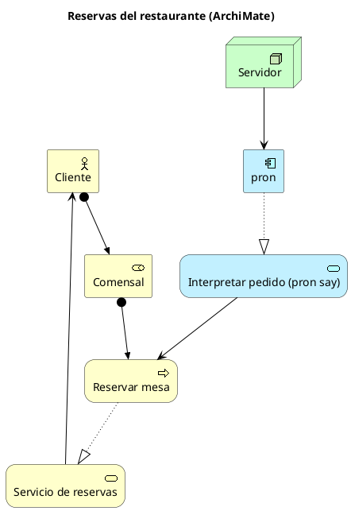
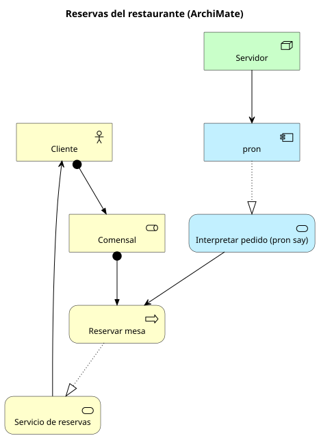

# ArchiMate

Carpeta: [nodo-arista tipado](index.md).

> Nota de verificación: la especificación ArchiMate 3.2 de The Open Group (pubs.opengroup.org) hoy
> exige iniciar sesión. Este documento se apoya en tres fuentes públicas verificables: la entrada de
> Wikipedia (resumen del marco y la notación), la **matriz de relaciones de Archi** (herramienta
> ArchiMate de código abierto que codifica las reglas de la especificación como datos) y la
> biblioteca estándar de ArchiMate de PlantUML.

## 1. Qué representa

La **arquitectura de una organización** a través de sus capas: qué hace el negocio, qué aplicaciones
lo sostienen y sobre qué tecnología corren. Es un estándar de The Open Group pensado para relacionar
dominios que UML o BPMN tratan por separado. Su diseño es deliberadamente chico: *"ArchiMate was
intentionally restricted 'to the concepts that suffice for modeling the proverbial 80% of practical
cases'"* (Wikipedia).

Un rasgo que lo hace especialmente relevante aquí: *"The ArchiMate language separates the concepts
from their notation (contrary to the UML or BPMN). As there are different groups of stakeholders,
they may need different notations. [...] it is solved by the viewpoint mechanism."*

## 2. Sintaxis abstracta

**Marco central: capas × aspectos.** *"It consists of three layers and three aspects. This creates a
matrix of combinations. Every layer has its passive structure, behavior and active structure
aspects."*

| | Estructura activa (quién actúa) | Comportamiento (qué se hace) | Estructura pasiva (sobre qué) |
|---|---|---|---|
| **Negocio** | Business Actor, Business Role | Business Process, Business Service | Business Object |
| **Aplicación** | Application Component | Application Service | Data Object |
| **Tecnología** | Node, Device | Technology Service | Artifact |

El marco completo agrega capas de estrategia, física, implementación y migración, y el aspecto de
motivación (stakeholder, driver, goal…).

**Relaciones**, clasificadas en estructurales (composition, aggregation, assignment, realization),
de dependencia (serving, access, influence, association), dinámicas (triggering, flow) y otras
(specialization). Las usadas en el ejemplo:

| Relación | Significado |
|---|---|
| **assignment** | quién o qué realiza un comportamiento o cumple un rol |
| **realization** | un elemento más concreto realiza uno más abstracto (un proceso realiza un servicio) |
| **serving** | un elemento provee su funcionalidad a otro |

**Gramática**: la especificación fija qué relaciones valen entre cada par de tipos de elemento
(Apéndice B). No es "cualquier relación entre cualesquiera elementos".

## 3. Sintaxis concreta

- **Forma según el aspecto**: *"Structural elements have square corners, behavioral elements come
  with round corners. Diagonal corners indicate a motivational element."*
- **Ícono** en la esquina según el tipo (actor: figura humana; rol: cilindro; proceso: flecha;
  servicio: óvalo redondeado; componente; nodo: caja 3D).
- **Color por capa, por convención**: *"Formally, color has no meaning in ArchiMate, but many modelers
  use colors to distinguish between the different layers: Yellow for the business layer, Blue for the
  application layer, Green for the technology layer."*
- **Relaciones**: cada tipo tiene trazo y terminal propios. En el ejemplo: *assignment* con punto en
  el origen y flecha en el destino; *realization* punteada con triángulo hueco; *serving* sólida con
  punta abierta.

Canales: forma de las esquinas (aspecto), ícono (tipo), tono (capa, convencional), trazo y terminal
(relación). Es una notación con más expresividad visual que UML (ver
[Physics of Notations](../../01-fundamentos/physics-of-notations.md)).

## 4. Reglas de conexión

Archi guarda la gramática de ArchiMate 3.2 como datos en `model/relationships.xml`: para cada par
(origen, destino), una cadena de letras con las relaciones permitidas. Fragmento real (commit
`24b1f22`):

```xml
<relationships version="3.2">

    <source concept="ApplicationCollaboration">
        <target concept="ApplicationCollaboration" relations="cfgostv" />
        <target concept="ApplicationComponent" relations="fgortv" />
        <target concept="ApplicationEvent" relations="fiortv" />
```

Y la clave de letras en `model/relationships-keys.xml`:

```xml
<relationshipskeys version="1.0">
	<key char="a" relationship="AccessRelationship" />
	<key char="c" relationship="CompositionRelationship" />
	<key char="f" relationship="FlowRelationship" />
	<key char="g" relationship="AggregationRelationship" />
	<key char="i" relationship="AssignmentRelationship" />
	<key char="n" relationship="InfluenceRelationship" />
	<key char="o" relationship="AssociationRelationship" />
	<key char="r" relationship="RealizationRelationship" />
	<key char="s" relationship="SpecializationRelationship" />
	<key char="t" relationship="TriggeringRelationship" />
	<key char="v" relationship="ServingRelationship" />
</relationshipskeys>
```

La gramática es una **relación arbitraria entre pares de tipos**, no un producto "estos orígenes con
estos destinos".

## 5. Ejemplo en notación estándar

Las reservas del restaurante vistas como arquitectura: el cliente cumple el rol de comensal, que
realiza el proceso de reservar; el proceso realiza el servicio de reservas; `pron` realiza un
servicio de aplicación que sirve al proceso; un servidor sirve a `pron`.

Archivo [`archimate.assets/restaurante.puml`](archimate.assets/restaurante.puml), con la biblioteca
estándar de ArchiMate de PlantUML, renderizado con `plantuml -tsvg`:





## 6. El mismo ejemplo como mundo `pron`

Opción B (ArchiMate como dominio): un modelo por tipo de elemento usado (`BusinessActor`,
`BusinessRole`, `BusinessProcess`, `BusinessService`, `ApplicationComponent`, `ApplicationService`,
`Node`) y un `RelationTypeDoc` por tipo de relación. Archivo
[`archimate.assets/restaurante.mundo.yaml`](archimate.assets/restaurante.mundo.yaml).

```yaml
tipos_de_relacion:
- name: assignment
  cardinality: many_to_many
  source_types: [BusinessActor, BusinessRole, ApplicationComponent]
  target_types: [BusinessRole, BusinessProcess, ApplicationService]
  description: 'Asignación: quién o qué realiza un comportamiento o cumple un rol.'
```

Montaje: `graph: 124 nodes, 134 edges, 14 relation types`; `pron check` → `ok`; `comandos con error: 0`.

### Contraste con la gramática real

Script [`archimate.assets/validar-contra-archi.py`](archimate.assets/validar-contra-archi.py):
descarga la matriz de Archi de un commit fijo y contrasta el mundo.

```sh
python3 archimate.assets/validar-contra-archi.py archimate.assets/restaurante.mundo.yaml
```

```
1. Relaciones del mundo contra ArchiMate 3.2 (Archi):
   permitida: BusinessActor -[assignment]-> BusinessRole
   permitida: BusinessRole -[assignment]-> BusinessProcess
   permitida: BusinessProcess -[realization]-> BusinessService
   permitida: BusinessService -[serving]-> BusinessActor
   permitida: ApplicationService -[serving]-> BusinessProcess
   permitida: ApplicationComponent -[realization]-> ApplicationService
   permitida: Node -[serving]-> ApplicationComponent
   NO PERMITIDA: BusinessRole -[assignment]-> BusinessRole

2. Pares que kgdb acepta por source_types × target_types y ArchiMate no permite:
   assignment: 5 de 9
      BusinessActor -> ApplicationService
      BusinessRole -> BusinessRole
      BusinessRole -> ApplicationService
      ApplicationComponent -> BusinessRole
      ApplicationComponent -> BusinessProcess
   realization: 1 de 4
      BusinessProcess -> ApplicationService
   serving: 0 de 9
```

La última relación de la parte 1 es el control negativo de la herramienta de montaje: una
asignación de un rol a sí mismo, que ArchiMate no permite. `kgdb` **la acepta** (`=> ACEPTADA (no se
detectó)`), porque el par cae dentro del producto `source_types × target_types`.

Dato de proceso: el primer control negativo elegido para este ejemplo (`Node` sirve a
`BusinessActor`) resultó estar **permitido** por ArchiMate. Solo contrastar con la matriz real lo
mostró.

## 7. Qué tendría que declarar un `VocabularyDoc`

**Para dibujar**

| Constructo | Viene de | Símbolo |
|---|---|---|
| elemento | documento de uno de los modelos ArchiMate | rectángulo; esquinas por **aspecto** (activo/comportamiento/pasivo/motivación); ícono por **tipo** |
| capa | declarada por modelo en el vocabulario (no es un campo del documento) | tono del *slot* de la capa (función, no color fijo) |
| relación | `RelationDoc` por tipo | trazo y terminales por tipo de relación |

El vocabulario necesita clasificar cada modelo en **dos dimensiones** (capa y aspecto), y derivar el
símbolo de la combinación: menos símbolos declarados, más combinaciones (economía gráfica).

**Gramática de conexión**: la matriz (origen, destino) → relaciones permitidas debería vivir **en el
`VocabularyDoc`**, como en Archi, no en el sustrato. Con ella la vista puede ofrecer, al soltar una
arista, solo las relaciones válidas para ese par.

**Para editar**

| Gesto | Operación | Escritura |
|---|---|---|
| unir dos elementos | el vocabulario ofrece las relaciones permitidas para el par | 1 `RelationDoc` del tipo elegido |
| cambiar la relación de una arista | `retype` | borrar + crear (el tipo está en el id) |
| arrastrar un elemento a otra capa | no significa nada: la capa la da el tipo | ninguna (solo layout) |

## 8. Huecos

- **La gramática por pares no se puede expresar en `kgdb`**: `source_types × target_types` es un
  producto; ArchiMate necesita una relación arbitraria entre pares. En el ejemplo, 6 de 22 pares que
  `kgdb` acepta no son válidos en ArchiMate. Decisión probable: la gramática es del vocabulario, y
  `graph_ui` la aplica antes de escribir.
- **Un tipo de elemento = un modelo**: la matriz de Archi tiene 62 conceptos como origen; la opción B
  requiere decenas de modelos casi idénticos (nombre + documentación). La alternativa, un solo modelo con un campo
  `type`, deja a `kgdb` sin poder distinguir tipos en `source_types`.
- **Relaciones como extremo de otras relaciones**: `Relationship` es uno de los 62 conceptos de la
  matriz (en ArchiMate una asociación puede apuntar a una relación). En `kgdb` una `RelationDoc` no es
  un nodo del grafo (*"the RelationDoc itself is not a node"*, `ingest/typed.py`), así que no puede
  ser extremo de otra. Se verifica en [`../n-aria/`](../n-aria/index.md).
- **Clasificación multidimensional** (capa × aspecto) no tiene lugar en el modelo: `__family__` y
  `__semantics__` existen pero no hay forma estándar de decir "esta clase es de la capa Negocio y del
  aspecto Comportamiento" que un vocabulario pueda leer.

## 9. Fuentes

- Wikipedia, *ArchiMate* (marco, capas, aspectos, notación, colores): https://en.wikipedia.org/wiki/ArchiMate
- The Open Group, *ArchiMate 3.2 Specification* (acceso con cuenta): https://pubs.opengroup.org/architecture/archimate32-doc/
- Archi, `com.archimatetool.model/model/relationships.xml` y `relationships-keys.xml`, commit
  `24b1f22`: https://github.com/archimatetool/archi/tree/24b1f22d651d05937faa53dd9edf6128d9552dd0/com.archimatetool.model/model
- PlantUML, *ArchiMate diagram* (biblioteca estándar `<archimate/Archimate>`): https://plantuml.com/archimate-diagram
