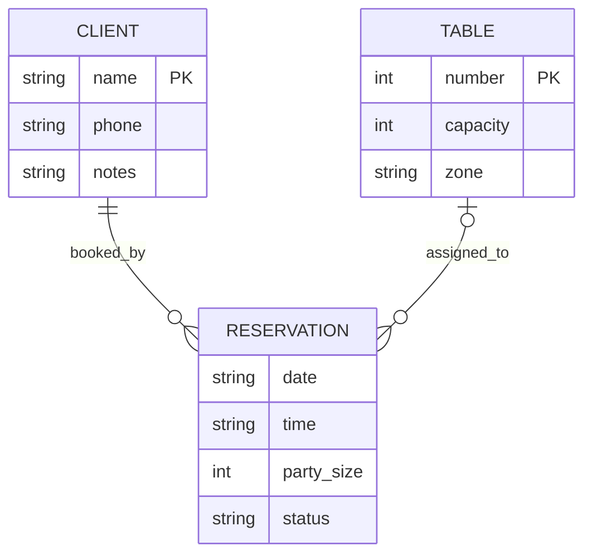
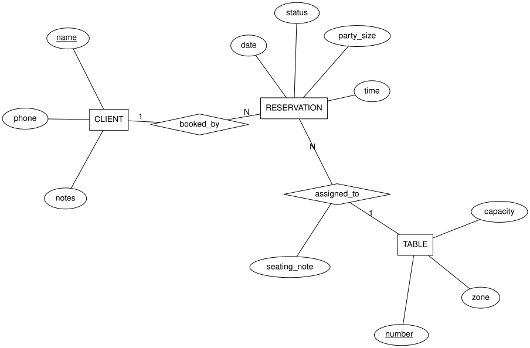

# Entidad-relación (Chen y crow's foot)

Carpeta: [nodo-arista tipado](index.md).

## 1. Qué representa

La **estructura de los datos** de un dominio: qué clases de cosas hay (entidades), qué se sabe de
ellas (atributos) y cómo se asocian (relaciones), con cuántas de cada lado. Lo propuso Peter Chen
en 1976 para diseño de bases de datos: *"A data model, called the entity-relationship model, is
proposed. This model incorporates some of the important semantic information about the real
world."* Hoy se usa desde
modelos conceptuales hasta esquemas físicos de tablas.

Es un vocabulario **del nivel de tipos**. La documentación de Mermaid lo aclara: *"technically an
entity is an abstract instance of an entity type, and this is what an ER diagram shows - abstract
instances, and the relationships between them"*. Por eso este documento usa la **opción A** de
[metamodelado](../../01-fundamentos/metamodelado-mof.md): el diagrama ER *es* el esquema del mundo.

## 2. Sintaxis abstracta

Definiciones de Chen (1976, §2.2):

| Constructo | Definición |
|---|---|
| **Entity set** | clasificación de entidades: *"Entities are classified into different entity sets such as EMPLOYEE, PROJECT, and DEPARTMENT. There is a predicate associated with each entity set to test whether an entity belongs to it"* |
| **Relationship set** | *"a mathematical relation among n entities, each taken from an entity set"*; no está limitado a dos |
| **Role** | *"The role of an entity in a relationship is the function that it performs in the relationship. 'Husband' and 'wife' are roles."* |
| **Attribute** | *"a function which maps from an entity set or a relationship set into a value set or a Cartesian product of value sets"* |
| **Atributo de relación** | *"Note that relationships also have attributes. [...] The attribute PERCENTAGE-OF-TIME [...] is neither an attribute of EMPLOYEE nor an attribute of PROJECT, since its meaning depends on both the employee and project involved."* |
| **Cardinalidad** | cuántas entidades de un lado se asocian con una del otro (1:1, 1:N, M:N) |
| **Participación** | total (toda entidad participa) o parcial; en crow's foot se lee como mínimo cero o uno |
| **Clave** | atributo(s) que identifican una entidad |
| **Entidad débil** | entidad que no se identifica sin otra (relación identificadora) |

## 3. Sintaxis concreta

Dos notaciones sobre la misma sintaxis abstracta (un buen ejemplo de
[sintaxis concreta múltiple](../../01-fundamentos/sintaxis-abstracta-y-concreta.md)):

| Constructo | Chen | Crow's foot (Information Engineering, la que usa Mermaid) |
|---|---|---|
| entidad | rectángulo | caja con el nombre y una tabla de atributos |
| relación | rombo con líneas a las entidades | línea directa entre entidades, con etiqueta |
| atributo | elipse unida a su entidad o relación | fila dentro de la caja |
| clave | nombre subrayado | marca `PK` |
| cardinalidad | `1`, `N`, `M` escritos en la línea | terminal de la línea: `\|\|` exactamente uno, `\|o` cero o uno, `}o` cero o más, `}\|` uno o más |
| relación identificadora | rombo doble / entidad débil con rectángulo doble | línea sólida (`--`); no identificadora: punteada (`..`) |
| atributo de relación | elipse unida al rombo | no tiene lugar: hay que convertir la relación en entidad asociativa |

Tabla de terminales de Mermaid (documentación, *Relationship Syntax*):

| Valor (izquierda) | Valor (derecha) | Significado |
|---|---|---|
| `\|o` | `o\|` | Zero or one |
| `\|\|` | `\|\|` | Exactly one |
| `}o` | `o{` | Zero or more (no upper limit) |
| `}\|` | `\|{` | One or more (no upper limit) |

Canales: forma (rectángulo/rombo/elipse o caja/terminal), texto, trazo sólido o punteado. En crow's
foot la cardinalidad es un **terminal de forma** (canal de identidad); en Chen es **texto** (doble
codificación ausente).

## 4. Reglas de conexión

- Una relación conecta entidades (en Chen, dos o más); un atributo pertenece a exactamente una
  entidad o relación.
- En crow's foot cada terminal combina un máximo (uno o muchos) y un mínimo (cero o uno).
- Una entidad débil necesita al menos una relación identificadora con su entidad dueña.

## 5. Ejemplo en notación estándar

El modelo de datos del restaurante de `pron` (spec 09a), en las dos notaciones.

**Crow's foot**, archivo [`entidad-relacion.assets/restaurante.mmd`](entidad-relacion.assets/restaurante.mmd),
renderizado con `mmdc` (Mermaid CLI):





`CLIENT ||--o{ RESERVATION`: un cliente tiene cero o más reservas; cada reserva, exactamente un
cliente. `TABLE |o--o{ RESERVATION`: una reserva tiene **cero o una** mesa (puede no estar asignada).

**Chen**, archivo [`entidad-relacion.assets/restaurante-chen.dot`](entidad-relacion.assets/restaurante-chen.dot),
renderizado con Graphviz (`dot -Tsvg`). Agrega un atributo de la relación `assigned_to`
(`seating_note`, una indicación sobre esa asignación en particular), que crow's foot no puede
mostrar sin inventar una entidad asociativa:

```dot
RESERVATION -- booked_by [label="N"]; booked_by -- CLIENT [label="1"];
RESERVATION -- assigned_to [label="N"]; assigned_to -- TABLE [label="1"];
assigned_to -- a_note;
```



## 6. El mismo ejemplo como mundo `pron`

Archivo [`entidad-relacion.assets/restaurante.mundo.yaml`](entidad-relacion.assets/restaurante.mundo.yaml).
Correspondencia directa con el esquema de un mundo:

| ER | Mundo `pron` |
|---|---|
| entidad | modelo (`Client`, `Table`, `Reservation`) |
| atributo | campo del modelo |
| relación | `RelationTypeDoc` (`booked_by`, `assigned_to`) |
| cardinalidad máxima | `cardinality: many_to_one` |
| clave | `ProjectionDoc.key` (`{Table: number, Client: name}`): *"Per model, the field that identifies an object by value"* |
| restricción de relación | `condition: "capacity >= {party_size}"` |

```yaml
tipos_de_relacion:
  - {name: booked_by, cardinality: many_to_one, axis: WHAT, source_types: [Reservation], target_types: [Client],
     description: "Quién hizo la reserva. Toda reserva tiene exactamente un cliente."}
  - {name: assigned_to, cardinality: many_to_one, axis: WHERE, source_types: [Reservation], target_types: [Table],
     condition: "capacity >= {party_size}",
     description: "Qué mesa recibe la reserva; puede no tener mesa todavía. La mesa debe alcanzar para todos."}
```

Montaje: `pron refresh` → `graph: 102 nodes, 101 edges, 13 relation types`; `pron check` → `ok`;
`mundo sano … comandos con error: 0`. Control negativo (dirección invertida, `Client → Reservation`):
rechazado por `kgdb` en `refresh`, con los dos errores de tipo:

```
- edge sldb://document/Client:client-luis-soto -[booked_by]-> sldb://document/Reservation:reservation-2026-09-11-luis-soto: source class 'Client' not in source_types ['Reservation']
- edge sldb://document/Client:client-luis-soto -[booked_by]-> sldb://document/Reservation:reservation-2026-09-11-luis-soto: target class 'Reservation' not in target_types ['Client']
```

### ¿Se hace cumplir la participación mínima?

La descripción de `booked_by` dice *"Toda reserva tiene exactamente un cliente"*: participación
total. Variante [`restaurante-participacion.mundo.yaml`](entidad-relacion.assets/restaurante-participacion.mundo.yaml),
con una reserva sin cliente ni mesa:

```
  graph: 105 nodes, 104 edges, 13 relation types
$ pron check ...
  ok
mundo sano: .../world  ·  comandos con error: 0
```

Pasa. `cardinality` acota el **máximo** de cada lado; no hay mínimo. "Exactamente uno" y "cero o uno"
son indistinguibles en el mundo: la diferencia entre `||` y `|o` en crow's foot, o entre
participación total y parcial en Chen, solo vive en la prosa de `description`.

## 7. Qué tendría que declarar un `VocabularyDoc`

Este vocabulario aplica al **nivel de tipos**.

**Para dibujar**

| Constructo ER | Viene de | Símbolo |
|---|---|---|
| entidad | cada modelo registrado del mundo (o los de una `ProjectionDoc`) | caja (crow's foot) o rectángulo (Chen) |
| atributo | cada campo del modelo (`/api/schema`) | fila con tipo y nombre, o elipse |
| clave | `ProjectionDoc.key[Modelo]` | `PK` o subrayado |
| relación | cada `RelationTypeDoc` con `source_types` y `target_types` registrados | línea etiquetada (crow's foot) o rombo (Chen) |
| terminales | `cardinality`: `many_to_one` ⇒ muchos del lado origen, uno del lado destino | `}o`/`o{`…; el **mínimo** no tiene fuente (ver huecos) |
| restricción | `condition` | nota o tooltip (ninguna de las dos notaciones tiene símbolo) |

**Para editar**

| Gesto | Operación | Escritura |
|---|---|---|
| unir dos entidades con la herramienta *Relación* | `create-relation-type(nombre, origen, destino, cardinality)` | 1 `RelationTypeDoc` (documento: `/api/save`) |
| cambiar el terminal | `set(RelationTypeDoc.cardinality)` | 1 `update` |
| agregar un atributo | `add-field(Modelo, campo, tipo)` | **esquema**: draft + validar + promover (`models_service.py`) |
| crear una entidad | `create-model(nombre, campos)` | **esquema**: `models create` + `models add` |

La edición es **asimétrica**: las relaciones son documentos y se editan como datos; entidades y
atributos son modelos Python y se editan con el flujo de drafts. Un mismo diagrama mezcla dos
mecanismos de escritura con costos y garantías distintos.

## 8. Huecos

- **`kgdb` no tiene participación mínima**: `cardinality` solo acota el máximo; una `Reservation` sin
  `booked_by` pasa `refresh` y `check`. Crow's foot y Chen necesitan el mínimo.
- **`RelationDoc` sin atributos**: el `seating_note` de `assigned_to` (atributo de relación, un
  concepto central en Chen) no tiene lugar; `notes` es Markdown libre. Mismo hueco que en
  [UML de clases](uml-clases.md).
- **Sin entidades débiles**: no hay forma de declarar que un modelo no se identifica sin otro.
- **Relaciones de más de dos entidades** (Chen lo permite desde la definición): ver
  [ER n-aria](../n-aria/er-n-aria.md).
- **La clave está en `ProjectionDoc`, no en el esquema**: identifica por valor dentro de una
  proyección de `pron` pero no es una restricción de unicidad.
- **Edición asimétrica** entre relaciones (documentos) y entidades/atributos (modelos con drafts), y
  enums (`Table.zone`) sin soporte en `sldb models create`.

## 9. Fuentes

- P. P. Chen, *The Entity-Relationship Model — Toward a Unified View of Data*, ACM TODS 1(1), 1976,
  pp. 9–36, §2.2: http://bit.csc.lsu.edu/~chen/pdf/erd-5-pages.pdf (extracto de 5 páginas) y
  https://dl.acm.org/doi/10.1145/320434.320440
- Mermaid, *Entity Relationship Diagrams* (fuente en el repositorio oficial):
  https://github.com/mermaid-js/mermaid/blob/develop/packages/mermaid/src/docs/syntax/entityRelationshipDiagram.md
- Graphviz, atributos `shape` y etiquetas HTML: https://graphviz.org/doc/info/shapes.html
- `pron`, `src/pron/models/projection.py` (`key`); `kgdb`, `src/kgdb/models/relation_type_doc.py`.
