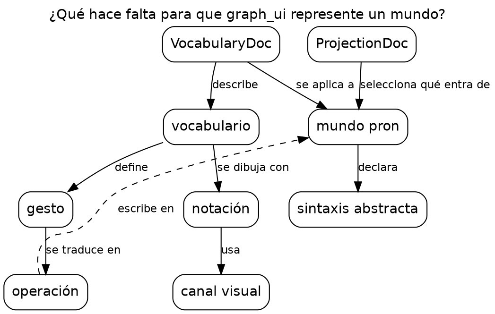
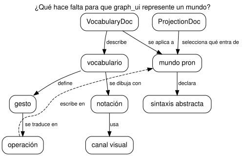

# Mapa conceptual

Carpeta: [nodo-arista tipado](index.md).

## 1. Qué representa

El **conocimiento sobre un tema** como una red de conceptos unidos por proposiciones. Se usa en
educación, en análisis de dominio y para externalizar lo que alguien entiende. Novak y Cañas (IHMC,
2008): *"Concept maps are graphical tools for organizing and representing knowledge."*

Es, de todos los vocabularios de esta carpeta, el más cercano a lo que un mundo `pron` ya **es**:
documentos (conceptos) unidos por verbos con nombre (proposiciones), con un léxico que da las
palabras. La KB de `pron` (`SurfaceDoc implements SpecDoc`) se lee naturalmente como mapa
conceptual.

## 2. Sintaxis abstracta

Definiciones de Novak y Cañas (2008, *Introduction*):

| Constructo | Definición |
|---|---|
| **Concepto** | *"a perceived regularity in events or objects, or records of events or objects, designated by a label"* |
| **Palabra de enlace** | *"Words on the line, referred to as linking words or linking phrases, specify the relationship between the two concepts."* |
| **Proposición** | *"statements about some object or event in the universe, either naturally occurring or constructed. Propositions contain two or more concepts connected using linking words or phrases to form a meaningful statement. Sometimes these are called semantic units, or units of meaning."* |
| **Jerarquía** | *"the concepts are represented in a hierarchical fashion with the most inclusive, most general concepts at the top of the map and the more specific, less general concepts arranged hierarchically below"* |
| **Pregunta de enfoque** | *"a question that clearly specifies the problem or issue the concept map should help to resolve. Every concept map responds to a focus question"* |
| **Enlace cruzado** | *"relationships or links between concepts in different segments or domains of the concept map"* |

La unidad de significado no es el nodo ni la arista: es la **proposición** (concepto — enlace —
concepto), que se lee como una oración.

## 3. Sintaxis concreta

| Constructo | Símbolo |
|---|---|
| concepto | caja o elipse con la etiqueta |
| proposición | línea (normalmente dirigida) con la palabra de enlace escrita sobre ella |
| jerarquía | **posición vertical**: lo general arriba, lo específico abajo |
| enlace cruzado | línea que cruza segmentos; se suele destacar (punteada o de otro color) |
| pregunta de enfoque | título del mapa |

Canales: texto (etiquetas y enlaces, la mayor parte del significado), posición vertical
(generalidad), trazo (enlace cruzado). Es una notación de baja expresividad visual y alta
**doble codificación**: casi todo el significado está en las palabras (ver
[Physics of Notations](../../01-fundamentos/physics-of-notations.md)).

## 4. Reglas de conexión

Casi ninguna: cualquier concepto puede unirse a cualquier otro. Las reglas son de calidad, no de
gramática: la proposición debe leerse como una oración con sentido, y el mapa debe responder la
pregunta de enfoque.

## 5. Ejemplo en notación estándar

Un mapa conceptual de este mismo manual. Pregunta de enfoque: *¿Qué hace falta para que graph_ui
represente un mundo?* Archivo [`mapa-conceptual.assets/representar.dot`](mapa-conceptual.assets/representar.dot),
renderizado con Graphviz (`dot -Tsvg`):





`operación escribe en mundo pron` es el enlace cruzado (punteado): une el segmento de la edición con
el del dato.

## 6. El mismo ejemplo como mundo `pron`

Archivo [`mapa-conceptual.assets/representar.mundo.yaml`](mapa-conceptual.assets/representar.mundo.yaml).

| Mapa conceptual | Mundo `pron` |
|---|---|
| concepto | documento `Concept` (`label`, `definition`) |
| palabra de enlace | verbo: un `RelationTypeDoc` por enlace (`declara`, `se_dibuja_con`, …) |
| formas de la palabra | `AnchorDoc` con `ref: relation:<verbo>` y sus `forms` (`se dibuja con`, `se dibujan con`) |
| proposición | `RelationDoc` |

```yaml
- model: AnchorDoc
  name: anchor-se-dibuja-con
  payload:
    symbol: se dibuja con
    forms:
    - se dibuja con
    - se dibujan con
    ref: relation:se_dibuja_con
    motive: 'Palabra de enlace del mapa conceptual: se dibuja con.'
```

Montaje: `graph: 132 nodes, 141 edges, 20 relation types`; `pron check` → `ok`; `comandos con error: 0`.
La herramienta corre además `pron lexicon`, que muestra que las palabras de enlace ya son parte del
léxico del mundo (extracto):

```
  se_dibuja_con            relation         relation:se_dibuja_con                           Proposición: <concepto> se dibuja con <concepto>.
  se dibuja con            relation         relation:se_dibuja_con                           Proposición: <concepto> se dibuja con <concepto>.
  ...
  se dibujan con           alias-relation   relation:se_dibuja_con                           Palabra de enlace del mapa conceptual: se dibuja con.
  selecciona qué entra de  alias-relation   relation:selecciona                              Palabra de enlace del mapa conceptual: selecciona qué entra de.
```

`pron` ya deriva una forma legible del nombre del verbo (`se_dibuja_con` → `se dibuja con`) y suma
las formas de los `AnchorDoc` como alias.

No hay control negativo: el vocabulario no tiene gramática que violar.

## 7. Qué tendría que declarar un `VocabularyDoc`

**Para dibujar**

| Constructo | Viene de | Símbolo |
|---|---|---|
| concepto | documentos de los modelos que el vocabulario declara como conceptos | caja con `label` (o la plantilla `display` de la proyección) |
| proposición | `RelationDoc` de cualquier verbo entre conceptos | línea dirigida |
| palabra de enlace | **el léxico**: `AnchorDoc.symbol` del verbo si existe, si no la forma derivada del nombre | texto sobre la línea |
| jerarquía | un orden de generalidad declarado (hoy no existe; ver huecos) | posición vertical |
| pregunta de enfoque | un campo de la vista, o la `description` de la `ProjectionDoc` | título |
| enlace cruzado | derivado del layout (une segmentos distintos) o marcado | trazo punteado |

**Para editar**

| Gesto | Operación | Escritura |
|---|---|---|
| unir dos conceptos y escribir la palabra de enlace | si la palabra es un alias existente: `assert(verbo, A, B)`; si no: crear el verbo y su ancla, y después afirmar | 1 `RelationDoc`, o 1 `RelationTypeDoc` + 1 `AnchorDoc` + 1 `RelationDoc` |
| editar la etiqueta de un concepto | `set(Concept.label)` | 1 `update` |
| cambiar la palabra de enlace de una proposición | `retype` | borrar + crear |

El primer gesto es interesante: la vista puede **resolver la palabra escrita contra el léxico** del
mundo (el mismo `Matcher` que usa `pron say`), en vez de pedir que el usuario elija un tipo de una
lista.

## 8. Huecos

- **`graph_ui` etiqueta aristas con el token del tipo** (`relation_type`, p. ej. `se_dibuja_con`) y no
  con el léxico del mundo (`AnchorDoc`, o la forma que `pron lexicon` ya deriva).
- **No hay orden de generalidad declarado** entre conceptos: la jerarquía vertical de un mapa
  conceptual no tiene fuente; dagre ordena por dirección de aristas, que no es lo mismo.
- **Cada palabra de enlace nueva es un tipo de relación nuevo**: en un mapa conceptual las frases de
  enlace son abundantes y a veces únicas; en `pron` cada una exige un `RelationTypeDoc` (y un ancla
  para sus formas). Es coherente con el diseño de `pron`, pero pesado para este uso.
- **Proposiciones de más de dos conceptos** (Novak y Cañas: *"two or more concepts"*): ver
  [`../n-aria/`](../n-aria/index.md).

## 9. Fuentes

- J. D. Novak, A. J. Cañas, *The Theory Underlying Concept Maps and How to Construct and Use Them*,
  Technical Report IHMC CmapTools 2006-01 Rev 01-2008, Florida Institute for Human and Machine
  Cognition, 2008: https://cmap.ihmc.us/publications/researchpapers/theoryunderlyingconceptmaps.pdf
- `pron`, `src/pron/models/anchor.py` (`AnchorDoc`) y `pron lexicon`.
- Graphviz, `dot`: https://graphviz.org/doc/info/lang.html
