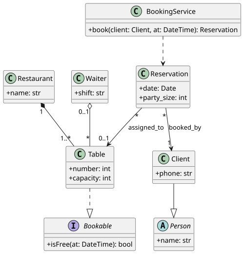

# UML — diagrama de clases

Carpeta: [nodo-arista tipado](index.md). Es el vocabulario de prueba del manual.

## 1. Qué representa

La **estructura de tipos** de un sistema: qué clases e interfaces hay, qué atributos y operaciones
tienen, y cómo se relacionan (quién es subtipo de quién, qué contiene qué, qué conoce a qué). Lo usan
quienes diseñan o documentan software orientado a objetos, y también quienes modelan dominios
(modelado conceptual). Es el más difundido de los diagramas de UML.

## 2. Sintaxis abstracta

Constructos del metamodelo UML 2.5.1 que usa este ejemplo:

| Constructo | Qué significa |
|---|---|
| **Class** | un clasificador con atributos y operaciones; puede ser abstracta (no tiene instancias directas) |
| **Interface** | un contrato: un conjunto de features que otros clasificadores se comprometen a proveer |
| **Property** (atributo o extremo de asociación) | tiene nombre, tipo, **multiplicidad** (`1`, `0..1`, `*`, `1..*`) y **aggregation** |
| **Association** | un vínculo entre instancias de clasificadores, con dos o más **extremos** (*memberEnd*), cada uno una Property con su rol y multiplicidad |
| **AggregationKind** (en un extremo) | `none`; `shared`: *"Precise semantics of shared aggregation varies by application area and modeler"*; `composite`: *"the composite object has responsibility for the existence and storage of the composed objects"* |
| **Generalization** | el clasificador específico hereda las features del general |
| **InterfaceRealization** | *"the BehavioredClassifier conforms to the contract specified by the Interface by supporting the set of Features owned by the Interface"* |
| **Dependency** | el cliente depende del proveedor: un cambio en el proveedor puede afectar al cliente |

Un detalle del metamodelo que `spec2viz` aplana: en UML la composición y la agregación **no son
tipos de relación distintos** de la asociación. Son asociaciones binarias en las que un extremo
tiene `aggregation = shared` o `composite`. La restricción `binary_associations` lo fija:
*"Only binary Associations can be aggregations."*

## 3. Sintaxis concreta

| Constructo | Símbolo (UML 2.5.1) |
|---|---|
| Class | rectángulo con compartimentos (nombre, atributos, operaciones); abstracta en cursiva |
| Interface | *"the default notation for Classifier (see 9.2.4) with the keyword «interface»"* |
| Generalization | *"a line with a hollow triangle as an arrowhead between the symbols representing the involved Classifiers. The arrowhead points to the symbol representing the general Classifier."* |
| Realization | *"a dashed line with a triangular arrowhead at the end that corresponds to the realized Element"* |
| Dependency | *"a dashed arrow between two model Elements. The model Element at the tail of the arrow (the client) depends on the model Element at the arrowhead (the supplier)."* |
| Association | línea sólida; nombre del rol y multiplicidad junto a cada extremo; flecha abierta = extremo navegable |
| Agregación compartida | *"a hollow diamond is added as a terminal adornment at the end of the Association line opposite the end marked with aggregation = AggregationKind::shared"* |
| Composición | el mismo rombo, relleno |

Canales usados (ver [variables visuales](../../01-fundamentos/variables-visuales.md)): forma del
nodo y del terminal, patrón de trazo, texto en los extremos (doble codificación). La posición no
significa nada.

## 4. Reglas de conexión

- Generalización: entre clasificadores; sin ciclos.
- Realización: el destino es una interfaz.
- Composición: una parte está en a lo sumo un compuesto a la vez (*"requires a part object be
  included in at most one composite object at a time"*), así que la multiplicidad del extremo del
  compuesto es como máximo 1.
- Agregación (compartida o compuesta): solo en asociaciones binarias.

## 5. Ejemplo en notación estándar

Un restaurante con los seis tipos de relación. Escrito como spec de `spec2viz` (valida la semántica:
extremos conocidos, multiplicidades bien formadas, ciclos de herencia, destino de realización) y
renderizado con su backend PlantUML.

Archivo [`uml-clases.assets/uml-clases.spec2viz.yml`](uml-clases.assets/uml-clases.spec2viz.yml):

```yaml
  relations:
    - {from: Client, to: Person, relation: inheritance}
    - {from: Table, to: Bookable, relation: realization}
    - {from: Restaurant, to: Table, relation: composition, from_multiplicity: "1", to_multiplicity: "1..*"}
    - {from: Waiter, to: Table, relation: aggregation, from_multiplicity: "0..1", to_multiplicity: "*"}
    - {from: Reservation, to: Client, relation: association, label: booked_by, from_multiplicity: "*", to_multiplicity: "1"}
    - {from: Reservation, to: Table, relation: association, label: assigned_to, from_multiplicity: "*", to_multiplicity: "0..1"}
    - {from: BookingService, to: Reservation, relation: dependency}
```

```sh
spec2viz diagram validate uml-clases.assets/uml-clases.spec2viz.yml      # uml-clases.spec2viz.yml: OK
spec2viz diagram render uml-clases.assets/uml-clases.spec2viz.yml --backend plantuml --out uml-clases.assets
plantuml -tsvg uml-clases.assets/uml-clases.spec2viz.puml
```

PlantUML generado ([`uml-clases.spec2viz.puml`](uml-clases.assets/uml-clases.spec2viz.puml)),
relaciones:

```plantuml
Client --|> Person
Table ..|> Bookable
Restaurant "1" *-- "1..*" Table
Waiter "0..1" o-- "*" Table
Reservation "*" --> "1" Client : booked_by
Reservation "*" --> "0..1" Table : assigned_to
BookingService ..> Reservation
```

**Resultado esperado** (lo que `graph_ui` + vocabulario visual debería poder dibujar desde el mundo de
la sección 6):



## 6. El mismo ejemplo como mundo `pron`

Se usa la **opción B** de [metamodelado](../../01-fundamentos/metamodelado-mof.md): UML es el
dominio del mundo. Archivo
[`uml-clases.assets/uml-clases.mundo.yaml`](uml-clases.assets/uml-clases.mundo.yaml).

- Clases: documentos de un modelo `UmlClass` (`name`, `kind`, `attributes`, `operations`).
- Generalización, realización y dependencia: `RelationDoc` de tipos `generalizes`, `realizes`,
  `depends_on`. No necesitan más datos que los dos extremos.
- Asociaciones (con o sin agregación): **no caben en una `RelationDoc`**, que solo tiene
  `source_id`, `target_id`, `relation_type`, `condition` y `notes`
  (`kgdb/models/relation_doc.py`). Roles, multiplicidades y tipo de agregación son datos de *cada*
  asociación. Se reifican: un documento `UmlAssociation` (`aggregation`, `a_role`,
  `a_multiplicity`, `b_role`, `b_multiplicity`) y dos aristas `end_a` y `end_b` hacia las clases.

Las restricciones del vocabulario que el mundo puede declarar:

```yaml
tipos_de_relacion:
  - {name: realizes, cardinality: many_to_many, source_types: [UmlClass], target_types: [UmlClass],
     condition: 'kind = "interface"',
     description: "El origen implementa el contrato del destino, que debe ser una interfaz (UML InterfaceRealization)."}
  - {name: end_a, cardinality: many_to_one, source_types: [UmlAssociation], target_types: [UmlClass],
     description: "Clase del extremo A de una asociación."}
```

Montaje (solo CLI):

```sh
python3 docs/representacion/herramientas/montar_mundo.py \
  docs/representacion/03-diagrama-vocabulario/nodo-arista-tipado/uml-clases.assets/uml-clases.mundo.yaml
```

Salida (resumida): 28 documentos creados y rastreados (5 tipos de relación, 12 documentos, 11 aristas), luego

```
$ pron refresh --world .../world --pythonpath ...
  graph: 115 nodes, 121 edges, 16 relation types
$ pron check --world .../world --pythonpath ...
  ok

mundo sano: .../world  ·  comandos con error: 0
```

### Controles negativos: ¿quién hace cumplir las reglas del vocabulario?

La herramienta agrega, uno por uno, tres `RelationDoc` inválidas escritas directo con
`sldb docs create` y vuelve a correr `pron refresh` y `pron check`:

| Arista inválida | Regla que viola | `sldb docs create` | `pron refresh` (`kgdb`) | `pron check` |
|---|---|---|---|---|
| `realizes` Reservation → Client | `condition: kind = "interface"` | la escribe | **la acepta** | `ok` |
| `generalizes` UmlAssociation → Person | `source_types: [UmlClass]` | la escribe | la rechaza: `source class 'UmlAssociation' not in source_types ['UmlClass']` | `ok` |
| segundo `end_a` de `booked-by` | `cardinality: many_to_one` | la escribe | la rechaza: `has 2 'end_a' targets but cardinality is many_to_one` | `ok` |

`kgdb` lo documenta así en `ingest/typed.py`: *"Any violation is an error, never a warning: the world
prevents at authoring time, kgdb detects at assembly time."* La condición no se revisa al ensamblar.
La prevención *al escribir* existe en `pron` (`Verbs.assert_edge`: tipos, cardinalidad **y
condición**). Script
[`uml-clases.assets/afirmar-aristas.py`](uml-clases.assets/afirmar-aristas.py), sobre el mundo
montado con `--conservar`:

```
RECHAZADA: realizes UmlClass:reservation -> UmlClass:client :: condition 'kind = "interface"' does not hold for UmlClass:reservation → UmlClass:client (find 'st.{UmlClass+}' --where 'kind = "interface"')
ACEPTADA: realizes UmlClass:waiter -> UmlClass:bookable => realizes--UmlClass:waiter--UmlClass:bookable
RECHAZADA: generalizes UmlAssociation:booked-by -> UmlClass:person :: generalizes takes UmlClass as subject, not UmlAssociation
```

Nota de sintaxis aprendida en el camino: en la condición, un literal de texto va entre comillas
(`kind = "interface"`). Sin comillas, `sldb` no encuentra nada y `pron` rechaza también la arista
válida.

## 7. Qué tendría que declarar el vocabulario visual

**Para dibujar**

| Constructo UML | Viene de | Símbolo |
|---|---|---|
| Class / Interface / abstracta | documento `UmlClass`; `kind` elige estereotipo o cursiva | caja con compartimentos: `name`, `attributes`, `operations` |
| Generalization | `RelationDoc` `generalizes` | línea sólida, triángulo hueco en el destino |
| InterfaceRealization | `RelationDoc` `realizes` | línea punteada, triángulo hueco en el destino |
| Dependency | `RelationDoc` `depends_on` | flecha punteada abierta |
| Association | documento `UmlAssociation` + sus aristas `end_a` y `end_b` | **una** línea entre las dos clases (el documento no se dibuja como nodo); `a_role`/`a_multiplicity` junto a la clase A, `b_role`/`b_multiplicity` junto a la B; rombo en A si `aggregation` ≠ `none`, relleno si es `composite` |

La última fila es una **arista basada en elemento con dos extremos resueltos por aristas**: un caso
que la vista Flujo actual no cubre (solo colapsa `RelationDoc` con `source_id`/`target_id`).

**Para editar** (gesto → operación):

| Gesto | Operación | Escrituras |
|---|---|---|
| arrastrar de una clase a otra con la herramienta *Generalización* | `assert(generalizes, A, B)` | 1 `RelationDoc`, validada por `pron` |
| ídem *Realización* | `assert(realizes, A, B)` | 1 `RelationDoc`; si B no es interfaz, el vocabulario debería impedir el gesto antes de escribir |
| arrastrar con la herramienta *Asociación* / *Composición* | `create-association(A, B, aggregation)` | 1 `UmlAssociation` + 2 `RelationDoc` (`end_a`, `end_b`): **un gesto, tres escrituras** |
| editar la multiplicidad junto a un extremo | `set(UmlAssociation.b_multiplicity)` | 1 `update` |
| mover el extremo B a otra clase | `reconnect-end(assoc, b, C)` | borrar la `RelationDoc` `end_b` y crear otra (el id lleva los extremos) |
| borrar la asociación | `delete-association` | 1 `UmlAssociation` + 2 `RelationDoc` |

## 8. Huecos

- **`graph_ui` escribe aristas sin validar.** El guardado usa `pron.Store.create`, que no pasa por
  `Verbs.assert_edge`: una realización hacia algo que no es interfaz se guarda sin error y ningún
  control posterior la detecta. Tipos y cardinalidad solo aparecen al correr `pron refresh`, y como
  traceback.
- **`pron check` no detecta aristas que `kgdb` rechaza**: responde `ok` mientras `pron refresh`
  falla.
- **`pron` no expone la afirmación de aristas por CLI** (`init, refresh, lexicon, say, repl, serve,
  check, docs`): por CLI solo se puede escribir la `RelationDoc` directo (sin validar) o pasar por
  lenguaje natural (`say`, que requiere anclas).
- **`RelationDoc` no tiene roles, multiplicidades por arista ni atributos**: una asociación UML se
  reifica en tres documentos. `cardinality` de `RelationTypeDoc` es por tipo y tiene cuatro valores;
  no expresa `0..1` o `1..*`.
- **`condition` de `RelationTypeDoc` se evalúa al escribir por `pron`, no al ensamblar por `kgdb`**:
  un mundo puede contener aristas que violan su condición si se escribieron por fuera de `pron`.
- **Opción A (el esquema del mundo como UML)** no se puede editar por CLI con enums ni herencia
  entre modelos (ver `sldb models create` en [`../../huecos.md`](../../huecos.md)).

## 9. Fuentes

- OMG, *Unified Modeling Language 2.5.1* (formal/17-12-05), §7.7.4 (Dependency, Realization), §9.2.4
  (Generalization), §9.5.3 y §9.9.1 (AggregationKind), §10.4.3–10.4.4 (Interface, InterfaceRealization), §11.5.4 (notación de Association), §11.8.1 (restricción
  `binary_associations`):
  https://www.omg.org/spec/UML/2.5.1/PDF
- `spec2viz`, `docs/CLASS_DIAGRAMS.md` (`tools/spec2viz`).
- PlantUML, diagramas de clases: https://plantuml.com/class-diagram
- `kgdb`, `src/kgdb/models/relation_doc.py` e `src/kgdb/ingest/typed.py`; `pron`,
  `src/pron/verbs.py` (`assert_edge`).
