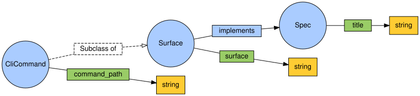

# VOWL (ontologías OWL)

Carpeta: [nodo-arista tipado](index.md). La herramienta como prior art está en
[`../../02-prior-art/vowl.md`](../../02-prior-art/vowl.md); aquí va la notación aplicada a un ejemplo.

## 1. Qué representa

El **esquema de una ontología OWL** (su TBox): qué clases hay, cómo se especializan, qué propiedades
unen clases entre sí y qué propiedades llevan a valores. Pensada para usuarios que no son expertos en
ontologías (Lohmann et al. 2016). Es un vocabulario del nivel de tipos, como
[entidad-relación](entidad-relacion.md).

Interesa porque OWL y un mundo `pron` modelan lo mismo con otras palabras, y la correspondencia es
casi uno a uno.

## 2. Sintaxis abstracta

Constructos de OWL/RDFS que usa el ejemplo:

| Constructo | Qué significa |
|---|---|
| `owl:Class` | un conjunto de individuos |
| `rdfs:subClassOf` | todo individuo de la subclase es individuo de la superclase |
| `owl:ObjectProperty` | una relación entre individuos |
| `owl:DatatypeProperty` | una relación entre un individuo y un valor literal |
| `rdfs:domain` / `rdfs:range` | de qué clase son los sujetos y los objetos de una propiedad |

## 3. Sintaxis concreta

Primitivas de VOWL (Lohmann et al. 2016, §3.1.1): *"Classes are depicted as circles that are
connected by lines representing the properties with their domain and range axioms. Property labels
and datatypes are displayed in rectangles, and text is used for labels and cardinality
constraints."*

| Constructo | Símbolo |
|---|---|
| clase | círculo (tamaño opcional según cantidad de individuos) |
| propiedad de objeto | línea de la clase dominio a la clase rango, con el rótulo en un rectángulo y punta hacia el rango |
| propiedad de dato | línea hacia un rectángulo del tipo de dato |
| subclase | notación inspirada en la generalización de UML (línea punteada, rótulo *Subclass of*) |
| externo, obsoleto | color de la función + texto (redundancia deliberada) |

Colores **por función** (§3.1.2): general, externo (*"a dark version of the general color"*),
propiedad de dato (*"clearly different"*), tipo de dato, obsoleto, resaltado. **Reglas de división**:
un tipo de dato aparece una vez por cada propiedad de dato; `owl:Thing`, una vez por clase conectada.

## 4. Reglas de conexión

- Una propiedad de objeto une clases; una propiedad de dato une una clase con un tipo de dato.
- Sin dominio o rango declarado, VOWL usa `owl:Thing` (o `rdfs:Literal` para el rango de una
  propiedad de dato).

## 5. Ejemplo en notación estándar

Una ontología mínima de la KB de `pron`: superficies de código que implementan capítulos del spec,
con `CliCommand` como subclase de `Surface`. Archivo
[`vowl-owl.assets/conocimiento.ttl`](vowl-owl.assets/conocimiento.ttl):

```turtle
:Surface    a owl:Class ; rdfs:label "Surface" ; rdfs:comment "Un módulo de código de pron." .
:CliCommand a owl:Class ; rdfs:label "CliCommand" ; rdfs:subClassOf :Surface ;
            rdfs:comment "Un comando del CLI; es una superficie." .
:Spec       a owl:Class ; rdfs:label "Spec" ; rdfs:comment "Un capítulo de la especificación." .

:implements a owl:ObjectProperty ; rdfs:label "implements" ;
            rdfs:domain :Surface ; rdfs:range :Spec .

:title       a owl:DatatypeProperty ; rdfs:label "title" ; rdfs:domain :Spec ; rdfs:range xsd:string .
:surface     a owl:DatatypeProperty ; rdfs:label "surface" ; rdfs:domain :Surface ; rdfs:range xsd:string .
:commandPath a owl:DatatypeProperty ; rdfs:label "command_path" ; rdfs:domain :CliCommand ; rdfs:range xsd:string .
```

Validada con `rdflib` 7.6 (parseo y lectura de los axiomas):

```
triples: 28
clases: ['CliCommand', 'Spec', 'Surface']
object property: implements Surface -> Spec
subClassOf: CliCommand ⊑ Surface
datatype property: title Spec -> string
datatype property: surface Surface -> string
datatype property: command_path CliCommand -> string
```

**Resultado esperado — con una salvedad.** No hay renderer VOWL local: WebVOWL necesita el
conversor OWL2VOWL (Java) y la aplicación web, y usar una instancia pública implicaría subir la ontología a
un tercero. La imagen es una **aproximación hecha para este manual** con Graphviz
([`conocimiento-vowl-aprox.dot`](vowl-owl.assets/conocimiento-vowl-aprox.dot)) que sigue las
primitivas, los colores por función y la regla de división del artículo; no es la salida de WebVOWL.



## 6. El mismo ejemplo como mundo `pron`

Opción A: la ontología **es** el esquema del mundo. Archivo
[`vowl-owl.assets/conocimiento.mundo.yaml`](vowl-owl.assets/conocimiento.mundo.yaml).

| OWL | Mundo `pron` |
|---|---|
| `owl:Class` | modelo (`Surface`, `CliCommand`, `Spec`) |
| `owl:DatatypeProperty` | campo del modelo |
| `owl:ObjectProperty` | `RelationTypeDoc` (`implements`) |
| `rdfs:domain` | `source_types` |
| `rdfs:range` | `target_types` |
| `rdfs:subClassOf` | herencia entre modelos (`base_models`; `kgdb` la sigue: *"model names (with inheritance)"*) |

Montaje: `graph: 88 nodes, 82 edges, 12 relation types`; `pron check` → `ok`; `comandos con error: 0`.
Control negativo (dominio y rango invertidos): rechazado en `refresh` con los dos errores de tipo.

### La subclase

`rdfs:subClassOf` no se puede declarar por CLI. En el mundo sano, `CliCommand` no hereda de `Surface`;
en su lugar `implements` lista los dos modelos en `source_types`. La variante
[`conocimiento-subclase.mundo.yaml`](vowl-owl.assets/conocimiento-subclase.mundo.yaml) agrega
`base: Surface` a `CliCommand`:

```
$ python3 -m sldb models add mundo_modelos.clicommand:CliCommand --store ... --pythonpath ...
  Failed to import module 'mundo_modelos.clicommand'.
  [exit 1]
...
$ python3 -m sldb docs create --model CliCommand ... {"command_path": "pron refresh"}
  Model 'CliCommand' not registered.
  [exit 1]
...
$ python3 -m sldb docs create --model RelationDoc ... --name implements--CliCommand:cli-pron-refresh--Spec:spec-01 ...
  Created and tracked 'implements--CliCommand:cli-pron-refresh--Spec:spec-01'
$ pron refresh ...
  - relation 'implements--CliCommand:cli-pron-refresh--Spec:spec-01': source 'CliCommand:cli-pron-refresh' is not a tracked document
  [exit 1]
$ pron check ...
  FAIL relation implements--CliCommand:cli-pron-refresh--Spec:spec-01: source_id CliCommand:cli-pron-refresh does not exist
  1 problem(s)
  [exit 1]

mundo sano: .../world  ·  comandos con error: 4
```

Tres cosas se ven en cascada: el módulo generado no importa (hereda de una clase que busca en
`sldb`), el modelo no se registra, y **`sldb docs create` escribe igual una `RelationDoc` hacia un
documento que no existe**. Esta vez `pron check` sí lo detecta: revisa que los extremos existan,
aunque no los tipos ni la cardinalidad.

## 7. Qué tendría que declarar el vocabulario visual

**Para dibujar** (nivel de tipos)

| Constructo | Viene de | Símbolo |
|---|---|---|
| clase | cada modelo del mundo | círculo; radio opcional según `docCount` (ya lo calcula la vista Schema) |
| subclase | `base_models` del modelo (`extends` en el grafo de `kgdb`) | línea punteada *Subclass of* |
| propiedad de objeto | cada `RelationTypeDoc` con dominio y rango registrados | línea con rótulo rectangular |
| propiedad de dato | cada campo del modelo | rótulo + rectángulo del tipo, **repetido por campo** (regla de división) |
| externo | propuesta: modelo que viene de un store enlazado, no del local | color de función "externo" + texto |

**Para editar**: igual que [entidad-relación](entidad-relacion.md) — las propiedades de objeto son
documentos y las clases y propiedades de dato son esquema — más la subclase, que hoy no tiene
escritura posible por CLI.

## 8. Huecos

- **Herencia entre modelos no declarable por CLI** (`rdfs:subClassOf`): el mundo tiene que duplicar
  `source_types` en vez de expresar la especialización. Ya registrado en
  [`../../huecos.md`](../../huecos.md) desde `sldb models create`.
- **`sldb docs create` no valida que los extremos de una `RelationDoc` existan**; lo detecta después
  `pron refresh` (traceback) y `pron check` (`FAIL ... does not exist`).
- **`pron check` es desparejo**: detecta extremos inexistentes pero no tipos ni cardinalidad (ver
  [UML de clases](uml-clases.md)).
- **Sin renderer VOWL local** para el resultado esperado: la imagen de este documento es una
  aproximación.

## 9. Fuentes

- S. Lohmann, S. Negru, F. Haag, T. Ertl, *Visualizing Ontologies with VOWL*, Semantic Web 7(4), 2016,
  pp. 399–419, §3.1.1–3.1.2: https://www.semantic-web-journal.net/system/files/swj1114.pdf
- W3C, *OWL 2 Web Ontology Language Primer*: https://www.w3.org/TR/owl2-primer/
- rdflib: https://rdflib.readthedocs.io/
- `kgdb`, `src/kgdb/models/relation_type_doc.py` (`source_types`, `target_types` con herencia).
