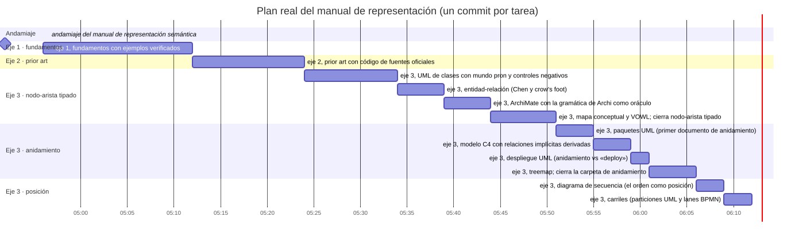

# Gantt

Carpeta: [posición](index.md).

## 1. Qué representa

El **plan de un proyecto en el tiempo**: qué tareas hay, cuándo empieza y termina cada una, y de cuáles
depende. La documentación de Mermaid lo resume: *"A Gantt chart is a type of bar chart, first developed
by Karol Adamiecki in 1896, and independently by Henry Gantt in the 1910s, that illustrates a project
schedule and the amount of time it would take for any one project to finish."*

Es la forma de esta carpeta donde el eje es **temporal y métrico**: la longitud de una barra es una
duración, no solo un orden (a diferencia de la [secuencia UML](uml-secuencia.md), donde las distancias
no significan nada).

## 2. Sintaxis abstracta

| Constructo | Qué significa |
|---|---|
| **tarea** | una unidad de trabajo con inicio y fin (o inicio y duración) |
| **hito** | un instante sin duración |
| **dependencia** | una tarea no empieza antes de que termine otra |
| **sección** o **fase** | una agrupación de tareas |
| **estado** | hecha, activa, crítica (etiquetas de Mermaid: `done`, `active`, `crit`) |

En Mermaid el inicio de una tarea puede ser **derivado**: *"reference another task using `after
<otherTaskID> [[otherTaskID2 [otherTaskID3]]...]`. In the latter case, the start date of the task will be
set according to the latest end date of any referenced task."*

## 3. Sintaxis concreta

Mermaid, *Gantt diagrams*: *"Gantt Charts will record each scheduled task as one continuous bar that
extends from the left to the right. The x axis represents time and the y records the different tasks
and the order in which they are to be completed."*

| Constructo | Símbolo |
|---|---|
| tarea | barra horizontal; su **inicio y fin sobre el eje x** |
| hito | rombo en un instante |
| fase | franja o sección con nombre |
| estado | color o borde de la barra |
| dependencia | (en muchas herramientas) flecha del fin de una barra al inicio de otra |

Canales: **posición en escala común** (inicio), **longitud** (duración) — los dos más efectivos para
magnitudes según Munzner ([variables visuales](../../01-fundamentos/variables-visuales.md)) — y región
(fase).

## 4. Reglas de conexión

- El fin de una tarea no es anterior a su inicio.
- Una tarea no empieza antes de que terminen las tareas de las que depende.
- Las dependencias no forman ciclos.

## 5. Ejemplo en notación estándar

El plan **real** de este manual: una tarea por commit de `docs/representacion`, desde la hora del commit
anterior hasta la del suyo (`git log`, commits `e69261f`…`26efd02`). La primera tarea se muestra como
hito porque no se sabe cuándo empezó. El archivo Mermaid se **genera desde el mundo** de la sección 6
con [`gantt-desde-mundo.py`](gantt.assets/gantt-desde-mundo.py).

[`gantt.assets/manual.mmd`](gantt.assets/manual.mmd) (extracto):

```text
gantt
    title Plan real del manual de representación (un commit por tarea)
    dateFormat YYYY-MM-DD HH:mm
    axisFormat %H:%M
    section Andamiaje
    andamiaje del manual de representación semántica :milestone, t-e69261f, 2026-09-14 04:56, 0m
    section Eje 1 · fundamentos
    eje 1, fundamentos con ejemplos verificados :t-832925f, 2026-09-14 04:56, 2026-09-14 05:12
    ...
    section Eje 3 · posición
    eje 3, diagrama de secuencia (el orden como posición) :t-9a696dd, 2026-09-14 06:06, 2026-09-14 06:09
    eje 3, carriles (particiones UML y lanes BPMN) :t-26efd02, 2026-09-14 06:09, 2026-09-14 06:12
```



## 6. El mismo ejemplo como mundo `pron`

Archivo [`gantt.assets/manual.mundo.yaml`](gantt.assets/manual.mundo.yaml): `Phase` y `Task` (`start`,
`end` como texto `YYYY-MM-DD HH:MM`, `commit`), verbos `part_of` y `depends_on`. La regla de
dependencia **se declara como `condition`** del verbo:

```yaml
- name: depends_on
  cardinality: many_to_many
  axis: WHEN
  source_types: [Task]
  target_types: [Task]
  description: 'La tarea origen no empieza antes de que termine la destino (condition: el fin de la destino <= el inicio del origen).'
  condition: end <= "{start}"
```

Montaje: `graph: 138 nodes, 155 edges, 13 relation types`; `pron check` → `ok`; `comandos con error: 0`.

### Qué regla hace cumplir quién

**Regla 2 (dependencias), al afirmar por `pron`.** Script
[`afirmar-dependencias.py`](gantt.assets/afirmar-dependencias.py) sobre el mundo montado con
`--conservar`:

```
ACEPTADA: Task:t-c97d21c depends_on Task:t-62c4751
RECHAZADA: Task:t-62c4751 depends_on Task:t-c97d21c :: condition 'end <= "{start}"' does not hold for Task:t-62c4751 → Task:t-c97d21c (find 'st.{Task+}' --where 'end <= "2026-09-14 05:51"')
```

La condición compara un campo del destino (`end`) con uno del origen (`{start}`); las fechas ISO se
comparan bien como texto. Un detalle aprendido al probarlo: la primera versión, `end <= {start}` **sin
comillas**, rechazaba también la dependencia válida, porque el valor interpolado no es un literal de
texto para `sldb` (el mismo problema que `kind = "interface"` en
[UML de clases](../nodo-arista-tipado/uml-clases.md)).

**Nadie, si se escribe por fuera.** Variante
[`manual-inconsistente.mundo.yaml`](gantt.assets/manual-inconsistente.mundo.yaml): una tarea que termina
antes de empezar y otra que empieza antes que su dependencia, con las aristas escritas por `sldb docs
create`. Monta sano (`pron check` → `ok`). El verificador del vocabulario,
[`verificar-plan.py`](gantt.assets/verificar-plan.py), sí las encuentra:

```
FIN ANTES DEL INICIO: Task:t-8424daf (2026-09-14 05:34 -> 2026-09-14 05:30)
EMPIEZA ANTES QUE SU DEPENDENCIA: Task:t-aed6e95 empieza 2026-09-14 05:20, Task:t-8424daf termina 2026-09-14 05:30
13 tareas, 2 problema(s)
```

La regla 1 (fin ≥ inicio dentro del **mismo** documento) no tiene dónde declararse en el sustrato: una
`condition` compara el destino de una arista con el origen, no dos campos de un documento.

## 7. Qué tendría que declarar un `VocabularyDoc`

**Para dibujar**

| Constructo | Viene de | Símbolo |
|---|---|---|
| eje x | `Task.start` y `Task.end`, tipo **temporal** | posición y longitud de la barra |
| eje y | una fila por tarea, agrupadas por `part_of` | orden de las filas |
| hito | `start == end` | rombo |
| dependencia | `depends_on` | flecha del fin de la destino al inicio del origen |
| inicio derivado | opcional: `start = max(end de las dependencias)` | — |

**Para editar** — el caso más directo de "mover escribe":

| Gesto | Operación | Escritura |
|---|---|---|
| arrastrar una barra en x | `shift(tarea, Δ)` | `update` de `start` y `end` |
| estirar el borde derecho | `set-end(tarea, t)` | `update` de `end` |
| arrastrar a otra fase | `reassign-phase` | borrar `part_of` + crear |
| unir dos barras | `assert(depends_on, …)` por `pron`, que evalúa la condición | 1 `RelationDoc` o rechazo |
| mover una tarea antes que su dependencia | debería impedirse o desplazar a las dependientes | según la política del vocabulario |

La última fila es una decisión que Mermaid resuelve con `after` (el inicio se deriva) y otras
herramientas con propagación: el vocabulario tiene que elegir si una dependencia **restringe** el gesto
o **mueve** a las demás.

## 8. Huecos

- **Restricciones entre campos del mismo documento** (`end >= start`): no declarables.
- **Fechas y duraciones como tipo**: el ejemplo usa texto ISO y confía en que la comparación
  lexicográfica coincida con la temporal; `sldb models create` no genera tipos de fecha con validación.
- **Valores derivados** (inicio desde dependencias): mismo hueco que el
  [treemap](../anidamiento/treemap.md).
- **Condición de verbo solo al afirmar**: si `graph_ui` escribe la dependencia por fuera de `pron`, nadie
  la evalúa (ver [UML de clases](../nodo-arista-tipado/uml-clases.md)).

## 9. Fuentes

- Mermaid, *Gantt diagrams* (fuente en el repositorio oficial):
  https://github.com/mermaid-js/mermaid/blob/develop/packages/mermaid/src/docs/syntax/gantt.md
- `pron`, `src/pron/verbs.py` (`assert_edge`, `condition_holds`); `kgdb`,
  `src/kgdb/models/relation_type_doc.py` (`condition`).
- `git log` del repositorio `graph_ui`, commits `e69261f`…`26efd02`.
