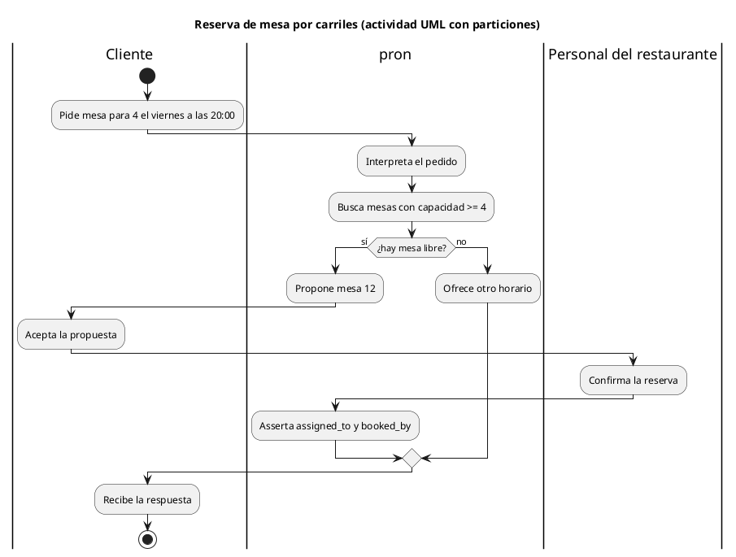
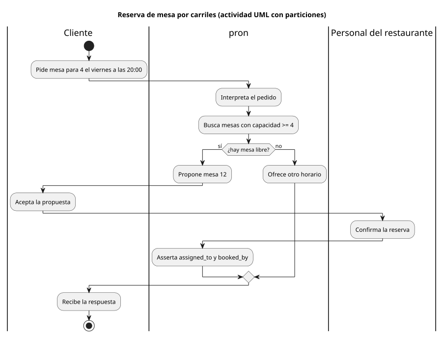

# Carriles (swimlanes)

Carpeta: [posición](index.md). El flujo de control con compuertas y eventos está en
[`../flujo/bpmn.md`](../flujo/index.md) y [`../flujo/uml-actividad.md`](../flujo/uml-actividad.md); este
documento se ocupa de la franja como significado.

## 1. Qué representa

**Quién es responsable de cada paso** de un proceso. El diagrama se divide en franjas paralelas, una
por participante (rol, sistema, área), y cada paso se dibuja dentro de la franja de quien lo hace. Se
usa en UML (particiones de actividad) y en BPMN (pools y lanes).

Las dos especificaciones coinciden en que la franja **organiza, no ejecuta**. UML 2.5.1, §15.6.3.1:
*"ActivityPartitions do not affect the token flow of the model."* BPMN 2.0, §10.7: *"Lanes are used to
organize and categorize Activities within a Pool. The meaning of the Lanes is up to the modeler. BPMN
does not specify the usage of Lanes."*

## 2. Sintaxis abstracta

| Constructo | Definición |
|---|---|
| **ActivityPartition** (UML) | *"a kind of ActivityGroup for identifying ActivityNodes that have some characteristics in common. ActivityPartitions can share contents. They often correspond to organizational units in a business model."* |
| **Pool** (BPMN) | la representación gráfica de un participante de una colaboración |
| **Lane** (BPMN) | *"a sub-partition within a Process (often within a Pool) and will extend the entire length of the Process level, either vertically or horizontally"* |
| **sub-partición** | UML: *"Swimlanes can express hierarchical partitioning"*; BPMN: *"Lanes can be nested"* |
| **partición multidimensional** | UML: *"each 'swim cell' is an intersection of multiple partitions"*; BPMN: lanes *"defined in a matrix"* |

## 3. Sintaxis concreta

- UML, §15.6.4.1: *"An ActivityPartition is notated with two, usually parallel lines, either
  horizontal or vertical, and a name labeling the partition in a box at one end. Any ActivityNodes and
  ActivityEdges placed between these lines are considered to be contained within the partition."*
- BPMN, §10.7: *"A Lane is a square-cornered rectangle that MUST be drawn with a solid single line"*.

Canal: **región espacial** (identidad, el más efectivo para categorías según Munzner; ver
[variables visuales](../../01-fundamentos/variables-visuales.md)). La posición *a lo largo* de la franja
suele leerse como orden del proceso, pero ni UML ni BPMN le dan significado métrico.

## 4. Reglas de conexión

- Un paso está en una franja por dimensión (en una partición simple, exactamente una).
- Las aristas de flujo cruzan franjas libremente: el cruce indica un traspaso de responsabilidad.
- Las franjas de una dimensión no se superponen; pueden anidarse.

## 5. Ejemplo en notación estándar

La reserva de una mesa, con tres responsables: el cliente, `pron` y el personal del restaurante.
Archivo [`swimlanes.assets/reserva.puml`](swimlanes.assets/reserva.puml) (actividad de PlantUML con
carriles):





## 6. El mismo ejemplo como mundo `pron`

Archivo [`swimlanes.assets/reserva.mundo.yaml`](swimlanes.assets/reserva.mundo.yaml).

| Carriles | Mundo `pron` |
|---|---|
| carril | documento `Participant`, con `position` (orden de las franjas) |
| paso en un carril | verbo `performed_by` (`many_to_one`) desde `Action` o `ControlNode` |
| flujo | verbo `next`; la guarda de la decisión (`sí`, `no`) en `notes` |

```yaml
- name: performed_by
  cardinality: many_to_one
  axis: WHO
  source_types: [Action, ControlNode]
  target_types: [Participant]
  description: El paso está en el carril de ese participante (UML ActivityPartition, BPMN Lane).
```

Montaje: `graph: 129 nodes, 150 edges, 13 relation types`; `pron check` → `ok`; `comandos con error: 0`.
Control negativo (`Confirma la reserva` en dos carriles): rechazado, `has 2 'performed_by' targets but
cardinality is many_to_one`.

`many_to_one` es la regla de una partición **simple**. Una partición multidimensional (departamento ×
rol) serían dos verbos, cada uno `many_to_one`, y la celda la intersección: el vocabulario tiene que
saber que son **dimensiones** del mismo diagrama.

## 7. Qué tendría que declarar un `VocabularyDoc`

**Para dibujar**

| Constructo | Viene de | Símbolo |
|---|---|---|
| carril | `Participant`; `position` ordena las franjas | franja con nombre en un extremo |
| paso | `Action` / `ControlNode` | caja o nodo de control **dentro de la franja** de su `performed_by` |
| orientación | declarada por la vista (horizontal o vertical) | — |
| flujo | `next` | flecha; la guarda desde `notes` |
| dimensión | cada verbo `many_to_one` declarado como dimensión | franjas en filas y columnas, celdas en la intersección |

Es **anidamiento en una región espacial alineada**: la franja es un contenedor que ocupa un eje
entero, y el layout dentro de ella sigue el flujo.

**Para editar**

| Gesto | Operación | Escritura |
|---|---|---|
| arrastrar un paso a otra franja | `reassign(paso, participante)` | borrar `performed_by` + crear |
| arrastrar un paso dentro de su franja | nada en el mundo (solo layout) | ninguna |
| reordenar franjas | `reorder-lane` | `update` de `position` en las desplazadas |
| crear una franja | `create-participant` | 1 `Participant` |

La diferencia entre las dos primeras filas es la lección de esta carpeta: **mover en un eje con
significado escribe; mover en un eje sin significado no**. El vocabulario tiene que declarar cuál es
cuál.

## 8. Huecos

- **Guarda de una decisión en `notes`**: `condition` de una `RelationDoc` es un predicado de `sldb`,
  no un rótulo; la guarda como texto (`sí`) no tiene campo propio. Se profundiza en
  [`../estado-bipartito/`](../estado-bipartito/index.md).
- **Dimensiones de partición**: nada en el mundo agrupa dos verbos como dimensiones de un mismo
  diagrama.
- **Paso sin carril**: por la falta de participación mínima (ver
  [entidad-relación](../nodo-arista-tipado/entidad-relacion.md)), un paso puede no tener
  `performed_by` y no habría dónde dibujarlo.

## 9. Fuentes

- OMG, *UML 2.5.1*, §15.6.3.1 (semántica de ActivityPartition) y §15.6.4.1 (notación):
  https://www.omg.org/spec/UML/2.5.1/PDF
- OMG, *Business Process Model and Notation (BPMN) 2.0* (formal/2011-01-03), §9.2.2 y §10.7 (Lanes):
  https://www.omg.org/spec/BPMN/2.0/PDF
- PlantUML, *Activity diagram (new syntax)*, swimlanes: https://plantuml.com/activity-diagram-beta
