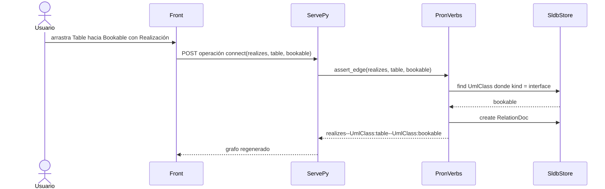
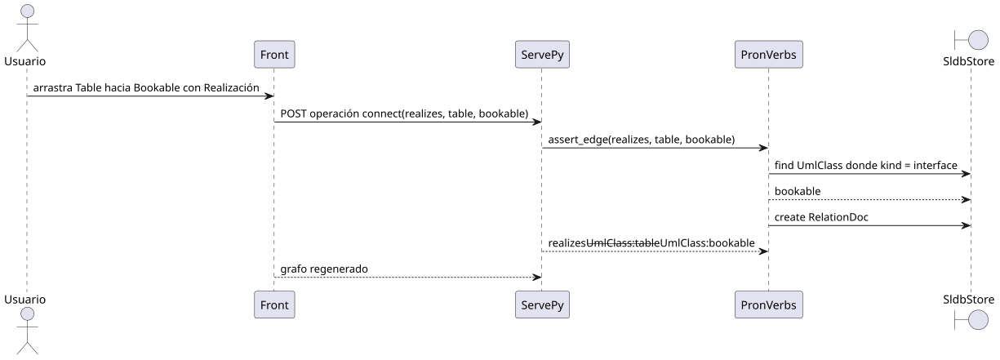

# UML — diagrama de secuencia

Carpeta: [posición](index.md).

## 1. Qué representa

Una **interacción**: qué participantes intercambian qué mensajes y **en qué orden**. Se usa para
diseñar y documentar protocolos, casos de uso y flujos entre componentes. Es el ejemplo canónico de un
vocabulario donde la posición significa: bajar un mensaje lo hace ocurrir después.

## 2. Sintaxis abstracta

UML 2.5.1, §17:

| Constructo | Qué significa |
|---|---|
| **Interaction** | una unidad de comportamiento centrada en el intercambio de mensajes |
| **Lifeline** | un participante de la interacción |
| **Message** | una comunicación de un emisor a un receptor, con un tipo (`messageSort`): `synchCall`, `asynchCall`, `reply`, `createMessage`, `deleteMessage`… |
| **OccurrenceSpecification** | los eventos de envío y recepción sobre cada línea de vida |
| **CombinedFragment** | `alt`, `opt`, `loop`, `par`: variantes, repeticiones, paralelismo |

La semántica del orden (§17.3.3): *"The order of OccurrenceSpecifications along a Lifeline is
significant denoting the order in which these OccurrenceSpecifications will occur. The absolute
distances between the OccurrenceSpecifications on the Lifeline are, however, irrelevant for the
semantics."* Y *"Events on the same time-line are ordered linearly down the page, except where they
occur within a parallel combined fragment"*.

Es decir: el eje vertical es **ordinal**, no métrico.

## 3. Sintaxis concreta

| Constructo | Símbolo (UML 2.5.1) |
|---|---|
| Lifeline | §17.3.4.1: *"a symbol that consists of a rectangle forming its 'head' followed by a vertical line (which may be dashed) that represents the lifetime of the participant"* |
| Message | §17.4.4.1: *"a line from the sender MessageEnd to the receiver MessageEnd. The line must be such that every line fragment is either horizontal or downwards when traversed from send event to receive event."* |
| síncrono | *"has a filled arrow head"* |
| asíncrono | *"has an open arrow head"* |
| respuesta | *"has a dashed line with either an open or filled arrow head"* |
| tiempo | posición vertical: *"time increases down the page"* |

Canales: **posición vertical ordinal** (orden), posición horizontal (participante), trazo y terminal
(tipo de mensaje), texto.

## 4. Reglas de conexión

- Un mensaje tiene exactamente un emisor y un receptor (pueden ser la misma línea de vida).
- Los mensajes de una línea de vida están totalmente ordenados, salvo dentro de `par` o de una
  *coregion*.
- Una respuesta corresponde a una llamada síncrona previa.

## 5. Ejemplo en notación estándar

El flujo que este manual propone para editar: conectar dos clases UML con una operación que `pron`
valida (ver [UML de clases](../nodo-arista-tipado/uml-clases.md) y
[lentes](../../01-fundamentos/lentes-bidireccionales.md)). Escrito como spec de `spec2viz`,
[`uml-secuencia.assets/conectar.spec2viz.yml`](uml-secuencia.assets/conectar.spec2viz.yml):

```yaml
  messages:
    - {from: Usuario, to: Front, message: "arrastra Table hacia Bookable con Realización"}
    - {from: Front, to: ServePy, message: "POST operación connect(realizes, table, bookable)"}
    - {from: ServePy, to: PronVerbs, message: "assert_edge(realizes, table, bookable)"}
    - {from: PronVerbs, to: SldbStore, message: "find UmlClass donde kind = interface"}
    - {from: SldbStore, to: PronVerbs, message: "bookable", kind: return}
    - {from: PronVerbs, to: SldbStore, message: "create RelationDoc"}
    - {from: PronVerbs, to: ServePy, message: "realizes--UmlClass:table--UmlClass:bookable", kind: return}
    - {from: ServePy, to: Front, message: "grafo regenerado", kind: return}
```

Validado (`conectar.spec2viz.yml: OK`) y renderizado con el backend **Mermaid** de `spec2viz` y `mmdc`:



### El oráculo encontró defectos en `spec2viz`

El mismo spec con el backend **PlantUML** de `spec2viz`
([`conectar.spec2viz-plantuml-defecto.puml`](uml-secuencia.assets/conectar.spec2viz-plantuml-defecto.puml))
genera:

```plantuml
SldbStore <-- PronVerbs: bookable
...
PronVerbs <-- ServePy: realizes--UmlClass:table--UmlClass:bookable
ServePy <-- Front: grafo regenerado
```



Dos defectos visibles en la imagen:

1. **Las respuestas van al revés.** La tabla del renderer es `_ARROW = {"sync": "->", "async": "->>",
   "return": "<--"}` (`spec2viz/renderers/plantuml.py`); con `from` a la izquierda, `A <-- B` apunta
   hacia `A`. `bookable` vuelve de `SldbStore` a `PronVerbs`, pero se dibuja hacia el store.
2. **Rótulos con `--` salen tachados**: PlantUML interpreta `--texto--` como formato y el renderer no
   lo escapa.

El backend Mermaid (`_SEQ_ARROW` con `"return": "-->>"`) dibuja las dos cosas bien. Sin renderizar, el
manual habría citado una secuencia con las respuestas invertidas.

## 6. El mismo ejemplo como mundo `pron`

Archivo [`uml-secuencia.assets/conectar.mundo.yaml`](uml-secuencia.assets/conectar.mundo.yaml),
generado desde el spec. Lo central: **el orden es un campo, no una relación**.

| Secuencia | Mundo `pron` |
|---|---|
| interacción | documento `Interaction` |
| línea de vida | documento `Lifeline` con `position` (orden horizontal) |
| mensaje | documento `Message` con `order` (orden vertical), `sort` y el texto |
| emisor, receptor | verbos `sends`, `receives` (`many_to_one`) |
| pertenencia | verbo `in_interaction` |

```yaml
  - name: Message
    fields:
    - {name: text, type: str, description: Rótulo del mensaje.}
    - {name: order, type: int, description: Posición en la secuencia (tiempo hacia abajo).}
    - {name: sort, type: str, default: synchCall, description: 'synchCall, asynchCall o reply (UML messageSort).'}
```

Montaje: `graph: 127 nodes, 150 edges, 14 relation types`; `pron check` → `ok`; `comandos con error: 0`.
Control negativo (un mensaje con dos emisores): rechazado por cardinalidad.

**Orden repetido.** Variante [`conectar-orden-repetido.mundo.yaml`](uml-secuencia.assets/conectar-orden-repetido.mundo.yaml)
con `m6.order = 5`, igual que `m5`: `graph: 127 nodes, 150 edges`, `pron check` → `ok`, `comandos con
error: 0`. Ninguna capa valida que el orden sea único ni continuo: es un campo como cualquier otro.

## 7. Qué tendría que declarar un `VocabularyDoc`

**Para dibujar**

| Constructo | Viene de | Símbolo |
|---|---|---|
| línea de vida | `Lifeline`; `position` → eje x (categórico ordenado) | cabecera + línea punteada |
| mensaje | `Message`; `order` → eje y (**ordinal**) | flecha horizontal de `sends` a `receives` |
| tipo de mensaje | `Message.sort` | terminal lleno, abierto o línea punteada |
| rótulo | `Message.text` | texto sobre la flecha (escapado según el renderer) |

La novedad de esta carpeta: **ejes declarados** con su campo y su tipo de medida (ordinal aquí). El
layout se calcula del mundo, no se guarda en `mindmap-view.json`.

**Para editar**

| Gesto | Operación | Escritura |
|---|---|---|
| arrastrar un mensaje hacia arriba o abajo | `reorder(mensaje, nueva posición)` | `update` de `order` en **ese mensaje y en todos los desplazados** (renumerar) |
| arrastrar el extremo de un mensaje a otra línea de vida | `reconnect-receiver` | borrar `receives` + crear |
| insertar un mensaje entre dos | `insert-message(k)` | 1 `Message` + 3 `RelationDoc` + renumerar los siguientes |
| arrastrar una línea de vida a la izquierda | `reorder-lifeline` | `update` de `position` en las desplazadas |

Reordenar en un eje ordinal con enteros **cuesta N escrituras**; con claves fraccionarias (insertar
entre 5 y 6 como 5.5) cuesta una. Es una decisión de modelado que el vocabulario debería poder
imponer.

## 8. Huecos

- **`spec2viz`, backend PlantUML de secuencias**: respuestas dibujadas en sentido inverso y rótulos sin
  escapar (ver sección 5).
- **Orden como campo sin restricciones**: no hay unicidad ni continuidad declarable sobre un campo
  (`order`); dos mensajes pueden ocupar el mismo lugar sin que nada lo detecte.
- **Relaciones ordenadas**: `kgdb` no tiene noción de orden entre aristas; hay que reificar el mensaje.
- **Fragmentos combinados** (`alt`, `loop`, `par`) no están en el ejemplo: requieren regiones que
  agrupan mensajes contiguos, un anidamiento sobre un eje ordinal.
- **`graph_ui` no tiene ejes**: la posición vertical sale de dagre o de coordenadas guardadas.

## 9. Fuentes

- OMG, *UML 2.5.1*, §17.3.3 (semántica de Lifeline), §17.3.4.1 (notación), §17.4.4.1 (notación de
  Message): https://www.omg.org/spec/UML/2.5.1/PDF
- `spec2viz`, `spec2viz/models/sequence.py`, `spec2viz/renderers/{plantuml,mermaid}.py` (`tools/spec2viz`).
- Mermaid, *Sequence diagrams*: https://mermaid.js.org/syntax/sequenceDiagram.html
