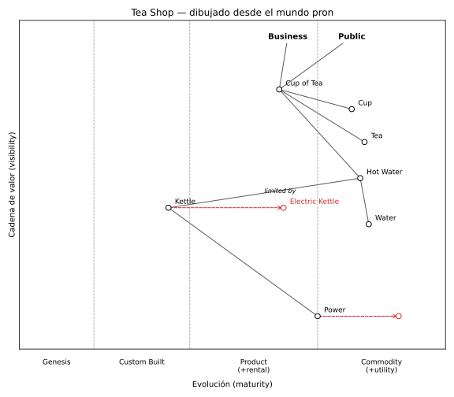

# Mapa de Wardley

Carpeta: [posición](index.md).

## 1. Qué representa

Un **paisaje estratégico**: qué necesita un usuario, de qué componentes depende esa necesidad y qué
tan evolucionado está cada componente. Lo creó Simon Wardley y se usa para decidir qué construir, qué
comprar y qué tercerizar. *Learn Wardley Mapping* (Ben Mosior, CC BY-SA 4.0) lo define como *"A value
chain — a chain of needs — (users, needs, and capabilities arranged and connected according to
dependency) mapped against the four stages of market evolution (Genesis, Custom, Product, and
Commodity)"*.

Es el caso de esta carpeta con **dos ejes continuos a la vez**, y el único donde cada eje tiene un
origen distinto: uno se deriva del grafo y el otro es un juicio sobre el componente.

## 2. Sintaxis abstracta

| Constructo | Qué significa |
|---|---|
| **usuario / necesidad** (`anchor` en OnlineWardleyMaps) | quién es servido y qué necesita; ancla el mapa arriba |
| **componente** (capacidad) | algo necesario para satisfacer la necesidad |
| **dependencia** | el origen necesita al destino (la cadena de valor) |
| **visibilidad** | qué tan cerca del usuario está el componente |
| **evolución** | en qué etapa está: I Genesis, II Custom, III Product, IV Commodity |
| **evolución prevista** (`evolve`) | hacia dónde se moverá el componente, con o sin nombre nuevo |

Los dos ejes se definen distinto (*Learn Wardley Mapping*, "Landscape"): *"First, visibility to the
user, which is a natural outcome of a component's relative position within the value chain, manually
adjusted as needed. Second, evolutionary stage, as determined through evaluation of the component's
general properties and characteristics."*

Y el nombre de las etapas **depende de qué clase de cosa es el componente** (misma página):

| Etapa | I | II | III | IV |
|---|---|---|---|---|
| Activities | Genesis | Custom | Product (+rental) | Commodity (+utility) |
| Practices | Novel | Emerging | Good | Best |
| Data | Unmodelled | Divergent | Convergent | Modelled |
| Knowledge | Concept | Hypothesis | Theory | Accepted |

## 3. Sintaxis concreta

| Constructo | Símbolo (convención de OnlineWardleyMaps) |
|---|---|
| usuario / necesidad | texto en negrita arriba |
| componente | círculo con nombre; **x = evolución, y = visibilidad** |
| etapas | cuatro franjas verticales separadas por líneas punteadas |
| dependencia | línea sin punta (la cadena se lee hacia abajo) |
| evolución prevista | flecha roja punteada hacia un círculo rojo a la misma altura |

OnlineWardleyMaps (`constants/defaults.ts`) fija los límites de etapa con `EvoOffsets = {custom: 3.5,
product: 8, commodity: 14}` sobre un ancho dividido en 20: las franjas cambian en **0.175, 0.40 y
0.70**. La conversión a pantalla es lineal (`components/map/PositionCalculator.ts`):

```ts
visibilityToY(visibility: number, mapHeight: number): number {
    return (1 - visibility) * mapHeight;
}

maturityToX(maturity: number, mapWidth: number): number {
    return maturity * mapWidth;
}
```

Canales: **posición en escala común en los dos ejes** (Munzner, [variables
visuales](../../01-fundamentos/variables-visuales.md)), región (etapa), color y trazo (evolución
prevista), conexión (dependencia).

## 4. Reglas de conexión

- Las dependencias van del usuario hacia abajo: el origen es más visible que el destino (convención,
  "manually adjusted as needed").
- La cadena de valor no tiene ciclos.
- Visibilidad y evolución están en `[0, 1]`.
- Un componente evoluciona a lo más hacia un sucesor; el sucesor conserva la visibilidad del original.

## 5. Ejemplo en notación estándar

El mapa de ejemplo de OnlineWardleyMaps, *Tea Shop*, copiado de
[`frontend/src/constants/defaults.ts`](https://github.com/damonsk/onlinewardleymaps/blob/71f2aad88ae83862fdce27c55c6733b8ba1009aa/frontend/src/constants/defaults.ts)
(MIT). Archivo [`wardley.assets/tea-shop.owm`](wardley.assets/tea-shop.owm). Las coordenadas son
`[visibilidad, evolución]`:

```text
title Tea Shop
anchor Business [0.95, 0.63]
anchor Public [0.95, 0.78]
component Cup of Tea [0.79, 0.61] label [-85.48, 3.78]
component Cup [0.73, 0.78]
component Tea [0.63, 0.81]
component Hot Water [0.52, 0.80]
component Water [0.38, 0.82]
component Kettle [0.43, 0.35] label [-57, 4]
evolve Kettle->Electric Kettle 0.62 label [16, 5]
component Power [0.1, 0.7] label [-27, 20]
evolve Power 0.89 label [-12, 21]
Business->Cup of Tea
Public->Cup of Tea
Cup of Tea->Cup
Cup of Tea->Tea
Cup of Tea->Hot Water
Hot Water->Water
Hot Water->Kettle; limited by 
Kettle->Power
```

No hay un renderer de Wardley instalado. El oráculo lo dibuja
[`mapa-desde-mundo.py`](wardley.assets/mapa-desde-mundo.py) (matplotlib) **desde el mundo** de la
sección 6, con las franjas y la conversión lineal de OnlineWardleyMaps. No es la imagen de
OnlineWardleyMaps: reproduce sus convenciones, no su estilo.



## 6. El mismo ejemplo como mundo `pron`

Archivo [`wardley.assets/tea-shop.mundo.yaml`](wardley.assets/tea-shop.mundo.yaml): `UserNeed` y
`ValueComponent` con `visibility` y `maturity` como `float` y `evolving_to` como `float | None`; verbos
`needs` y `evolves_to`.

| OnlineWardleyMaps | Mundo `pron` |
|---|---|
| `anchor` | documento `UserNeed` |
| `component` con `[v, m]` | documento `ValueComponent` con `visibility: v`, `maturity: m` |
| `A->B` | `needs` (`many_to_many`); `; limited by` en `notes` |
| `evolve Power 0.89` | campo `evolving_to: 0.89` (la posición futura no es una entidad) |
| `evolve Kettle->Electric Kettle 0.62` | documento `Electric Kettle` + `evolves_to` (`one_to_one`) |
| `label [dx, dy]` | nada: es dato de vista |
| `annotation`, `note`, `style` | nada: no están modeladas |

```yaml
- name: evolves_to
  cardinality: one_to_one
  axis: WHEN
  source_types:
  - ValueComponent
  target_types:
  - ValueComponent
  description: El componente origen evoluciona a otro componente (evolve A->B de OnlineWardleyMaps).
```

Montaje: `graph: 113 nodes, 115 edges, 13 relation types`; `pron check` → `ok`; `comandos con error: 0`.
Controles negativos, rechazados por la ingesta tipada:

```
- sldb://document/ValueComponent:kettle has 2 'evolves_to' targets but cardinality is one_to_one
- edge sldb://document/ValueComponent:power -[needs]-> sldb://document/UserNeed:business: target class 'UserNeed' not in target_types ['ValueComponent']
```

### Ida y vuelta al texto

[`owm-desde-mundo.py`](wardley.assets/owm-desde-mundo.py) escribe el mundo en la notación de
OnlineWardleyMaps ([`tea-shop.desde-mundo.owm`](wardley.assets/tea-shop.desde-mundo.owm)). Comparado con
el original sin `label`, `annotation`, `note` ni `style`:

```
10,11c10
< evolve Kettle->Electric Kettle 0.62
< component Power [0.1, 0.7]
---
> component Power [0.10, 0.70]
12a12
> evolve Kettle->Electric Kettle 0.62
```

Las diferencias son de **sintaxis concreta**: orden de líneas y formato de números. El significado es el
mismo. Lo que el mundo no guarda (desplazamiento de rótulos, anotaciones) se pierde en la vuelta: una
lente que parte del texto tiene que conservarlo como complemento (ver
[lentes](../../01-fundamentos/lentes-bidireccionales.md)).

### Qué regla hace cumplir quién

Variante [`tea-shop-fuera-de-rango.mundo.yaml`](wardley.assets/tea-shop-fuera-de-rango.mundo.yaml):
`Power.maturity = 1.7`, `Water.visibility = -0.2` y `Power needs Cup of Tea`, que cierra un ciclo.
Monta sano: `graph: 113 nodes, 116 edges`, `pron check` → `ok`, `comandos con error: 0`. El verificador
del vocabulario, [`verificar-mapa.py`](wardley.assets/verificar-mapa.py), sí lo encuentra:

```
FUERA DEL MAPA: ValueComponent:water.visibility = -0.2
FUERA DEL MAPA: ValueComponent:power.maturity = 1.7
CICLO EN LA CADENA: ValueComponent:cup-of-tea -> ValueComponent:hot-water -> ValueComponent:kettle -> ValueComponent:power -> ValueComponent:cup-of-tea
10 elementos, 3 problema(s)
```

## 7. Qué tendría que declarar un `VocabularyDoc`

**Para dibujar**

| Constructo | Viene de | Símbolo |
|---|---|---|
| eje x | `maturity`, **continuo** `[0, 1]`, con **bandas** en 0.175 / 0.40 / 0.70 | posición y franja |
| rótulos de banda | según la clase del componente (Activities, Practices, Data, Knowledge) | texto bajo el eje |
| eje y | `visibility`, **continuo** `[0, 1]`, invertido (1 arriba) | posición |
| componente | `ValueComponent` | círculo con nombre |
| necesidad | `UserNeed` | texto en negrita |
| dependencia | `needs` | línea sin punta |
| evolución | `evolving_to` o `evolves_to`; el sucesor **hereda** `visibility` | flecha roja punteada |

**Para editar**. OnlineWardleyMaps resuelve la vuelta **reescribiendo la línea del texto** con una
expresión regular al soltar el componente (`components/map/MapComponent.tsx`):

```ts
return line.replace(/\[([^[\]]+)\]/, `[${newVisibility.toFixed(2)}, ${newMaturity.toFixed(2)}]`);
```

y bloquea el eje y del sucesor de una evolución: `<Movable ... fixedY={component.evolved} fixedX={false}>`.

| Gesto | Operación | Escritura |
|---|---|---|
| arrastrar un componente | `move(c, m, v)` | `update` de `maturity` y `visibility` (redondeo a 2 decimales) |
| arrastrar el sucesor de una evolución | `move-evolved(c, m)` | `update` de `maturity`; **y fijo** |
| arrastrar un componente con sucesor | `move(c, m, v)` | `update` del original; ¿el sucesor lo sigue en y? el vocabulario debe decidir |
| soltar fuera de `[0, 1]` | debería recortarse o rechazarse | según la política del vocabulario |
| unir dos componentes | `assert(needs, …)` | 1 `RelationDoc` o rechazo por tipos |
| mover un componente bajo lo que necesita | nada lo impide; es una convención | advertencia, no rechazo |

A diferencia del [Gantt](gantt.md), aquí **los dos ejes escriben**, y a diferencia de los
[carriles](swimlanes.md), ninguna posición es solo layout.

## 8. Huecos

- **Rangos en campos**: `maturity = 1.7` se acepta; no hay dónde declarar `[0, 1]`.
- **Aciclicidad**: un ciclo en `needs` monta sano (mismo hueco que en
  [anidamiento](../anidamiento/index.md)).
- **Campo vacío ilegible en Markdown**: `evolving_to` es `float | None` (`sldb models create` lo acepta y
  el documento vuelve a parsear a `null`), pero el Markdown muestra el marcador de plantilla literal,
  `evolving_to: ⸢rev•evolving_to⸥`. Quien edite el archivo a mano ve sintaxis interna.
- **Valores heredados**: `Electric Kettle.visibility` repite la de `Kettle`; nada los mantiene iguales
  si se edita uno (mismo hueco de valores derivados que el [treemap](../anidamiento/treemap.md)).
- **Etiquetas de eje según la clase**: el mundo sabe la clase del componente, pero la tabla
  Activities / Practices / Data / Knowledge es del vocabulario, no del sustrato.
- **Dato de vista de la notación** (`label [dx, dy]`, anotaciones): no tiene lugar en el mundo; si
  `graph_ui` importa texto OWM y lo vuelve a escribir, se pierde.

## 9. Fuentes

- B. Mosior, *Learn Wardley Mapping*, "Landscape" (definición, ejes y tabla de etapas; CC BY-SA 4.0,
  contenido cortesía de Simon Wardley): https://learnwardleymapping.com/landscape/
- OnlineWardleyMaps, commit `71f2aad88ae83862fdce27c55c6733b8ba1009aa` (MIT):
  `frontend/src/constants/defaults.ts` (`ExampleMap`, `EvoOffsets`),
  `frontend/src/components/map/PositionCalculator.ts`,
  `frontend/src/components/map/MapComponent.tsx` (`updatePosition`, `fixedY`):
  https://github.com/damonsk/onlinewardleymaps/tree/71f2aad88ae83862fdce27c55c6733b8ba1009aa
